# pam
[](https://github.com/jlinoff/pam/releases)


personal account manager webapp

> **New to PAM?** Start with the [Quick Start guide](./QUICKSTART.md) — get up and running in five minutes.

> **Documentation note:** The screenshots and UI descriptions in this document reflect PAM 1.2.5 and earlier. PAM 1.3.0 introduced tabbed preferences navigation and other visual changes. The concepts and features are identical — the documentation remains accurate and useful, but some screenshots and UI descriptions may not map 1:1 to what you see on screen.


<details>
<summary>Metadata</summary>

The meta data in the table is populated during the build process when
the on-line help is generated.

| Field              | Value                                                                             |
| -----              | -----                                                                             |
| Author             | Joe Linoff                                                                        |
| Copyright (&copy;) | 2022                                                                              |
| License            | MIT Open Source                                                                   |
| Version            | `__VERSION__`                                                                     |
| Bootstrap Version  | `__BOOTSTRAP_VERSION__`                                                           |
| Build              | `__BUILD__`                                                                       |
| GitCommitId        | `__GIT_COMMIT_ID__`                                                               |
| GitBranch          | `__GIT_BRANCH__`                                                                  |
| project            | [https://github.com/jlinoff/pam](https://github.com/jlinoff/pam)                  |
| webapp             | [https://jlinoff.github.io/pam/www/](https://jlinoff.github.io/pam/www/)          |
| help               | [https://jlinoff.github.io/pam/www/help/](https://jlinoff.github.io/pam/www/help) |

</details>

<details>
<summary>Table of Contents</summary>

<!--ts-->

  * [Introduction](#introduction)
  * [Overview](#overview)
    * [Reasons to not use PAM](#reasons-to-not-use-pam)
      * [Reason 1: You want browser autofill](#reason-1-you-want-browser-autofill)
      * [Reason 2: You already have something that works](#reason-2-you-already-have-something-that-works)
      * [Reason 3: Too complex](#reason-3-too-complex)
    * [Reasons to consider using PAM](#reasons-to-consider-using-pam)
      * [Reason 1: No Client Server Communications](#reason-1-no-client-server-communications)
      * [Reason 2: Record Model](#reason-2-record-model)
      * [Reason 3: Searching](#reason-3-searching)
      * [Reason 4: Automatic Password Generation](#reason-4-automatic-password-generation)
      * [Reason 5: File Based Storage](#reason-5-file-based-storage)
      * [Reason 6: Secure Context Encryption](#reason-6-secure-context-encryption)
      * [Reason 7: Hiding Passwords from Casual Observers](#reason-7-hiding-passwords-from-casual-observers)
      * [Reason 8: Access from mobile devices](#reason-8-access-from-mobile-devices)
      * [Reason 9: FOSS](#reason-9-foss)
      * [Reason 10: Duplicate Password Checking](#reason-10-duplicate-password-checking)
      * [Reason 11: Breached Password Detection](#reason-11-breached-password-detection)
    * [PAM vs mainstream password managers](#pam-vs-mainstream-password-managers)
  * [Records](#records)
    * [Unexpanded View of all Records](#unexpanded-view-of-all-records)
    * [Expanded View of a Record](#expanded-view-of-a-record)
  * [Topics](#topics)
  * [Fields](#fields)
    * [Field Types](#field-types)
    * [Custom Fields](#custom-fields)
  * [Password Fields](#password-fields)
    * [Cryptic Passwords](#cryptic-passwords)
    * [Memorable Passwords](#memorable-passwords)
    * [Hidden Password Representation](#hidden-password-representation)
    * [Visible Password Representation](#visible-password-representation)
    * [Password Generator](#password-generator)
  * [Layout](#layout)
    * [Menu and Search Section](#menu-and-search-section)
      * [Search](#search)
      * [Menu](#menu)
    * [Records Section](#records-section)
    * [Status and Controls Section](#status-and-controls-section)
  * [Menu Functions](#menu-functions)
    * [About](#about)
    * [Create New Record](#create-new-record)
      * [Method 1: Menu Approach](#method-1-menu-approach)
      * [Method 2: Clone Approach](#method-2-clone-approach)
      * [Method 3: JSON Approach](#method-3-json-approach)
    * [Edit Record](#edit-record)
    * [Delete Record](#delete-record)
    * [Deactivate Record](#deactivate-record)
    * [Clone Record](#clone-record)
    * [Clear Records](#clear-records)
    * [Save File](#save-file)
    * [Load File](#load-file)
    * [Reused Passwords](#reused-passwords)
    * [Breached Passwords](#breached-passwords)
    * [Get Help](#get-help)
  * [Preferences](#preferences)
    * [Search Preferences](#search-preferences)
      * [Case Insensitive Searches](#case-insensitive-searches)
      * [Search Record Titles](#search-record-titles)
      * [Search Record Field Names](#search-record-field-names)
      * [Search Record Field Names](#search-record-field-names)
      * [Search Record Field Values](#search-record-field-values)
      * [Hide Inactive Records](#hide-inactive-records)
    * [Password Preferences](#password-preferences)
      * [Minimum Password Length](#minimum-password-length)
      * [Maximum Password Length](#maximum-password-length)
      * [Memorable Password Min Word Length](#memorable-password-min-word-length)
      * [Memorable Password Word Separator](#memorable-password-word-separator)
      * [Memorable Password Min Words](#memorable-password-min-words)
      * [Memorable Password Max Tries](#memorable-password-max-tries)
      * [Memorable Password Prefix](#memorable-password-prefix)
      * [Memorable Password Suffix](#memorable-password-suffix)
    * [Miscellaneous Preferences](#miscellaneous-preferences)
      * [Log Status to the Console](#log-status-to-the-console)
      * [Clear Records On Load](#clear-records-on-load)
      * [Enable Printing](#enable-printing)
      * [Load Duplicate Record Strategy](#load-duplicate-record-strategy)
      * [Clone Field Values when Cloning Records](#clone-field-values-when-cloning-records)
      * [Require Record Fields](#require-record-fields)
      * [Enable Editable Field Name](#enable-editable-field-name)
      * [filePass Cache Strategy](#filepass-cache-strategy)
      * [Custom About](#custom-about)
    * [Record Fields](#record-fields-preferences)
    * [Saving Preferences](#saving-preferences)
  * [Content-Security-Policy](#content-security-policy)
* [Security Considerations](#security-considerations)
    * [MITM](#mitm)
    * [Third Party Web Site Security](#third-party-web-site-security)
    * [Site Reliability](#site-reliability)
    * [Over the Shoulder Surfing Attack](#over-the-shoulder-surfing-attack)
    * [Malware: Key Logging and Screen Recording](#malware-key-logging-and-screen-recording)
    * [Malware: Clipboard Attack](#malware-clipboard-attack)
    * [Unattended Browser](#unattended-browser)
    * [Website Spoofing](#website-spoofing)
    * [Dictionary and Brute Force Password Attacks](#dictionary-and-brute-force-password-attacks)
    * [Protecting Yourself](#protecting-yourself)
    * [Multi-Factor Authentication](#multi-factor-authentication)
  * [Usage Examples](#usage-examples)
    * [Personal Account Records](#personal-account-records)
      * [Create Record File](#create-record-file)
      * [Use Record Data to Log into a Site](#use-record-data-to-log-into-a-site)
      * [Edit an Existing Record](#edit-an-existing-record)
      * [Delete an Existing Record](#delete-an-existing-record)
      * [Clone an Existing Record](#clone-an-existing-record)
    * [Share Credentials for a Small Group](#share-credentials-for-a-small-group)
    * [Recipes](#recipes)
    * [Books](#books)
    * [Decrypting and encrypting PAM files from the command line](#decrypting-and-encrypting-pam-files-from-the-command-line)
  * [Developer Notes](#developer-notes)
    * [License](#license)
    * [Build PAM](#build-pam)
    * [Create Favicon](#create-favicon)
    * [Test PAM](#test-pam)
      * [Interactive unit testing in the browser](#interactive-unit-testing-in-the-browser)
    * [Release PAM](#release-pam)
    * [History](#history)

<!--t3-->

</details>

## Introduction
_PAM_ or Personal Account Manager is a free and open source, single
page web application that is designed to help you conveniently and
securely manage your confidential information _like passwords_ inside
the secure context of your web browser as dynamically configurable
records that can be searched _without having to rely on services from
a third party server_ because they are stored in a file that _you
control_ either on your local device or on a cloud based file server.

The _PAM_ file is encrypted both in transit and when stored so the contents are
safe from hackers if the file was stolen assuming, of course, that the password
you used to encrypt it _was strong_.

The PAM file flow is shown in the figure below. Note that the _save_ device and
the _load_ device could be _the same device_.

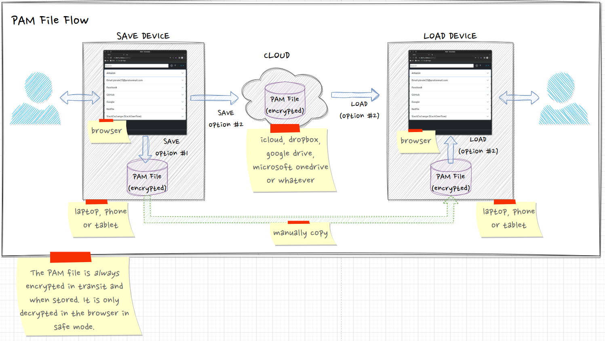

You can access _PAM_ from your own secure web server (including
localhost) or from the public
[github.io server](https://jlinoff.github.io/pam/www/index.html).
In either case, once the application is loaded into your browser
or run as a local web app
([PWA](https://developer.mozilla.org/en-US/docs/Web/Progressive_web_apps/Installing))
_there is no other communication_ with the web server which you can
verify by monitoring outbound network traffic.

In addition, _PAM_ is designed to be mobile friendly so you can access
it from your laptop browser as well as your mobile phone and tablet.

It looks _something_ like this on my iphone in dark mode for the fictitious
example records that are provided by PAM to practice with, as described
in the [Load File](#load-file) section later on.

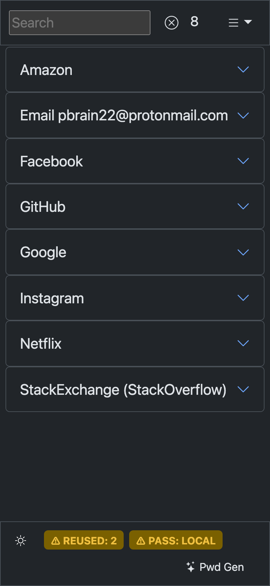

And _something_ like this in light mode.

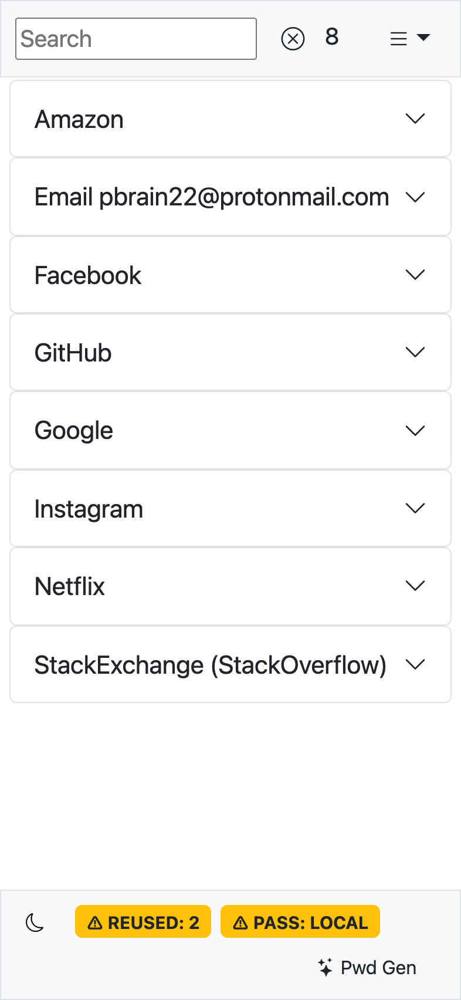

At the bottom left of the screen there is a button that allows you to toggle between
light and dark mode. It looks like a sun (switch to light) in dark mode:

and like a moon (switch to dark) in light mode:
.

Dark and light mode examples will be intermixed throughout this document.

The records appear as accordion entries that expand when you click on them as shown below.

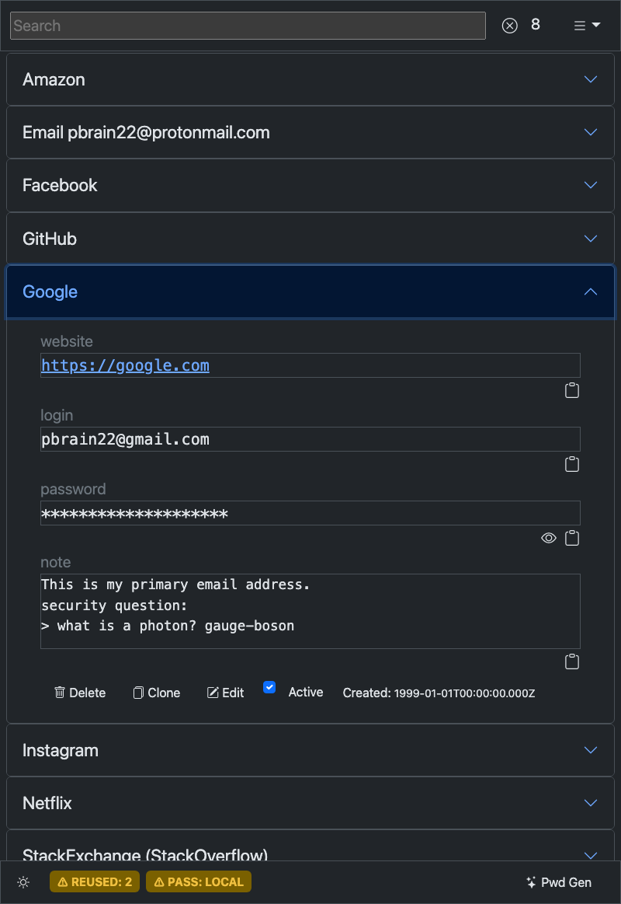

Once the record is expanded you simply click on the clipboard

icon associated with the record field you are interested in (like the
password) to copy its value to the system clipboard so that it can
then be pasted them into the appropriate login field. You can click on the eye

icon to see the password in plaintext. By default all record fields containing
sensitive information,like passwords, are masked so that a casual observer
cannot see it.

You can even include images as shown in this example which is also provided
by PAM to practice with and, like the examples above, is also described in
the [Load File](#load-file) section later on.

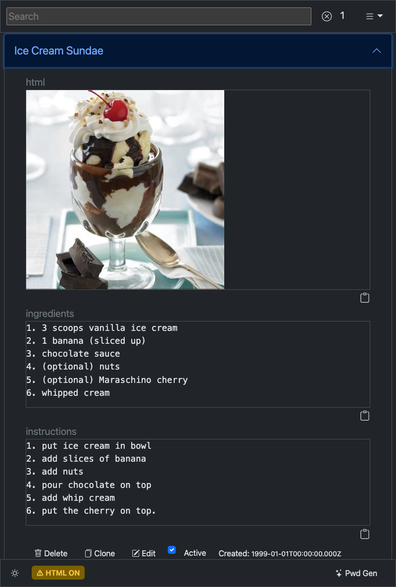

There are other features like memorable password generation and
customized record fields that are described in the documentation
below.

Please note that this is not the first tool I have written to manage
passwords but it is meant to be the last. If you are interested in
what motivated me to create yet another tool, see the
_[Security Considerations](#security-considerations)_
and
_[Reasons to consider using PAM](#reasons-to-consider-using-pam)_.
If you are interested in the genesis of _PAM_ and the stories of its
predecessors, see the [History](#history) section.

I hope that you also find useful in some way.

## Overview
_PAM_ is a pretty simple application. It is basically a record editor
that runs in your browser that allows you to create records with
interesting information that can then be stored and retrieved in a
secure way.

### Reasons to not use PAM
This section talks about why you may not need or want to use _PAM_.

#### Reason 1: You want browser autofill
The most important reason not to use PAM is that it has no browser
integration. Mainstream password managers like
[Bitwarden](https://bitwarden.com) automatically detect login forms
and fill in your credentials with a single click or tap. PAM requires
you to manually copy each field to the clipboard and paste it into
the browser. For day-to-day web login use, that friction adds up
quickly.

If autofill is important to you — and for most people it is — use
Bitwarden or a similar tool instead.

#### Reason 2: You already have something that works
If you are already using a password manager, an Excel spreadsheet, a
text file, or any other method that works for you, you should keep
using it. There is no reason to switch.

#### Reason 3: Too complex
_PAM_'s record and field model is more flexible than a typical password
manager, but that flexibility comes with some complexity. Creating
records, managing field types, and maintaining your own encrypted file
requires more engagement than simply installing a browser extension.
If you want something that works without thinking about it, a
mainstream password manager will serve you better.

The features and design decisions behind PAM are discussed in the next
section to help you decide whether any of them matter to you.

### Reasons to consider using PAM

This section presents the nine primary reasons that motivated me to
develop _PAM_. They are provided to help you determine whether
_PAM_ might be interesting to you.

#### Reason 1: No Client Server Communications
_PAM_ is a single page web application (SPA) that has no backend which
means that it never communicates with an external site which protects
it from some types of cyber attacks as detailed in the
[Security Considerations](#security-considerations) section.

#### Reason 2: Record Model
In _PAM_, information is organized into files composed of records that
each have a unique title and are, in turn, composed of fields that
have a name, a type and a value. This approach is similar
to organizing information using index cards or a rolodex.

Following the index card analogy a little further, we can use a
simple example to understand the record model a bit better.

A recipe would be something you might store on an index card. Each
recipe could be a single record that might contain the _title_ (the
name of the recipe), the _ingredients_ (a field) and the
_instructions_ (another field).

##### Simple Recipe Record

So what would a simple dessert recipe look like as a in _PAM_ record?
Well, if you had a simple dessert recipe like this written on a card
with an attached picture.

<!-- PP: <blockquote style="border: 1px black solid; width: 32ch"> PP: -->


```
Ice Cream Sundae

ingredients
1. 3 scoops vanilla ice cream
2. 1 banana (sliced up)
3. chocolate sauce
4. (optional) nuts
5. (optional) Maraschino cherry
6. whipped cream

instructions
1. put ice cream in bowl
2. add slices of banana
3. add nutes
4. pour chocolate on top
5. add whip cream
6. put the cherry on top.
```

<!-- PP: </blockquote> PP: -->

It would look like this when you _create_ it in _PAM_.

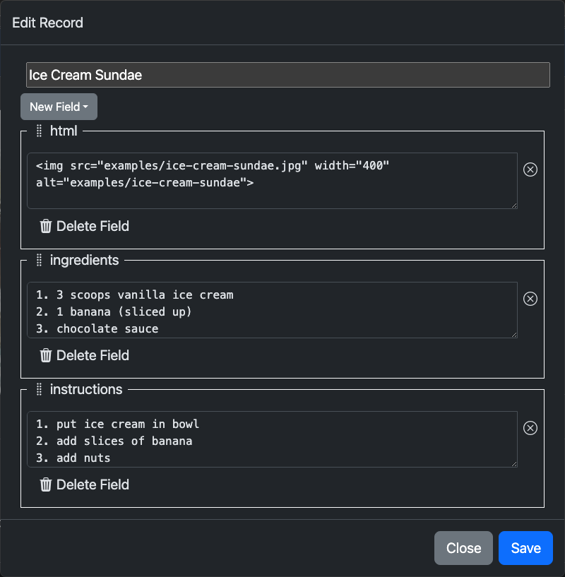

It would look like this when you _view_ it in _PAM_ in edit mode.


In this _"recipe"_ record, the title is `"Ice Cream
Sundae"` and the two fields "ingredients" and "instructions" contain
the multiline (`textarea`) descriptions of what the ingredients and
instructions are for this specific recipe. And, finally, there is an
"html" field that contains the image.

Note that the record field names "ingredients" and "instructions" used
in this example are custom _field names_.
They are not available by default. The "html" field _is_ a default field.

Custom fields can be created by adding new fields to the default
fields defined in the preferences so they are available all of the
time.

For this example I created two new _textarea_ fields named
"ingredients" and "instructions" so that users could enter multiple
lines and removed all of the other default fields except the "html"
field because they were not needed. I kept the default "html" field
because I wanted to be able add pictures to the recipes.  Here is what
the preferences look like after the modifications were made.

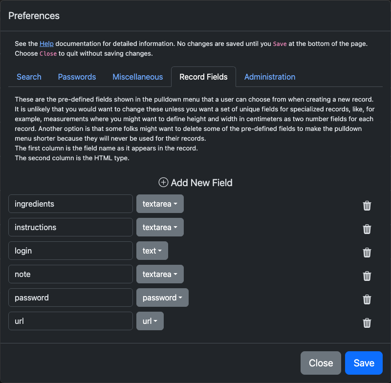

##### Simple Account Record

Of course, there are many other types of records that might be
interesting to store in _PAM_ that can use the default record
fields _as is_.
See the [Fields](#fields) section for a description of the default
records and their types.

One common one is a record for each account that you need to login
into where you information about how to login is stored so you don't
have to remember it.

Such an _"account"_ record would have, at a minimum, the web address
(URL), the login name and the password of the account.

Note that this simplified example is only meant to show the basic
idea of importance of supporting record formats that are different
than recipes. For a real account record you would probably want to add
additional fields like an email address or a notes field.

Here is what the simple account record would look like.


Note that the password is hidden in the example above.
_PAM_ always hides the contents of passwords by default.

##### Record Model Summary

Both records look quite different. Recipes records have
fields for "ingredients" and "instructions" whereas account records
have fields for the "url", "login" and "password". However, in both
cases they have the same basic structure: a title and a set of fields
that are relevant to recipes or accounts.

You could easily imagine defining other records that contain
information for other topics like _"books read"_ or _"unidentified
aerial phenomena"_ or _"bird watching"_ which would undoubtedly
require different fields. The idea of topics is dicussed in more
detail in the [Topics](#topics) section.

In my view, this approach of using _records composed of fields_
does a better job of representing this type of information than a
spreadsheet or a text file.

#### Reason 3: Searching
_PAM_ allows you to search records by their title or their field
names and values. It also filters out the records that don't match
to make it easier to see the matching records visually.

The availability of fast interactive searching makes finding records
easy.

This is what search/filtering looks like for all example records that
contain a "g" in them. Note that, by default, search operations are
case insensitive but that can be changed in the preferences.

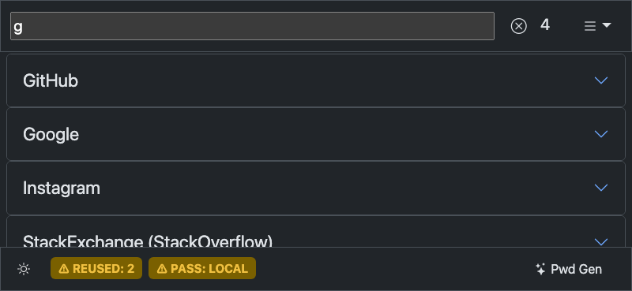

Note that regular expressions can be used as well as shown in the
example below that looks for records that start with "g".

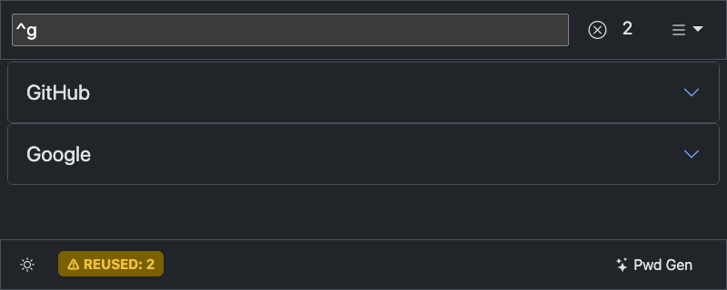

See [Search](#search) for more details.

#### Reason 4: Automatic Password Generation
I always find it hard to come up with passwords in the spur of the
moment so _PAM_ was built with the ability to automatically generate
passwords.

Of course almost all browsers and password tools provide this same
capability nowadays, but they tend to generate secure, cryptic, hard
to memorize passwords which is perfectly fine for passwords for most
accounts.

But there are a cases when you need a password that must be typed in
manually like the login password for a computer that does not use
biometric scanning or a key FOB. In those cases it is beneficial to
have a password that is secure, easy to remember and easy to type
because you cannot access a password management system _before you
login_.

I call passwords of this type _memorable_ passwords. They are composed
of common lower case English words with an optional prefix, an
optional separator between each word and an optional suffix.

Often, the prefix and suffix are used to guarantee that the password
contains the correct mix of characters that the authentication system
requires, like, at least one capital letter, at least one digit and at
least one special character.

To make these concepts a bit clearer, here are examples of a cryptic
and a memorable password.

| <!-- --> | <!-- --> |
| -------- | -------- |
| cryptic   | `Rf5NaR7LH2LbZMRhkPCfeG8` |
| memorable | `A1/health/mpegs/hopes!!` |

In this example, the memorable password word separator is `"/"`, the
prefix is `"A1/"` (capital letter and digit) and the suffix is `"!!"`
(special characters).

To help with this, _PAM_ was built with the ability to generate _cryptic_
and _memorable_ passwords.

For more detailed information about password generation in _PAM_ see the
[Password Fields](#password-fields) section.

#### Reason 5: File Based Storage
_PAM_ uses files to load and store the record data.

Using a file means that the user does not have to rely on the
cybersecurity infrastructure of a company running a web server and
storing your data at their site or another third party site. This was
alluded in
[Reason 1: No Client Server Communications](#reason-1-no-client-server-communications)
but that is not the _only_ advantage of using files.

A _PAM_ file is composed of a set of records. Any records you like.
You can use a single file for all of your records or you can have
multiple files where each file contains records that are somehow
related like records of _"recipes"_ or _"book reviews"_
or _"my favorite species of Euglena"_.

What this means is that you can group records associated by a topic in
different files to make them easier to organize and find.  This
ability to organize files around topics is the other reason that I
prefer the file based storage model.

For a more detailed discussion about how the user controls the
organization of the records and fields in a file see the
[Reason 2: Record Model](#reason-2-record-model)
section of this document.

As a side note, I store my personal _PAM_ record files in _Apple iCloud_
which is one of many cloud based storage services like _Dropbox_, _Google
Drive_ and _Microsoft OneDrive_.

For files I want to share with other folks, I use _Google Drive_ to
store the file and then share it.

When properly configured all of these storage services store the _PAM_
record file in the cloud so that it is available to anyone who knows
the file password as long as their laptop, phone or tablet is
authorized to access the storage service.

Of course you could simply load and save the data to a local file but
that _might_ restrict your ability to access to it from other devices
(like mobile phones or tablets). Not only that but you would have to be
very diligent about keeping it backed up so that you would not lose
data if the local file was corrupted or lost.

#### Reason 6: Secure Context Encryption
When records are stored in a _PAM_ file they can be encrypted using a
password. As of v2 (April 2026), the password is used with a
high-iteration PBKDF2-SHA-256 key derivation function and a
properly random salt to produce an
[_NIST certified_](https://csrc.nist.gov/projects/cryptographic-algorithm-validation-program)
AES-256-CBC key.

Using a certified encryption algorithm provides a strong security
guarantee which means, that if an encrypted _PAM_ file is stolen, the
record data is considered safe from hackers trying to crack the
contents _if a strong password was used_.

> **Note for existing users:** PAM v1 files used a lower iteration
> count and had a salt entropy bug. If you have v1 files, re-save them
> in PAM to upgrade them to the v2 format. See
> [MIGRATION.md](./MIGRATION.md) for details.

Passwords like _"secret"_ or _"password123"_ or any other password
that can be found in freely available password dictionaries like the
[Kali password dictionary](https://kalitut.com/best-password-dictionary/#Kali_password_dictionary)
are _not_ strong and will _not_ protect your data because they are easy to guess.

_Always_ use a strong password to make it hard to guess. Typically a strong
password would have at least 20 characters would not include any personally
identifiable information (PII) like your name, birth date or address. Also
_never, ever_ use the same password for two different sites. This is
to protect you from hackers if a site you use to is attacked and your
password is stolen.

I recommend reading
[NIST Password Guidelines](https://www.auditboard.com/blog/nist-password-guidelines/)
for more information about how to create strong passwords.

As an interesting aside, note that `AES-256-CBC` algorithm is
considered to be reasonably resistant to quantum attacks as discussed
in the literature. For example,
[here](https://crypto.stackexchange.com/questions/6712/is-aes-256-a-post-quantum-secure-cipher-or-not)
is one relevant exchange from a `crypto.stackexchange.com` discussion.

_PAM_ encryption and decryption operations are provided by and run
_inside_ the _secure context_ of the browser. This is the same _secure
context_ used for accessing sites securely for transactions, like your
bank. In practice this means that you must access _PAM_ from an HTTPS site.

The safety and security of _secure context_ operations is taken very
seriously by the internet standards organization and the organizations
that develop the major browsers.

You can read more about secure contexts
[here](https://developer.mozilla.org/en-US/docs/Web/Security/Secure_Contexts).

#### Reason 7: Hiding Passwords from Casual Observers

Passwords and other secrets are automatically hidden on the screen
(displayed as asterisks) so that someone looking over your shoulder
cannot read them unless you choose to make them visible. You can read
more about why this is beneficial in the
[Security Considerations](#security-considerations) section.

This is the default hidden view of a password.  You can see that the
password value is all _asterisks_.

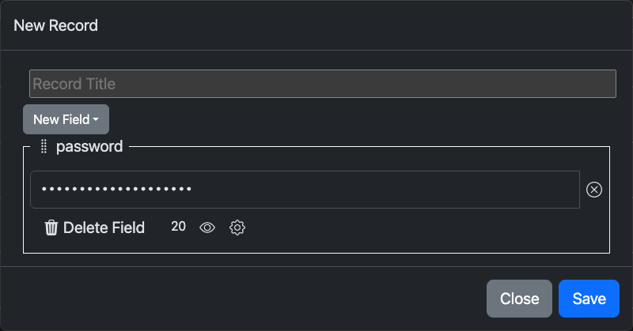

This is the same view of a password when it is not hidden.
You can now see the password value.

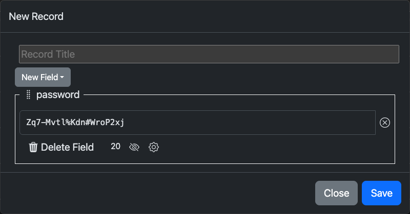

#### Reason 8: Access from mobile devices

The record files can be accessed from mobile devices so the user has access to the
records anywhere as described in the
[Reason 5: File Based Storage](#reason-5-file-based-storage)
but that does not necessarily imply that the interface is _mobile friendly_.

What makes _PAM_ mobile friendly is that it is implemented using the
[bootstrap-5](https://getbootstrap.com/docs/5.0/getting-started/introduction/)
library to make the interface work better in the browsers present on
mobile devices. PAM also supports installation as a
[Progressive Web App (PWA)](https://developer.mozilla.org/en-US/docs/Web/Progressive_web_apps/Installing),
which means you can add it to your home screen and use it like a
native app without going through an app store.

#### Reason 9: FOSS

Last but not least, one compelling reason to try _PAM_ is that it is
free and open source software (FOSS) so you can try it without any
obligation or cost. You can also help find and fix bugs or improve
the UI.

#### Reason 10: Duplicate Password Checking

A password shared between two accounts is only as safe as the least safe of
them. If any one of those sites is breached, every account sharing that
password is exposed — and you may not find out which ones they were.

_PAM_ finds reuse across your whole vault and shows it in the
[Reused Passwords](#reused-passwords) report, listing the entries that share a
password without ever displaying the password itself. A
**⚠ REUSED** badge appears in the footer whenever any stored password is used
more than once, so you do not have to go looking.

The check runs **entirely on your device**. No request is made, nothing is
uploaded, and no third party learns anything about your vault. Reuse detection
needs no network at all, so this holds whether or not
[Password Breach Check](#enable-password-breach-check) is enabled.

#### Reason 11: Breached Password Detection

A password that has appeared in a public breach is not yours any more, whatever
its length or complexity. Attackers try published passwords first because it is
cheap and it works.

_PAM_ can check yours against the
[Have I Been Pwned](https://haveibeenpwned.com/) corpus without revealing them:
it sends a twenty-bit hash prefix and compares the returned list locally, so no
password, no full hash, and nothing about which record it belongs to ever
leaves the device. See
[Breached Passwords](#breached-passwords) for the report and
[Enable Password Breach Check](#enable-password-breach-check) for what is sent.

This is the one feature that makes _PAM_ contact anything, so it is **off by
default**, it announces itself with a toolbar badge while active, and the one
host it may reach is named in the
[Content-Security-Policy](#content-security-policy) where you can check it.

It also applies local checks that need no network — keyboard runs, sequences,
repeats, embedded years, an entropy floor — because being absent from a breach
corpus is a low bar. A password can be unpublished and still bad.

You can check the whole vault at once, or a single password from the record
view, the record editor, or the password generator. Checking while you are
choosing a password is the most useful of these: it is the last point at which
changing your mind is free.

### PAM vs mainstream password managers

_Analysis: April 2026. Compared against Bitwarden and 1Password as representative mainstream alternatives._

**TL;DR — direct most users to a mainstream product like [Bitwarden](https://bitwarden.com).** PAM has no browser autofill, which is a dealbreaker for everyday web login use. It excels as a flexible encrypted notebook for non-password data (medication lists, account numbers, notes, recipes) and for users who want zero cloud dependency.

| Feature / use case | PAM | Bitwarden / 1Password | Verdict |
| --- | --- | --- | --- |
| **Core password management** | | | |
| Password storage & retrieval | Manual copy/paste — no browser integration so credentials must be copied to the clipboard and pasted into login forms | Automatic autofill via browser extension or native app | PAM loses — manual copy/paste for every login is significant friction |
| Password generation | Yes — cryptic and memorable | Yes — cryptic only by default | PAM wins — memorable passwords are unique to PAM |
| Multi-device sync | File-based — works naturally on iCloud/Dropbox for single users | Automatic cloud sync | PAM loses for teams; single-user sync via iCloud/Dropbox works naturally |
| Mobile access | Mobile-friendly browser UI; PWA install available; no native app | Native iOS/Android app with Face ID | PAM loses — no native app, though PWA install is available |
| **Security model** | | | |
| Local-only operation | Local by default — no server traffic after page load unless you enable [Password Breach Check](#enable-password-breach-check), which sends a 20-bit hash prefix to one host | Cloud-dependent; requires trust in vendor | PAM wins for offline/air-gapped scenarios: the one optional exception is off by default and named in the policy |
| Encryption | AES-256-CBC; v2 format (shipped April 2026) fixes PBKDF2 iteration count and salt entropy bug. Existing v1 files need manual re-save to upgrade. | AES-256, strong PBKDF2 / Argon2 KDFs | Tie — v2 closes the gap; v1 files remain weak until re-saved |
| Zero-knowledge architecture | Inherently — no server ever sees data | Bitwarden: yes. 1Password: yes | Tie |
| Reused password detection | Yes — the [Reused Passwords](#reused-passwords) report and a footer badge, computed locally with no network request | Yes — 1Password Watchtower, Bitwarden reports; both require the vault to be synced to the vendor | Tie on capability, PAM wins on disclosure — the same answer without anything leaving the device |
| Breach checking | Yes, on demand — [Breached Passwords](#breached-passwords) checks against the same Have I Been Pwned corpus, using a 20-bit hash prefix so nothing identifying is sent. Off by default | Bitwarden checks against HaveIBeenPwned; 1Password's Watchtower does it automatically, for a vault synced to the vendor | Close. The competitors check continuously and in the background; PAM checks when you ask. PAM sends less and tells you when it could not check rather than implying all is well |
| Unsolicited breach alerts | None — PAM cannot notify you of a breach you did not ask about, because it does not run in the background or hold your address | Push and email alerts when a breach affects a stored credential | PAM loses. Checking on demand means you have to remember to check |
| **Flexible / non-password data** | | | |
| Free-form text records | Excellent — first-class textarea fields | Secure notes exist but limited formatting | PAM wins for general text storage |
| Custom field types | Full HTML input types: text, textarea, url, phone, email, number, html | Fixed item templates; some custom fields | PAM wins — more flexible data model |
| Medication lists / account numbers | Natural fit — textarea records work well | Possible via secure notes; not purpose-built | PAM wins for structured non-password data |
| Images / rich HTML in records | html field type renders inline | Attachments only; free cloud tier excludes them | PAM wins for embedding inline content |
| Search across all fields | Title, field name, field value; regex support | Vault-wide search | Tie; PAM's regex is a plus |
| **Usability & setup** | | | |
| Setup complexity | Open browser URL; file management required | App install + account creation | Comparable; PAM needs no account but needs file discipline |
| Sharing credentials | Share the file + master password via out-of-band channel | Built-in sharing with fine-grained permissions | PAM loses — coarse sharing only |
| Offline use | Full — no dependency on any external service. Breach checking, if enabled, reports that it could not reach the corpus rather than implying a password is safe | Local vault cache; full offline possible | PAM wins — no caching surprises |
| Cost | Free, open-source (MIT) | Bitwarden free tier; paid for advanced features. 1Password paid only. | PAM wins on cost |
| **Bottom line** | | | |
| Recommended for most users? | No — autofill absence is a dealbreaker for daily web login use | Yes — Bitwarden in particular covers the common case well | Direct most users to Bitwarden |

**PAM shines when** the user wants zero cloud dependency; needs flexible record types for non-password data (medication lists, account numbers, notes, recipes); is comfortable managing files manually; or needs a fully auditable FOSS tool.

## Records

Records composed of fields are a key concept in _PAM_ as described in
[Reason 2: Record Model](#reason-2-record-model).

This section talks about how records are presented in _PAM_ using an
example with nine records that contain confidential information for
"Amazon", "Email", "Facebook", "Github", "Google", "Netflix" and
"Stack Exchange" fictional accounts from the [Load File](#load-file) example.

See the [Create New Record](#create-new-record) section for details about how to create
records and the [Topics](#topics) and [Fields](#fields) sections for more details
about their contents.

### Unexpanded View of all Records
We start with the unexpanded view of all records as shown below.

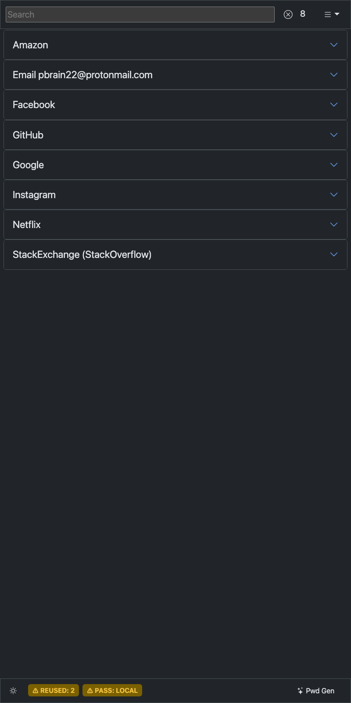

_PAM_ presents the records as an accordion. Each record
is one entry in the accordion that you can expand to view the record fields
or [delete](#delete-record),  [deactivate](#deactivate-record), [clone](#clone-record) or
[edit](#edit-record)
 the record.

To get the information for an account you click or tap the button.

At the top of the screen is the search bar and, at the far right, the
menu.

At the bottom of the screen is a status and controls section that shows status
messages. On the right side of the status and controls section are two buttons: the
dark/light mode toggle and a **✨ Pwd Gen** button that opens a
standalone password generator. The standalone generator is useful when
creating a new account somewhere and you need a strong password before
you have a PAM record to attach it to. Click a generated password to
copy it to the clipboard, then paste it wherever you need it.

### Expanded View of a Record
Click or tap a record to expand it. Below, the "Facebook" record has been
tapped: the other records stay collapsed above and below it, and its fields
appear indented beneath the title.

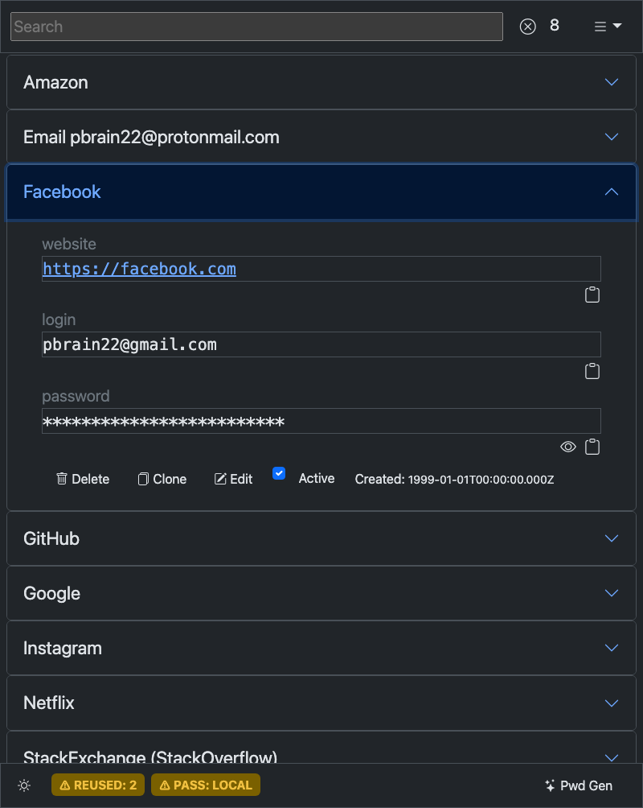

The Facebook record has three fields — `website`, `login` and `password` —
each shown as a label with its value below it, in the order they were defined.

**The clipboard icon**

sits at the right-hand end of every field, just below the value. Click or tap
it to copy that field to the clipboard so you can paste it into a login page.
A confirmation appears briefly in the
[status area](#layout) at the bottom of the screen.

**The eye icon**

appears only on password fields, immediately to the left of that field's
clipboard icon. Passwords are masked by default so they are not visible to
casual observers. Click or tap the eye to reveal the value; the icon becomes
an eye with a slash through it

and clicking again re-hides it. Copying always copies the real password,
whether it is shown or hidden.

**Three buttons sit below the last field**, in this order:

| Button | Effect |
|---|---|
| &nbsp;Delete | delete the record, after a confirmation |
| &nbsp;Clone | copy the record to a new title |
| &nbsp;Edit | change the record's fields |

To their right is the **Active** checkbox, and below it the date the record was
created. Clearing Active deactivates the record — see
[Deactivate Record](#deactivate-record).

The fields _in_ records are completely customizable when you select the `"Edit"` option.

Fields are added _to_ the record from the **New Field** drop down menu at the
top of the Edit dialogue, below the record title. Choosing a predefined name
sets both the field's name and its type. See the
[Custom Fields](#custom-fields) and [Field Types](#field-types) sections for
details.

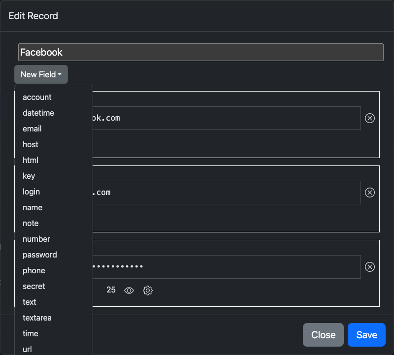

Existing fields are edited in place: change a name or a value by typing in it,
reorder fields by dragging the handle on the left of each one, and remove a
field with the

**Delete Field** button inside it.

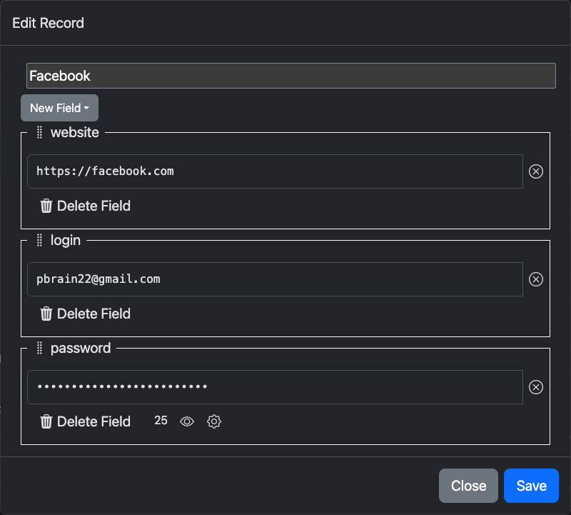

## Topics

Topics define how records are related. They provide a convenient
abstraction for organizing related records in files.  Topics are
completely arbitrary. For example a topic could be something like
_"recipes"_ or _"accounts"_ or _"unidentified aerial phenomena"_ or
_"my favorite cryptography algorithms"_ or _"green things"_.

One way to use topics is to keep records related by a topic in separate
files. For example, you could define a "`recipes.txt`" file for all of
your recipe records (topic: _"recipes"_ or _"stuff to cook"_) and an
"`accounts.txt`" for your account records (topic: _"accounts"_).

Or, you could completely disregard organizing by topics and put all of
your records into a single file like "`myrecords.txt`".

Note the use of the "`.txt`" extension in the previous paragraphs.
Although the "`.pam`" file extension is supported for record files
and it works on laptops. It does not always work on mobile devices
so a records file named "`myrecords.pam`" might not be readable
by the mobile browser. Thus, I recommend using the "`.txt`" for all
record files for maximum portability.

## Fields
Records are composed of fields. Each field has a unique name, a type
and a value.

The field _name_ is arbitrary and is meant to describes how the data in the
field is used. For example, an "ingredients" field would indicate that the value
is a list of ingredients and a "number" field would indicate that the value
is a number. An example of a field _name_ might be "mobile phone".

The field _type_ explicitly describes the type of data that field
holds like a "number" or a "phone" or an "email". Types are
built in and strictly enforced by javascript.

An example of the difference between a _name_ and a _type_ would be a
field named "mobile" of type _phone_.  The name describes _how_ it is
used whereas the type describes _what_ the input type is which, in
turn, dictates what user inputs are acceptable.  A description of each
built in record field type can be found in the
[Field Types](#field-types)
section.

The field _value_ is the unique value for the field in an individual
record that is set when a field is created or edited. For example, an
field named "email" of type "email" could have a value "wombat@foo.io"
the _name_ and the _type_ could be the same for all records that had an "email"
field but the _value_ would vary.

The default record fields are the fields that are available in the
`"New Field"` pull down menu when a record is created or edited. They
are defined in the
[Preferences](#preferences)
section and they are stored in each records _file_ along with the
records so each records file can have different default fields.

For example a file of recipe records would probably want fields of
type _"textarea"_ named "ingredients" and "instructions" but a file of
_"books read"_ records probably would not. Instead it might want
_"text"_ fields named "author" and "publisher" along with, possibly, a
field of type _"number"_ named "copyright".

See the [Record Fields](#record-fields-preferences) section for details about how
to add or modify the default record fields in the preferences dialogue.

There is a second more obscure way to define field names. You can
change field names _when you create or edit an individual record_ by
setting the
[Enable Editable Field Name](#enable-editable-field-name)
preference.

This capability is _not_ enabled by default, to avoid confusion between the
**Name** input and the **Value** input. With it off, only the Value input is
shown and the field name appears as a fixed label above it. With it on, each
field gains a Name box above its Value box, and the field name is edited there:

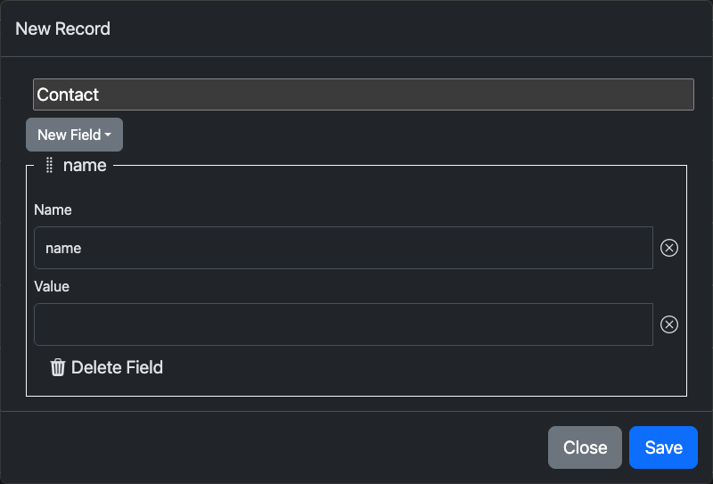

Typically there is no reason to change record field names on a per record
basis, and doing so is not recommended — it is better to add the field names
you want to the default list in
[Record Fields](#record-fields-preferences) preferences, where they apply
consistently across every record.

### Field Types

Record field types define the type of each field that you define for a
record. They are based on HTML _input_ element types except for the
_"textarea"_ type which is a HTML _textarea_ element that is displayed
as _preformatted_ text (&lt;pre&gt;&lt;/pre&gt;) and the _"html"_ type
which is also a HTML _textarea_ type but is displayed as raw HTML so
it can be used for inserting images. They are presented below as
simple types regardless of the underlying HTML element to avoid
unnecessary complexity.

You can change, add or delete record field _names_ here if you wish to
customize the user experience but you cannot change the built in
_types_. For example, you change the record field name _"note"_ from a
_"textarea"_ field to a _"text"_ but there is no way to add a new built in
type to the drop down list from the user interface.

These are the default field definitions.

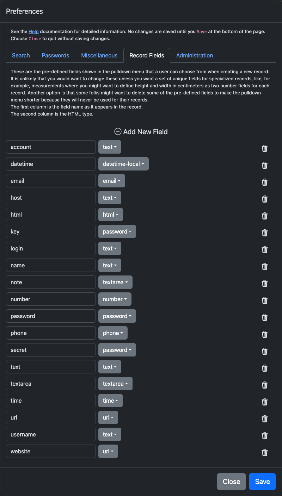

The table below presents a brief overview of the default record
fields and their associated built in types and when to use them. You
can search the web for more details about
[HTML input types](https://developer.mozilla.org/en-US/docs/Learn/Forms/HTML5_input_types).

| Type | Usage |
| ---- | ----- |
| datetime-local | A datetime text string. Use it if you _only_ want to accept a datetime value. A typical usage might be the date that you finished reading a book. |
| email | An email text string. Use it if you _only_ want to accept an email value. A typical usage might be the email address of a contact. |
| html | Textarea data that is rendered directly as HTML. A typical usage might be to reference an image or to display formatted text. |
| number | A numeric value (integer or decimal). PAM validates that the value is a valid number before saving — non-numeric input will be rejected with a clear error message. A typical usage might be a measurement like height or width or a copyright year. |
| password | A secret text string that is normally displayed as asterisks (`****`) with an eye () button that can be clicked or tapped to show the value. |
| phone | A phone number text string. Use it if you _only_ want to accept a phone number value.  A typical usage might be a mobile phone number. |
| text | A string, like a name or keyword. You can use this for any text but it is especially useful when a field can be multiple types like an email or a name. A typical usage might be a login name where the value might be a name like "wiley" or an email like "wcoyote@acme.io" or a number like "12345678". |
| textarea | A multi-line text box. A typical usage might be a note or a list of recipe ingredients. |
| url | A text string that is a uniform resource locator (URL). Use it if you _only_ want to accept a URL value. A typical usage might be the path to an account like `https://google.com` |
| username | A username. This may be slightly different than a login because a login could be an email address but, in general, it probably makes more sense to user `login` rather than `username`. |

Remember that the types were not made up by me, they were
taken directly from input element description
[here](https://developer.mozilla.org/en-US/docs/Web/HTML/Element/input),
the separate textarea element is described
[here](https://developer.mozilla.org/en-US/docs/Web/API/HTMLTextAreaElement).


### Custom Fields
It is oftentimes the case that all of the _default_ record fields are
not needed for the records you are managing or you may want to define
new, custom fields that are more intuitive for your records. This
section shows you how to do that.

Here is an example that shows a recipe record with "ingredients" and
"instructions" fields.


Here is what the preferences look like after "ingredients" and "instructions" record fields
have been added and the previous default record fields other than _"html"_ have been pruned out.


Here is an example that shows an account record with "url", "login"
and "password" record fields.


Here is what the preferences look like with the other fields pruned out.
The "url", "login" and "password" record fields are part of the default.

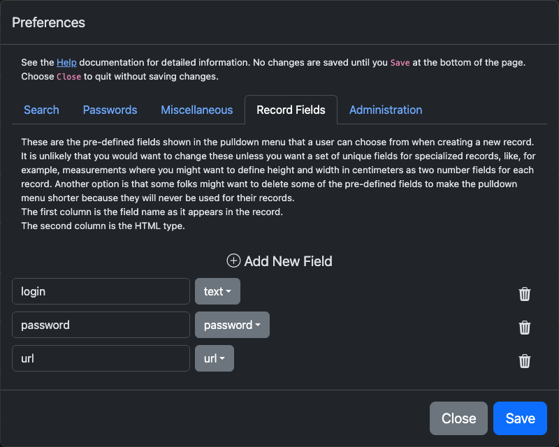

This is what they will look like in the `"New Record"` pull down menu
when creating or editing a record.

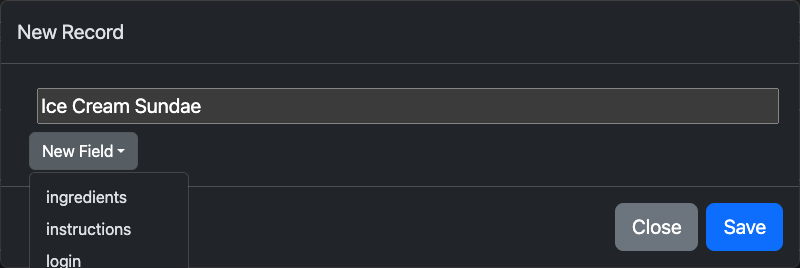

## Password Fields

Password fields are a special case for the following three reasons.

First, they provide a generator that allows you to automatically
create passwords at the click or tap of a button.
For information about preferences that can be used to customize
password generation see
[Password Preferences](#password-preferences)

Second, they always hide the value by default so that it can be seen
by someone observing your screen.

And, finally, because they provide the ability to generate two
different types of passwords: cryptic and memorable.

### Cryptic Passwords
Cryptic passwords consist of letters, digits and
special characters.

Here is an example: `'N5yAb!XfGa3vELPsK95K4/AAz8mts'`.

Cryptic passwords tend to be hard to memorize for most people.

They are perfect for cases where you don't have to type the
password in because they are hard to crack.

### Memorable Passwords
Memorable passwords are used to define passwords that must
be typed in manually, as described in the
[Reason 4: Automatic Password Generation](#reason-4-automatic-password-generation)
section which means that it is important that they are secure, easy to
type and to remember.

They are composed of common lower case English words with an
optional prefix, an optional separator between each word and an
optional suffix. Often, the prefix and suffix are used to guarantee that the password
contains the correct mix of characters that the authentication system
requires, like, at least one capital letter, at least one digit and at
least one special character.

The security rationale for memorable passwords is described in this article:
[The logic behind three random words](https://www.ncsc.gov.uk/blog-post/the-logic-behind-three-random-words).

Here is an example: `'Z0/rebates/restructuring/jamaica??'` where the prefix is `'Z0/'`,
the separator is `'/'` and the suffix is `'??'`.

Memorable passwords tend to be easier to memorize than cryptic
passwords for most people.

### Hidden Password Representation
Here is an example that shows a password in its standard hidden form.


To make the password visible, click or tap on the
 icon.

The password can be copied to the clipboard when it is hidden by
clicking on the

icon.

### Visible Password Representation
Here is an example that shows a password in its visible hidden form.

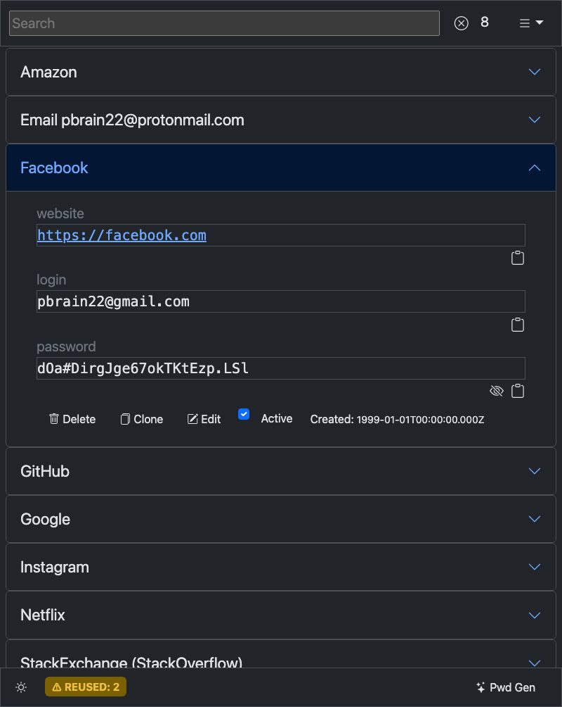

The password can be copied to the clipboard by clicking on the

icon.

To hide the password, click or tap on the
 icon.

### Password Generator
PAM has two password generators:

1. **Record field generator** — opened by clicking the

icon on a password field inside a record. The generated password is
inserted directly into the field when you click it.

2. **Standalone generator** — opened by clicking the **✨ Pwd Gen**
button in the toolbar footer. Use this when you need a strong password
for a new account before you have created a PAM record for it. Click
any generated password to copy it to the clipboard.

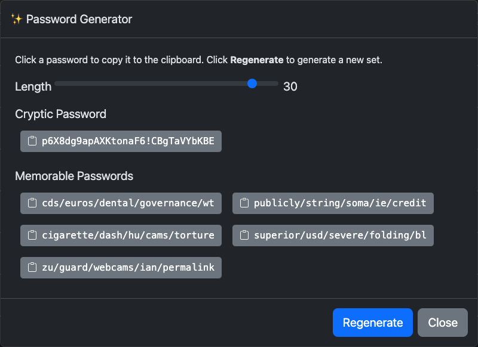

Both generators produce the same set of options: one cryptic password
and five memorable passwords.

This is what the record field password dialogue looks like with no generator.

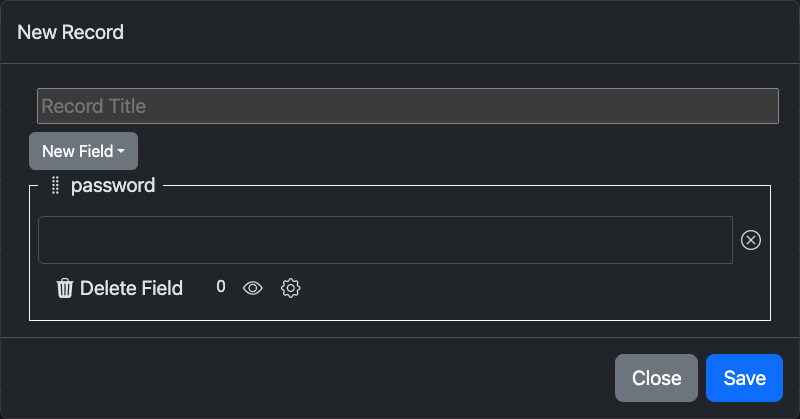

When you click or tap on the  icon,
cryptic and memorable passwords are generated and the password
generator dialogue appears.

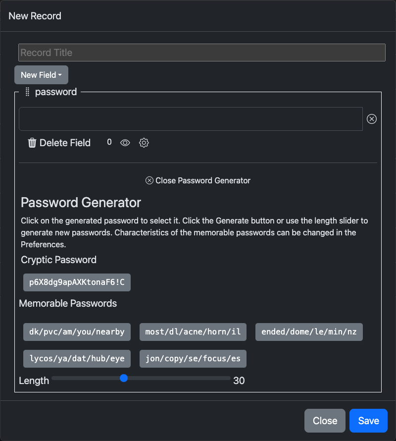

It always generates five memorable passwords to provide
choices. I found that more useful than the original
implementation which only had a single choice.

> The decision to present five memorable passwords was completely
> arbitrary but it seems to work well enough for my needs and can easily be
> changed.

Click or tap on the <b>Regenerate</b> button to generate a new set of passwords.

To choose a generated password simply click or tap on it and it will
be added to the field value.

See the [Password Preferences](#password-preferences) section about
how to define the prefix and suffixes for memorable passwords.


## Layout
_PAM_ is a simple single page web application (SPA). It is laid out as three
stacked regions, described here from top to bottom.

**The menu and search section** runs across the top. On the left is the search
box, which filters records as you type. Next to it is a circled **✕** that
clears the search, followed by the number of records currently visible. On the
right is the **☰** menu button.

**The records section** fills the middle and takes up most of the screen. Each
record is one row showing its title, with a chevron on the right to expand it.
Deactivated records are shown with an _*INACTIVE*_ prefix, or hidden entirely
depending on the
[Hide Inactive Records](#hide-inactive-records) preference.

**The status and controls section** is the footer. The dark/light mode toggle
is on the left, a status message area is in the centre, and on the right is the
**✨ Pwd Gen** button for the standalone password generator.

Warning badges also appear in the footer when the relevant preference is
enabled. Each marks a setting that trades some security for convenience:

| Badge | Preference | See |
|---|---|---|
| **⚠ PASS: LOCAL** | file password cached in `localStorage` | [filePass Cache Strategy](#filepass-cache-strategy) |
| **⚠ HTML ON** | HTML field values rendered as live HTML | [Allow HTML Field Rendering](#allow-html-field-rendering) |
| **⚠ PW SEARCH** | search matches against password values | [Search Password Field Values](#search-password-field-values) |
| **⚠ REUSED: _n_** | _n_ stored passwords are used more than once | [Reused Passwords](#reused-passwords) |

The **⚠ REUSED** badge is the odd one out: it reports a property of your data
rather than a setting you chose, and clicking it opens the
[Reused Passwords](#reused-passwords) report.

It looks something like this.


### Menu and Search Section
The top section that contains a search input
and a menu.

#### Search

_PAM_ allows you to search records by their title or their field
names and values to filter out records that do not match the search
pattern. This is extremely useful when the number of records
grows.

The search function at the top left supports case insensitive searches
and regular expressions to make it easier to find records.

This can be very helpful for finding out where old
passwords and obsolete accounts are still being used.

Here is the made up list of account records from the [Load Files](#load-file) example:


Here is the same list after filtering for those whose titles contain the
letter `"g"`. Note that searches are case insensitive but you can change
that by unsetting the [Case Insensitive Searches](#case-insensitive-searches)
preference.


To filter only those that start with `"g"` you
would use this regular expression search term instead: `"^g"`.
which would result in only two records found.

For more information about regular expression syntax see the documentation
for [Javascript Regular Expressions](https://developer.mozilla.org/en-US/docs/Web/JavaScript/Guide/Regular_Expressions).

For more information about how you control the all of
the available search options see the
[Search Preferences](#search-preferences)
section.

#### Menu

The menu at the top right is the control center for the application it
has a number of options as you can see below. This is what it looks
like.

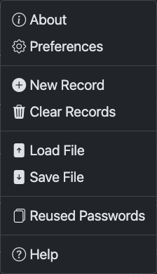

As you can see, there are nine menu options:

1. [About](#about)
1. [Preferences](#preferences)
1. [New Record](#create-new-record)
1. [Clear Records](#clear-records)
1. [Load File](#load-file)
1. [Save File](#save-file)
1. [Reused Passwords](#reused-passwords)
1. [Breached Passwords](#breached-passwords)
1. [Help](#get-help).

A tenth, **Print**, appears between Breached Passwords and Help when the
[Enable Printing](#enable-printing) preference is set. It is hidden by default.

Click or tap on the "&nbsp;About"
entry to see information about the app.
See the [About](#about) section for more details.

Click or tap on the "&nbsp;Preferences"
entry to see the preferences dialogue which allows you
to customize some of the app behavior. There is a lot of stuff so you might want
to read the [Preferences](#preferences) section before trying it.

Click or tap on the "&nbsp;New Record"
entry to create a new record.
See the [Create New Record](#create-new-record) section for more details.

Click or tap on the "&nbsp;Clear Records"
entry to delete all of the records.
This is useful for times when you want to create a new collection of
records that is saved in a separate file.  For example, if you wanted
to create a collection personal accounts in one file and a collection
shared accounts for a group of folks (like a development team sharing
AWS accounts).

Click or tap on the "&nbsp;Load File"
entry to load a records file.
See the [Load File](#load-file) section for more details.

Click or tap on the "&nbsp;Save File" entry
to save all of the records to a file.
See the [Save File](#save-file) section for more details.

Click or tap on the "&nbsp;Reused Passwords"
entry to see which stored passwords are used by more than one entry. A password
shared between entries is only as safe as the least safe of them. The check
runs entirely on your device.
See the [Reused Passwords](#reused-passwords) section for more details.

Click or tap on the "&nbsp;Breached Passwords"
entry to check your passwords against a corpus of passwords exposed in known
breaches. This entry is always present, but the check itself is **off by
default** — with it off, the entry opens a page explaining what would be sent
and what would not, so you can decide.
See the [Breached Passwords](#breached-passwords) section for more details.

Click or tap on the "&nbsp;Print"
entry to print your records. This entry only appears when the
[Enable Printing](#enable-printing) preference is set.

Click or tap on the "&nbsp;Help"
entry to see this help message.

### Records Section

Underneath the top level bar, in the middle, is the records
section. Each record is shown as an entry that is displayed by its
title.  If you click or tap on the record title, the record will
expand to show the record contents (fields) and provide options for
deleting, cloning or editing the record contents.

This way of presenting the records is called an accordion display.
Below you can see how it expands after the "Facebook" entry has been
selected, showing its three fields: `website`, `login` and `password`.


You can copy any field value to the clipboard so it can be pasted into a login
form, and the copy works for passwords whether they are visible or not. Click
or tap the title of an open record to close it again.

See [Expanded View of a Record](#expanded-view-of-a-record) for what each icon
and button does.

Each of the record management options is discussed in more detail in the
[Functions](#menu-functions) section.


### Status and Controls Section
Below the records section, at the bottom, is the status and controls section where
ephemeral status messages are displayed. The messages disappear after
about 1.5 seconds but the duration is controlled by a preference that
you can set. See the [Preferences](#preferences) section for more
information.

The status messages are used to provide activity feedback like showing
how many bytes were copied to a clipboard when a copy button is
clicked or tapped as shown in the example below.

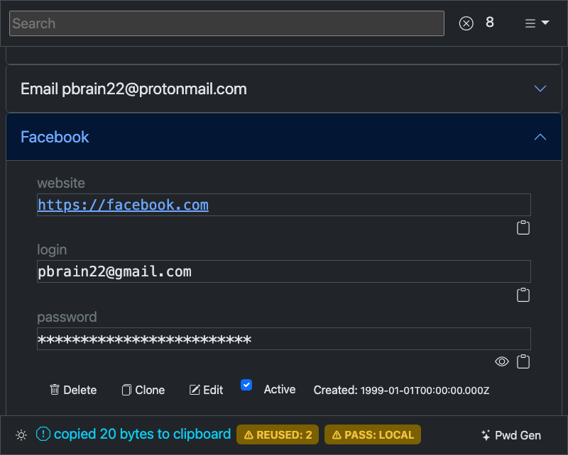

## Menu Functions
The following sections will go over the basic menu functions that _PAM_
provides.

In a nutshell they are:

1. [Display information About the application](#about)
1. [Create New Record](#create-new-record)
1. [Edit Record](#edit-record)
1. [Delete Record](#delete-record)
1. [Deactivate Record](#deactivate-record)
1. [Clone Record](#clone-record)
1. [Clear Records](#clear-records)
1. [Save Records](#save-file)
1. [Load Records](#load-file)
1. [Reused Passwords](#reused-passwords)
1. [Breached Passwords](#breached-passwords)
1. [Help](#get-help).

Each function will be discussed in a separate subsection below.

Note that Preferences were not included because they have their own
top level section in this document.

### About

click or tap on the "About" menu entry to get information about _PAM_.
You can even add custom HTML through the preferences that is stored
for each _PAM_ file.

Here is a screen shot of what you would normally see with no customization.
Of course details will vary, like the Commit, Branch or Version fields.

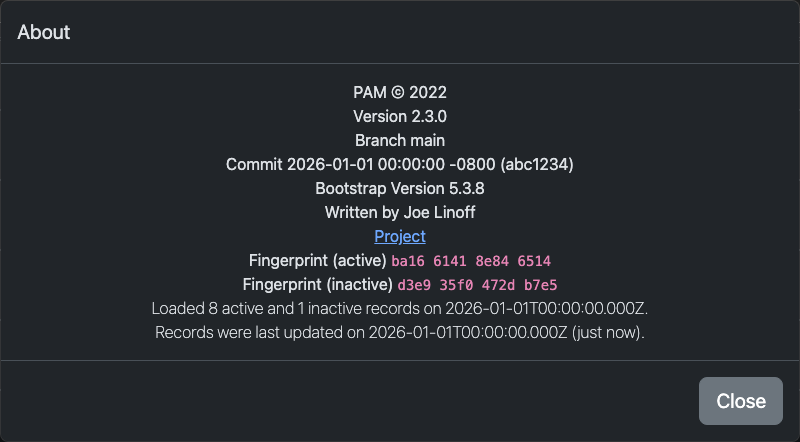

Here is the "About" dialogue with a simple custom message that uses
bootstrap formatting classes.

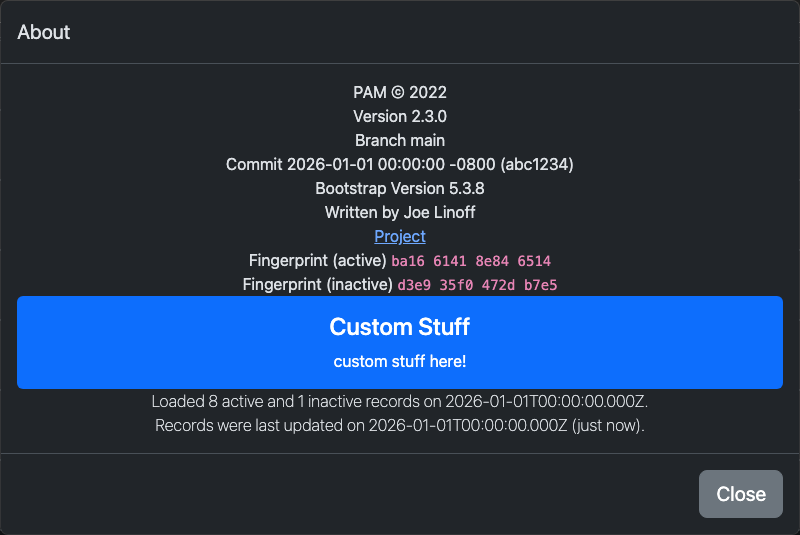

Custom messages are defined in the "Custom About" field in the
[Preferences](#preferences)
as shown below. You can used plain HTML or bootstrap 5 classes (as
shown in this example).

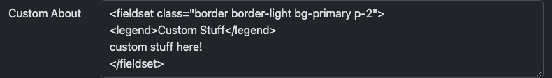

The motivation for allowing custom messages is that someone might want
to share a _PAM_ file or describe how the records are related. The
custom message would allow the person to provide their _imprimatur_ on
the collection.

### Create New Record

Before reading this section, please make sure that you are familiar
with the ideas covered in the [Topics](#topics), [Fields](#fields) and
[Password Fields](#password-fields) sections.

Creating a new record is a very common activity in _PAM_ so I tried to
make it as easy as possible.

There are three different methods you can use to create new records:

1. A record can be created in the application by clicking or tapping the "New Record" menu option,
2. A record can be created in the application by cloning an existing record or
3. A record can be created outside of the application by editing a JSON record file.

Each method is discussed in detail in the following subsections.

#### Method 1: Menu Approach

The first method, creating the record by clicking or tapping the "New
Record" menu option in the application, is probably the best way to
create the first new record for a topic family. This is also known as
the "menu" approach and is shown below.


To show how it works, we will create a recipe record using
"ingredients" and "instruction" fields. But first we need to define
them as default _"textarea"_ fields in the [Preferences](#preferences)
dialogue. So the available records look like this.


To create a new record using the menu approach, choose **New Record** from the
[menu](#menu-functions) — third from the top, below Preferences. That pops up a
dialogue that looks like this.

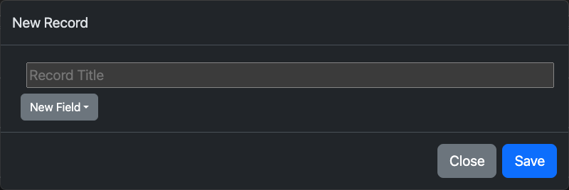

You can now type in the record title.

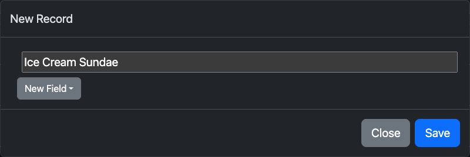

From there you click or tap on the `"New Field"` pulldown to select
and create the first record field. Don't worry if you select the wrong
one, they are easy to delete.

Here is where you select "ingredients" for the first field.


Populate it by typing into the _"textarea"_ box.

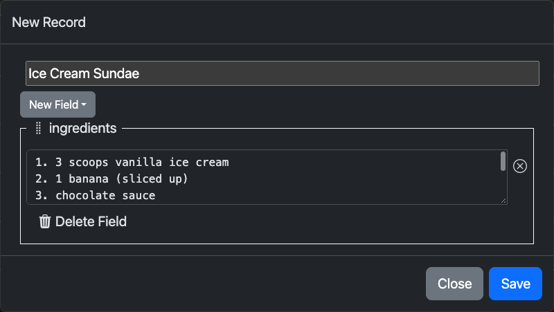

Now do the same thing to create an "instructions" field.

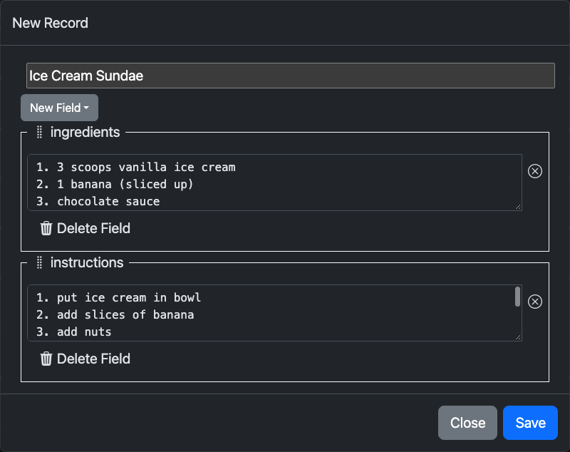

One interesting thing to understand is that you can _change the order
of the fields_ by dragging them up or down. To do that select the
field title at the top of the box (fieldset) and move it. This can
also be done when editing the record.

Here is what it looks like when I dragged the "instructions" field up.

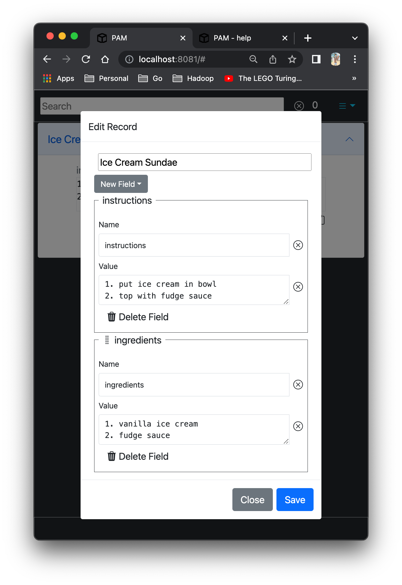

I then dragged "instructions" field back down because it should appear after
"ingredients" field.

When you are finished click or tap on the `"Save"` button to save it and you
will see it show up as a new record in the records part of the screen.

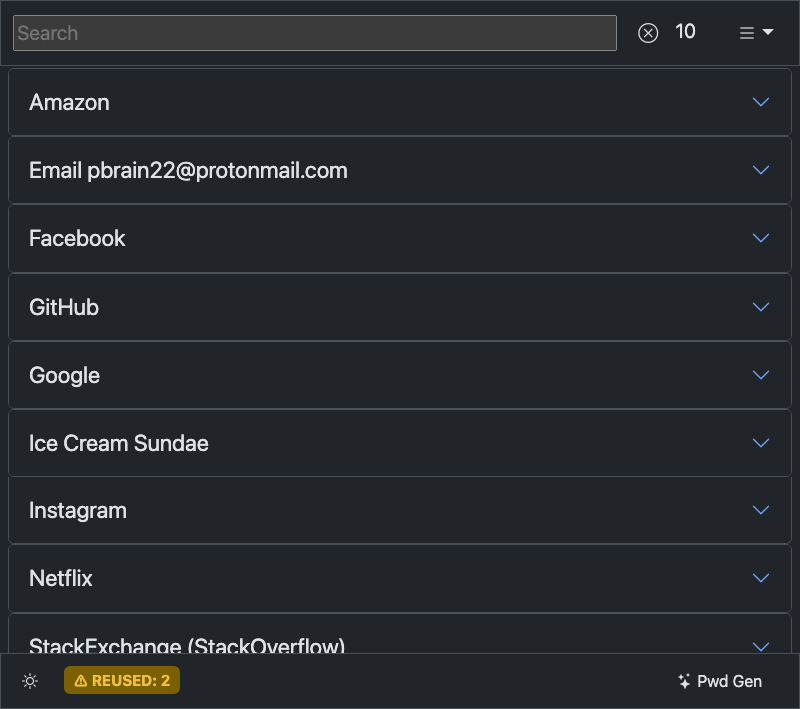

You can click or tap on the record to expand it and see the fields you just defined.

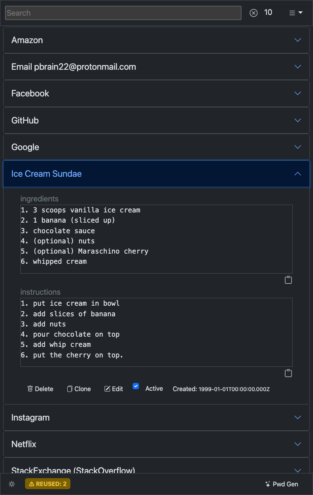

#### Method 2: Clone Approach

The second method, creating a record by cloning an existing record, is
useful when you want to use the same fields as the existing record. It
is a great way to guarantee uniformity. Although if the number of
fields is small using the first method is also fine.

Cloning a record is simple. Expand the record you want to copy and click or
tap the

**Clone** button — it sits below the last field, between **Delete** and
**Edit**, as described in
[Expanded View of a Record](#expanded-view-of-a-record).

Using the record that was created in the previous section, here is what happens
when you click or tap `"Clone"`.

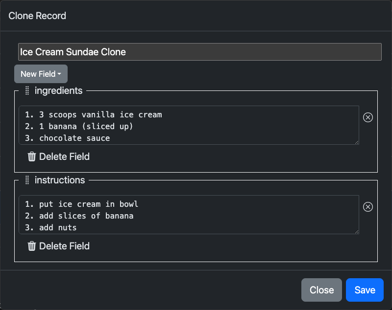

The clone operation created a new record with a
slightly modified title "Ice Cream Sundae Clone" _because the record
title must be unique_ and the same fields as the original record.

At this point you would typically change the title and field values
but for this demonstration will not do anything. _PAM_ makes sure that
the title is unique so it can be saved.

Click or tap the `"Save"` button and you will see this.

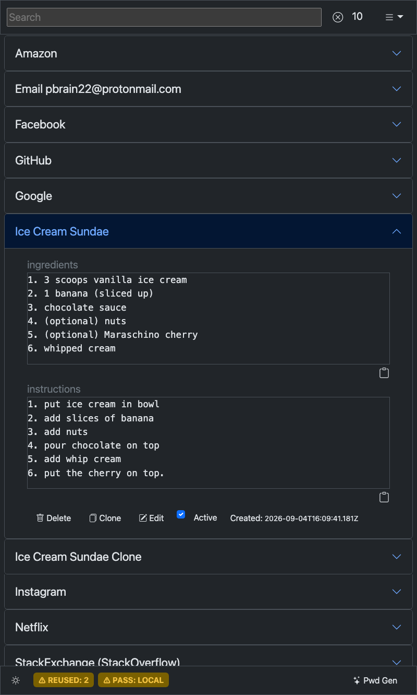

_PAM_ still remembers that you had the original record
open. Just below it you will see the new cloned record.

The reason that the original record is left open is so that it is easy
to continue clicking or tapping the `"Clone"` button to create more
records.

In this case we only care about one record so you can click
or tap on the new record to expand it.

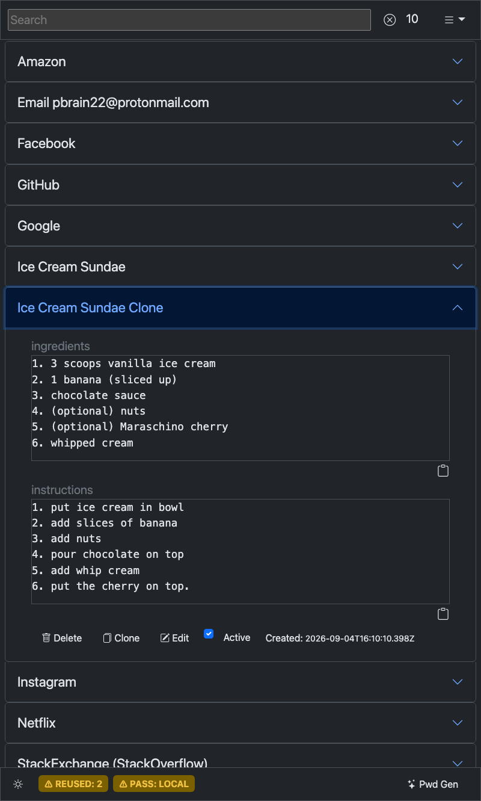

#### Method 3: JSON Approach

The third method, creating a record by editing a JSON record file, is most
useful if you are interested in creating records programmatically
(perhaps a subset of accounts that shared with a small group of users
that is automatically generated from a database). The example records
and recipes example files that are available in the "Load" dialogue
are a great place to start.

This approach does not have any screenshots because it deals with
_PAM_ internals and may change from time to time. Instead a set of instructions
is provided that should allows you to figure it out pretty easily.

1. Create one record using the menu approach or use one the examples from the "Load" dialogue.
2. Save the record to a file _without a password_.
   Normally this is a very bad idea because it could expose your data
   to a hacker so take precautions to protect the file.
3. Look at the "records" section of the file and use that as a template
   to create more records.
4. When you have finished adding the new records into the file,
   save the changes and then re-load the file in _PAM_.
5. Then save it again _with a password_.

The reason that this has to be done without a password is because
editing an encrypted file directly is not practical. If you need to
encrypt or decrypt a PAM file from the command line, see
[Decrypting and encrypting PAM files from the command line](#decrypting-and-encrypting-pam-files-from-the-command-line).

<details>
<summary>Click here to see an example javascript file</summary>

Beware! That the format of this record may change. This is just an
example that shows how simple the format is.

```javascript
{
  "meta": {
    "date-saved": "2022-05-01T20:50:29.125Z",
    "format-version": "1.0.0"
  },
  "prefs": {
    "passwordRangeLengthDefault": 20,
    "passwordRangeMinLength": 12,
    "passwordRangeMaxLength": 32,
    "memorablePasswordWordSeparator": "/",
    "memorablePasswordMinWordLength": 2,
    "memorablePasswordMinWords": 3,
    "memorablePasswordMaxWords": 5,
    "memorablePasswordMaxTries": 10000,
    "clearBeforeLoad": true,
    "loadDupStrategy": "ignore"
  },
  "records": [
    {
      "title": "Amazon",
      "fields": [
        {
          "name": "url",
          "type": "url",
          "value": "https://www.amazon.com"
        },
        {
          "name": "username",
          "type": "text",
          "value": "pbrain22@protonmail.com"
        },
        {
          "name": "password",
          "type": "password",
          "value": "hr5Hn9pqm3u.VqMiALfdN-\""
        },
        {
          "name": "note",
          "type": "textarea",
          "value": "Lorem ipsum dolor sit amet, consectetur adipiscing elit.\nCras sodales elit in metus tempus, ut semper magna finibus.\nDonec aliquam elementum velit quis pharetra.\nPellentesque accumsan neque ut massa elementum mollis.\nNulla eget pellentesque est."
        }
      ]
    },
    {
      "title": "Email pbrain22@protonmail.com",
      "fields": [
        {
          "name": "url",
          "type": "url",
          "value": "https://mail.protonmail.com/inbox"
        },
        {
          "name": "login",
          "type": "text",
          "value": "pbrain22"
        },
        {
          "name": "password",
          "type": "password",
          "value": "rHfZ6bihw$g8ra$P4hHD"
        }
      ]
    },
    {
      "title": "Facebook",
      "fields": [
        {
          "name": "url",
          "type": "url",
          "value": "https://facebook.com"
        },
        {
          "name": "login",
          "type": "text",
          "value": "pbrain22@gmail.com"
        },
        {
          "name": "password",
          "type": "password",
          "value": "dOa#DirgJge67okTKtEzp.LSl"
        }
      ]
    },
    {
      "title": "GitHub",
      "fields": [
        {
          "name": "url",
          "type": "url",
          "value": "https://github.com"
        },
        {
          "name": "login",
          "type": "text",
          "value": "pbrain22"
        },
        {
          "name": "password",
          "type": "password",
          "value": "Aq7GdcOmYWVkyHEWEk6fBeJzm"
        }
      ]
    },
    {
      "title": "Google",
      "fields": [
        {
          "name": "url",
          "type": "url",
          "value": "https://google.com"
        },
        {
          "name": "login",
          "type": "text",
          "value": "pbrain22@gmail.com"
        },
        {
          "name": "password",
          "type": "password",
          "value": "NIJMeb8OfXEfshOG$db!"
        },
        {
          "name": "note",
          "type": "textarea",
          "value": "This is my primary email address.\nsecurity question:\n> what is a photon? gauge-boson"
        }
      ]
    },
    {
      "title": "Netflix",
      "fields": [
        {
          "name": "url",
          "type": "url",
          "value": "http://netflix.com"
        },
        {
          "name": "login",
          "type": "text",
          "value": "pbrain22@gmail.com"
        },
        {
          "name": "password",
          "type": "password",
          "value": "cGwJ$NPQ4SsI#haEsFRD"
        }
      ]
    },
    {
      "title": "StackExchange (StackOverflow)",
      "fields": [
        {
          "name": "url",
          "type": "url",
          "value": "https://stackoverflow.com"
        },
        {
          "name": "login",
          "type": "text",
          "value": "pbrain22@gmail.com"
        },
        {
          "name": "password",
          "type": "password",
          "value": "FpnzQcuq0nk/PxlMdYJ_itnK"
        }
      ]
    }
  ]
}
```

</details>

### Edit Record
To edit a record, select it from the records list and click or tap on the `"Edit"` button
to popup the edit dialogue _which is exactly the same_ as the dialogue used to
create a new record.

In fact, it is implemented using the _same code_ so you can use the
instructions from the [Create New Record](#create-new-record) section to
understand how to change or add new fields.

### Delete Record
To delete a record, select it from the records list and click or tap on the `"Delete"` button.

_PAM_ will ask you to confirm before deleting the record. Click `OK` to confirm or `Cancel` to keep the record.

**Beware the record is deleted permanently and cannot be recovered once confirmed!**

### Deactivate Record
To deactivate a record click on the Active checkbox to make the record inactive.
Inactive records are considered deactivated.

Deactivated records are the same as deleted records because they do not show up in the
records list but they can always be recovered by going to
[Preferences](#preferences)
and unchecking the
[Hide Inactive Records](#hide-inactive-records)
entry.
Each deactivated record will be labeled with
a <small>*INACTIVE*</small> prefix.

### Clone Record
To clone a record, select it from the records list and click or tap on the `"Clone"` button.
This will create a new record that you can edit.

The clone operation is described in detail in the
[Create New Record](#create-new-record) section
under the  [Method 2: Clone Approach](#method-2-clone-approach)
subsection.

### Clear Records
Clear all of the records currently defined.

This is normally done automatically when a new file is loaded but
could be useful if you want to enter new a set of records from scratch
using the currently defined fields. Of course, you could simply delete
all of the records manually but this is simpler.

To clear all records choose the
"&nbsp;Clear Records"
option from the menu. See the [Menu](#menu) section for screenshots.

This option will ask you to confirm.

### Save File
To save records and preferences to a file by choose the
"&nbsp;Save File"
option from the menu. See the [Menu](#menu) section for screenshots.

This is the save file dialogue.

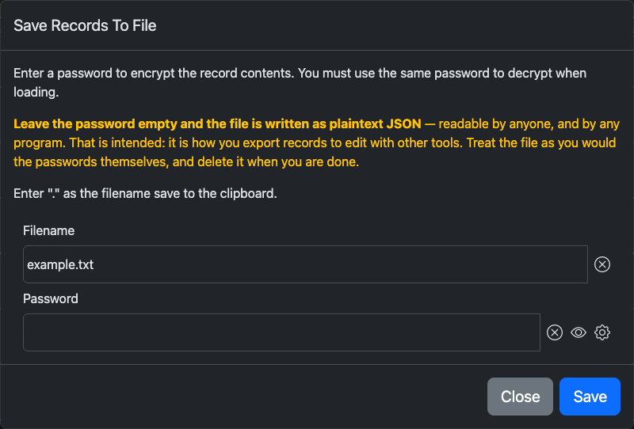

If you want the records to be encrypted, enter or generate a password
as described in [Password Generator](#password-generator) section.

If you want to copy the records to the clipboard enter a dot `"."`
as the filename.

Make sure that you do not forget this password. It is the _master_
password this is used to unlock all of the records and _PAM_
does _not_ keep track of it. That means that if the password is lost,
_PAM_ cannot recover the data it is lost forever.

More details about the encryption algorithm used can be found in
[Reason 6: Secure Context Encryption](#reason-6-secure-context-encryption).

Note that if you do not enter a password, the output will be plain
javascript that can be read by anyone.

Plain javascript is _NOT_ secure.

If you have records with passwords _ALWAYS_ use a password unless you
understand the consequences. For example, saving the data without a
password can sometimes be convenient because it allows you to see how
the _PAM_ data is organized which can aid automation.

### Load File
To load records and preferences from a file by choose the
"&nbsp;Load File"
option from the menu.  See the [Menu](#menu) section for screenshots.

This is the load file dialogue.

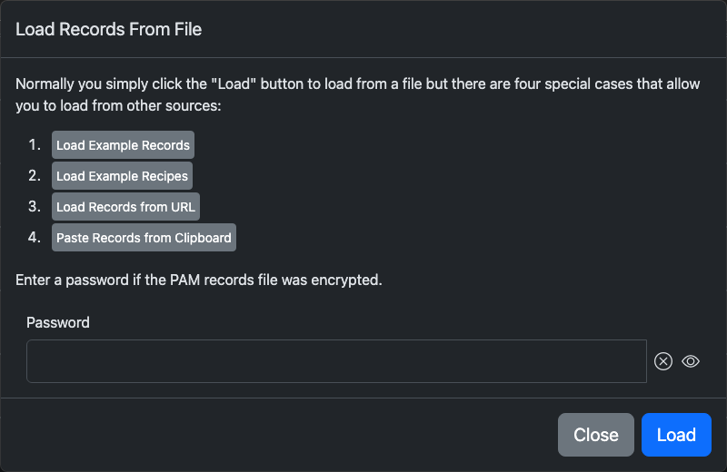

If the file was saved with a password, you must enter that password or
the file will prompt for the password when loading.

##### Load Example Records
If you wish to load the example records file, click or tap on the
"Load Example Records" button (#1) to load the following example
records that can be used to get you started.


##### Load Example Recipe
If you wish to load the example recipes file, click or tap on the
"Load Example Recipes" button (#2) and PAM will load this.


##### Load Records from URL
Click or tap on the "Load Records from URL" button (#3) to load a
file from the web.

This is typically used when a PAM records file is shared because
no changes can be made.

##### Paste Records from Clipboard
Click or tap on the "Paste Records from Clipboard" button (#4) to
paste records from the clipboard.

This is typically used when records are copies to the clipboard
from a save operation or manually after editing.

### Reused Passwords
A password shared between entries is only as safe as the least safe of them:
if any one of those sites is breached, every entry in the group is exposed.
PAM finds these locally — no network request is made and nothing leaves the
device.

When any stored password is used more than once, a **⚠ REUSED: _n_** badge
appears in the [status and controls section](#layout), where _n_ counts the
_fields_ involved rather than the groups. Choosing **Reused Passwords** from
the menu, or clicking the badge, opens the report.

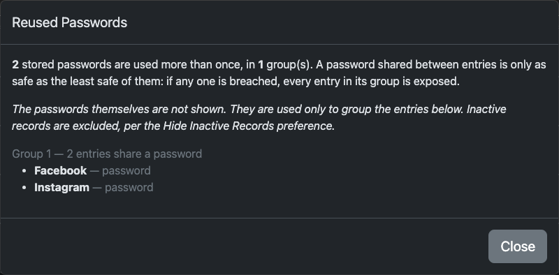

Entries are listed by record title and field name, grouped by the password
they share. **The passwords themselves are never shown** — they are used only
to group the entries.

Reuse is a property of a _field_, not a record. One record may hold several
password fields, and two fields in the same record can share a value, so a
group can name the same record twice.

Inactive records are excluded when
[Hide Inactive Records](#hide-inactive-records) is set: a deactivated record
is a retired credential, and reporting a collision with one would be noise.
The dialogue says so when it applies.

The badge can be turned off with the
[Show Password Reuse Warning](#show-password-reuse-warning) preference. That
suppresses the badge only — the check still runs and the report is still
available from the menu, so there is no state in which PAM knows about reuse
and cannot tell you.

### Breached Passwords

Checks your stored passwords against the
[Have I Been Pwned](https://haveibeenpwned.com/) corpus, and against local
structural checks that need no network. Turn it on in
[Preferences → Administration → Enable Password Breach Check](#enable-password-breach-check);
it is off by default.

The menu entry is always present. With the preference off it opens a page
explaining what the feature would send and what it would not, so the disclosure
appears when you are deciding rather than only in this document. **Nothing is
sent while the preference is off, and nothing is sent by opening the report.**

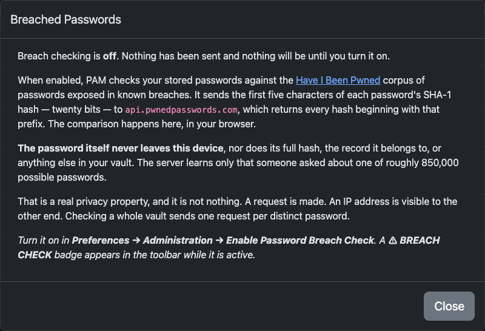

With it on, the report says how many requests a check would need — one per
distinct password, so a password shared by three records costs one — and waits.

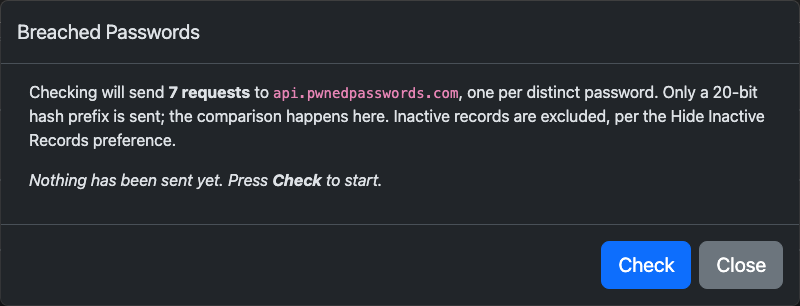

Press **Check** to start. Requests are sent one at a time with a short pause
between them; a few hundred passwords takes about a minute. **Cancel** stops
after the current request, and closing the dialogue stops it too.

Each result is labelled:

| Label | Meaning |
|---|---|
| **⚠ BREACHED** | found in the corpus; it is published, change it |
| **⚠ WEAK** | not in the corpus, but the local checks objected |
| **could not check** | the lookup failed; **nothing was learned** about it |

The last is not a verdict. It is _PAM_ reporting that it failed to reach one,
and it is never merged with the clean result — if you were offline, the report
says so rather than implying your passwords are fine.

### Get Help
To get this help message, choose the `"Help"` option from the menu.

If you find a bug or want to request a change or submit an improvement,
go to the [Metadata section](#pam) at the top of
this help and click or tap on the project link.


## Preferences
Preferences allow you to customized the behavior of the app.
The defaults are set so that most people will never have to change anything.

The preferences dialogue is a big one. It is broken into 4 sections
to make it easier to understand:

1. Search - preferences that control searches.
1. Passwords - preferences that control password creation and length.
1. Miscellaneous - preferences for other stuff.
1. Record Fields - the definitions of the available fields.

Each preference is discussed in more detail in the subsections below.

### Search Preferences
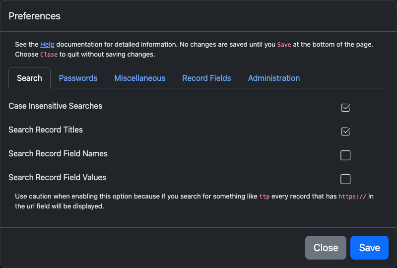

These preferences control search options.
See the [Search](#search) section for an example.

#### Case Insensitive Searches
If enabled, all searches are case insensitive, otherwise they are case sensitive.

The default is enabled.

#### Search Record Titles
If enabled, all searches look at the record titles, otherwise they do not.

The default is enabled.

**Turning this off also disables selecting records from the reports.** Clicking
a group in [Reused Passwords](#reused-passwords), or an entry in
[Breached Passwords](#breached-passwords), works by putting a search pattern
built from the record titles into the search box — which finds nothing if
titles are not searched. Rather than filtering your records down to an empty
list, _PAM_ shows those entries as plain text instead of clickable ones and
says why at the top of the report.

#### Search Record Field Names
If enabled, all searches look at the record field names, otherwise they do not.

The default is not enabled.

You would want to enable this you wanted to see records that contained a specific field.

#### Search Record Field Values
If enabled, all searches look at the record field values, otherwise they do not.

The default is not enabled.

You would want to enable this you wanted to see records that contained a specific field
value like an obsolete email or really old password.

### Hide Inactive Records
Each record in PAM allows you to set it as Active or Inactive.
Inactive records are also called deactivate.

If this checkbox is set those inactive records invisible.

When disabled this checkbox allows you to view all of the inactive records.

Note that each inactive record will have a <small>*INACTIVE*</small> prefix.

### Password Preferences
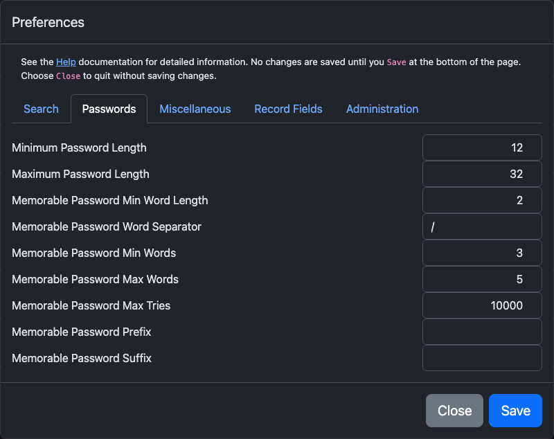

These preferences control automatic password creation.

For more information about passwords see [Password Fields](#password-fields)

#### Minimum Password Length
Defines the minimum length of generated cryptic and memorable passwords.

The default is 12.

I would recommend not making it shorter than the default unless a website
specifically demands it because shorter passwords are easier to crack.

#### Maximum Password Length
Defines the minimum length of generated cryptic and memorable passwords.

The default is 32.

I would recommend making it longer than the default if you can but many
websites have an upper bound for the length of password.
The chosen default seems to work for most of them.

#### Memorable Password Min Word Length
Defines the minimum size of a word in a generated memorable password.
> It has no affect on cryptic passwords.

The default is 2.

If you do not want short words like `'as'` or `'it'`, then make this longer.
I would not recommend making it shorter.

#### Memorable Password Word Separator
The string used to separate the words in a generated memorable password.

> It has no affect on cryptic passwords.

The default is a single character: `'/'`.

If you want to change the character, add any string that you like. It can be multiple
characters.
Other reasonable choices might be `':'` or `'.'` or `'@@'` or whatever you like.
It is best not to use letters.

#### Memorable Password Min Words
The minimum number of words in a generated memorable password.

> It has no affect on cryptic passwords.

The default is 3.

#### Memorable Password Max Tries
The maximum number of attempts to generate a memorable password
that meets the specified criteria from the other password preferences.

> It has no affect on cryptic passwords.

The default is 10000.

There is normally no need to ever change this but, if you change it
and make it too small, _PAM_ will report errors if it fails to
generate passwords after the maximum number of tries.

#### Memorable Password Prefix
The prefix to add to all generated memorable passwords.

The default is `''` (empty string).

You might want to add a prefix or suffix to make sure that the
generated passwords meet the requirements of websites that require
upper case letter, digits and special characters.

For example, you might specify something like `'A1!!/'` to meet the
criteria which might create passwords like
`'A1!!/html/wishes/combined'` or `'A1!!/rebates/restructuring/jamaica'`.

#### Memorable Password Suffix
The suffix to add to all generated memorable passwords.

The default is `''` (empty string).

You might want to add a prefix or suffix to make sure that the
generated passwords meet the requirements of websites that require
upper case letter, digits and special characters.

For example, you might specify something like `'/A1!!'` to meet the
criteria which might create passwords like
`'html/wishes/combined/A1!!'` or `'rebates/restructuring/jamaica/A1!!'`.

### Miscellaneous Preferences
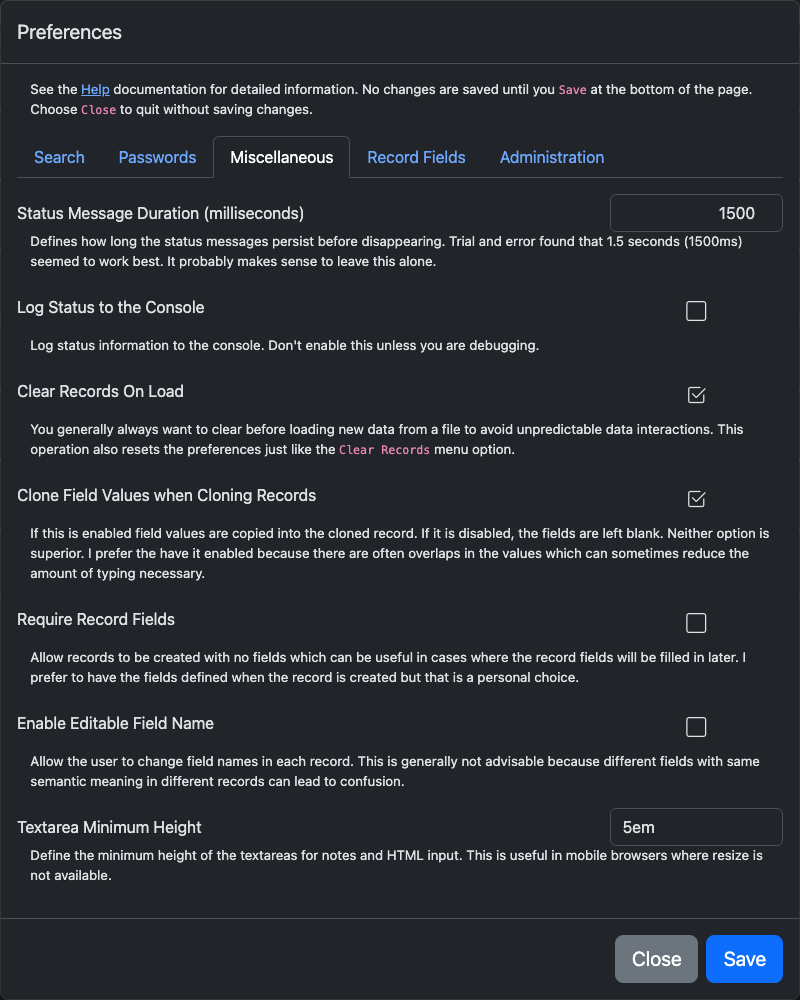

These are the preferences that didn't fall into the other categories.

#### Log Status to the Console
Log status messages to the console as well as the screen to aid
debugging.

The default is false which says do not log status messages to the
console.

You might want to enable console logging if you are debugging a
problem and are working in a browser that supports debugging.

#### Clear Records On Load
Clear all records before loading records from a file.

The default is true which says to clear the records before a loading
new records from a file.

If you set this to false, another option titled "Load Duplicate Record
Strategy" will appear that is not normally visible to ask you with
strategy you want to used for conflicts.

You might set this preference to false if you want to to merge sets of records
from different files.

#### Load Duplicate Record Strategy
This preference is not visible unless the "Clear Records On Load" preference is false.

It presents three strategies for handling duplicate records during a load operation: "allow",
"ignore", "replace".

The "allow" strategy allows duplicate records to exist by cloning them. For example
if a record with the title "Google" exists in the records and in the file being loaded,
the record from the file would be renamed to "Google Clone".

The "ignore" strategy ignores the duplicate record that is being loaded.
If there is a conflict it prefers the one already present.

The "replace" strategy ignores the duplicate record that already exists.
If there is a conflict it prefers the record being loaded.

#### Clone Field Values when Cloning Records
This preference specifies that all data is kept when cloning a record.

Remember that cloning a record is very simple and powerful way to
create new records with the same fields but you have to delete the
existing values before entering new ones which is very simple.

The default is false which says to keep the field values when cloning.

Set this preference if you want to avoid deleting the fields manually.

#### Require Record Fields
This determines whether a record can be created with no fields.

If it is true, then a new record must have a least one field defined.

The default is false which means that records can be created with no
fields so that records.

#### Enable Editable Field Name
This preference defines whether or not the user can change a field
name on a _per record_ basis.

Setting this preference is not recommended because the presence of the
"name" input can be confusing for users, a better approach is to
simply add a new field to the default fields in the preference section
as described in the
[Fields](#fields)
section.

##### Not Enabled
Unchecked, which is the default:


Each field in a record then shows only its **Value** box, with the field name
fixed as a label above it.

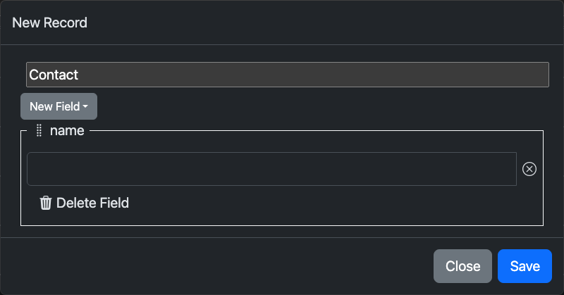

Record fields can then only be chosen from the list defined in preferences —
see [Record Fields](#record-fields-preferences).

##### Enabled
Checked:


Each field now shows a **Name** box above its **Value** box. The Name box holds
the field's label — in the example below, `name` — and can be replaced with
anything, such as "full name", "first name" or "last name". The Value box below
it still holds the data itself.


#### Textarea Minimum Height

Define the minimum height of the textareas for notes and HTML
input. This is useful in mobile browsers where resize is not
available.

### Administration Preferences
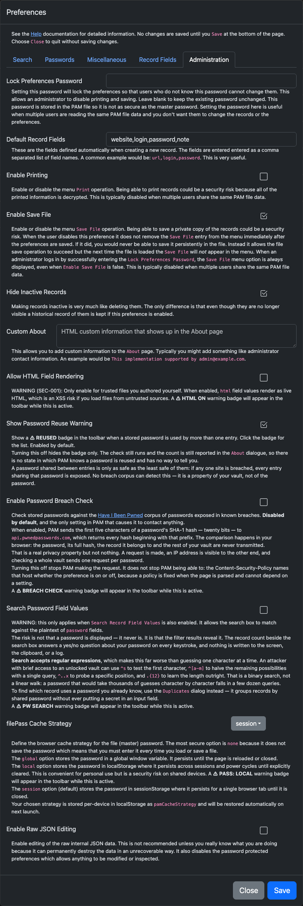

These are the preferences that are generally for site adiministration.

#### Lock Preferences Password
Click this to lock the Preferences dialogue so that only authorized users can change them.

Setting this password will lock the preferences so that users who do
not know this password cannot change them. This allows an
administrator to disable printing and saving. Leave blank to keep the
existing password unchanged. This password is stored in the PAM file
so it is not as secure as the master password. Setting the password
here is useful when multiple users are reading the same PAM file data
and you don't want them to change the records or the preferences.

#### Default Record Fields

These are the fields defined automatically when creating a new
record. The fields are entered entered as a comma separated list of
field names. A common example would be: `url,login,password`. This is
very useful.

#### Enable Printing
Click this to add the Print option to the menu.

Enable or disable the menu Print operation. Being able to print
records could be a security risk because all of the printed
information is decrypted. This is typically disabled when multiple
users share the same PAM file data.

This is what the enable printing preference (`Enable Printing`) looks like in the `Administration` preferences dialogue.

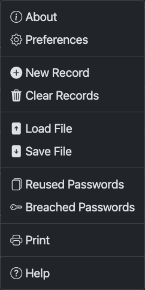

When you click on "Print", PAM will open a print-ready document showing
all visible records with passwords in plain text, formatted as a compact
two-column card layout suitable for estate planning. This is what it
looks like for the example records.

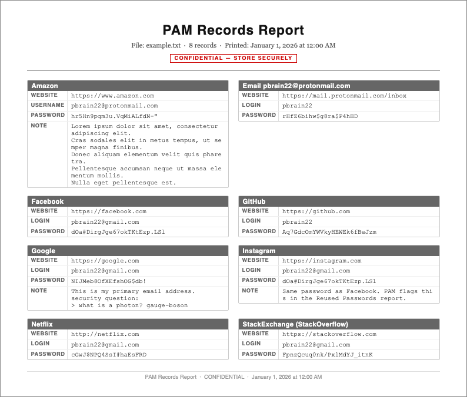

This capability is useful if you want a paper copy of your records but
it is a security risk. If you choose to enable this option, make sure
that the paper copy is stored securely.

Disable this option (the default) if you intend to share PAM records
with multiple users from a read-only URL.

#### Enable Save File

Enable or disable the menu "Save File" operation. Being able to save a
private copy of the records could be a security risk. When the user
disables this preference it does not remove the Save File entry from
the menu immediately after the preferences are saved. If it did, you
would never be able to save it persistently in the file. Instead it
allows the file save operation to succeed but the next time the file
is loaded the Save File will not appear in the menu. When an
administrator logs in by successfully entering the Lock Preferences
Password, the Save File menu option is always displayed, even when
Enable Save File is false. This is typically disabled when multiple
users share the same PAM file data.

#### Hide Inactive Records

Making records inactive is very much like deleting them. The only
difference is that even though they are no longer visible a historical
record of them is kept if this preference is enabled.

#### Custom About

This allows you to add custom information to the "About"
page. Typically you might add something like administrator contact
information. An example would be This implementation supported by
admin@example.com.

Its use is described in the [About](#about) section.

#### Allow HTML Field Rendering

WARNING (SEC-001): Only enable for trusted files you authored
yourself. When enabled, html field values render as live HTML, which
is an XSS risk if you load files from untrusted sources. A ⚠ HTML ON
warning badge will appear in the toolbar while this is active.

#### Show Password Reuse Warning

Show a ⚠ REUSED badge in the toolbar when a stored password is used by
more than one entry. Click the badge for the list. Enabled by default.

Turning this off hides the badge only. The check still runs and the
count is still reported in the About dialogue, so there is no state in
which PAM knows a password is reused and has no way to tell you.  A
password shared between entries is only as safe as the least safe of
them: if any one site is breached, every entry sharing that password
is exposed. No breach corpus can detect this — it is a property of
your vault, not of the password.

#### Enable Password Breach Check

Check stored passwords against the [Have I Been Pwned](https://haveibeenpwned.com/)
corpus of passwords exposed in known breaches. **Disabled by default**, and the
only setting in PAM that causes it to contact anything.

When enabled, PAM sends the first five characters of a password's SHA-1 hash —
twenty bits — to `api.pwnedpasswords.com`, which returns every hash in the
corpus beginning with that prefix, typically around eight hundred. The
comparison happens in your browser. The password, its full hash, the record it
belongs to, and the rest of your vault are never transmitted.

This is the range API's k-anonymity model. Five hex characters divide the corpus
into about a million buckets, so the server learns only that you asked about
one of the several hundred corpus entries sharing that prefix — or about some
password that is not in the corpus at all, which it cannot distinguish from the
first case.

That is a real privacy property, but it is not nothing. A request is made, and
an IP address is visible to the other end. Checking a whole vault sends one
request per **distinct** password: a password used by three records costs one
request, not three.

**Nothing is sent until you ask.** Opening the report does not contact anyone;
the requests begin when you press **Check** and stop when you press **Cancel**
or close the dialogue.

### What it checks besides the corpus

Being absent from a breach corpus is a low bar. `Summer2026` appears in no
corpus worth the name and is still a bad password, so PAM also applies checks
that need no network at all:

- keyboard runs (`qwer`, `asdf`)
- character sequences (`abcd`, `4321`)
- a character repeated four or more times
- an embedded year between 1900 and 2099
- a rough entropy floor of 60 bits, and a minimum length of 12

These run whether or not the corpus is reachable, and the report distinguishes
them: an entry is labelled **BREACHED** if it was found in the corpus and
**WEAK** if only the local checks objected. The reasons are listed either way.
The distinction matters because the urgency differs — a password in the corpus
is published, and whoever holds the dump has it.

### When the check cannot be made

_PAM_ is a progressive web app; being offline is a normal state, not an error.
A lookup that fails is reported as **could not check**, never as a clean
result, and the report says plainly that nothing was learned about those
passwords. If the corpus is unreachable when a run starts, _PAM_ says so once
rather than making several hundred requests that will all fail.

**What enabling it does not change.** The
[Content-Security-Policy](#content-security-policy) permits that host whether
the preference is on or off. The preference controls whether PAM makes the
request, not whether it is able to.

That is a limitation of the mechanism rather than a choice. A policy in a
`<meta>` tag is only honoured while the page is being parsed, so it cannot be
rewritten later from JavaScript. And when a page carries more than one policy,
a request must be permitted by *all* of them — so adding a policy can only
tighten, never relax. Both properties exist to stop an attacker widening the
policy from injected script, and the same mechanism prevents PAM narrowing it
conditionally.

A **⚠ BREACH CHECK** badge appears in the toolbar while this is enabled, in the
same style as the other warning badges, so an outbound-capable configuration is
never invisible.

Enabling it also adds a

button in three places, for checking a single password without running the
whole vault:

- **On every password field** in a record, beside the
  
  show/hide button.
- **In the record editor**, beside the
  
  password generator button. This is the most useful of the three: it is the
  last moment before a password is adopted, whether typed, pasted, or taken
  from the generator. The result clears as soon as you edit the value, because
  it would otherwise describe a password you no longer have.
- **In the [password generator](#password-generator)**, beside each suggested
  password.

All three are hidden while the preference is off, and the result appears beside
the password it describes.

The generator button is worth explaining, because a randomly generated password
is not going to be in a breach corpus. It is there for the **memorable**
passwords. A 20-character cryptic password carries around 130 bits of entropy;
three words drawn from PAM's 9,858-word list carries around 40. That is still a
reasonable password, but it is within reach of a corpus in a way the cryptic
one is not — and _PAM_'s local entropy estimate cannot see the difference,
because it measures length and character variety rather than recognising
dictionary words. For word-based passwords the corpus is the only check that
can object at all.

**If you cannot find the button**, the most likely reason is that the
preference is off — the ⚠ BREACH CHECK badge in the toolbar tells you at a
glance. Note also that loading a records file applies that file's preferences,
so opening a shared vault can switch breach checking off.

#### Search Password Field Values

WARNING: this only applies when Search Record Field Values is also
enabled. It allows the search box to match against the plaintext of
password fields.

The risk is not that a password is displayed — it never is. It is that
the filter results reveal it. The record count beside the search box
answers a yes/no question about your password on every keystroke, and
nothing is written to the screen, the clipboard, or a log.

Search accepts regular expressions, which makes this far worse than
guessing one character at a time. An attacker with brief access to an
unlocked vault can use ^s to test the first character, ^[a-m] to halve
the remaining possibilities with a single query, ^..x to probe a
specific position, and .{12} to learn the length outright. That is a
binary search, not a linear walk: a password that would take thousands
of guesses character by character falls in a few dozen queries.  To
find which record uses a password you already know, use the Duplicates
dialog instead — it groups records by shared password without ever
putting a secret in an input field.

A ⚠ PW SEARCH warning badge will appear in the toolbar while this is active.

#### filePass Cache Strategy

This defines the browser cache strategy for the file password.
The options are `none`, `global`, `local` and `session`.

The `none` option means that the file password is never stored.
The file password is _not_ remembered for the file load and save operations.
Each time you load or save a file you must re-enter it.

The `global` option means that the file password is stored in a global window
session variable.
The file password is remembered for the file load and save operations.
It is remembered until the browser tab is closed.

The `local` option means that the file password is stored in `localStorage`.
The file password is remembered across sessions and power cycles until
explicitly cleared. This is convenient for personal use but is a security
risk on shared devices. A **⚠ PASS: LOCAL** warning badge appears in the
toolbar while this is active.

The `session` option (default) means that the file password is stored in
`sessionStorage`. The file password is remembered for the file load and save
operations. It is remembered until the browser tab is closed.

Your chosen strategy is stored per-device in `localStorage` under the key
`pamCacheStrategy` and is restored automatically each time PAM starts,
independently of the PAM file.

#### Enable Raw JSON Editing

Enable editing of the raw internal JSON data. This is not recommended
unless you really know what you are doing because it can permanently
destroy the data in an unrecoverable way. It also disables the
password protected preferences which allows anything to be modified or
inspected.


### Record Fields Preferences
These are the default record fields offered when you create or edit a
record. They can be changed, and they are stored with each record file
individually.

See the [Fields](#fields) section for more about record fields.

The 
**Add New Field** control at the top of the tab creates a new record field.

Each row is one field: its name on the left, its type in a pulldown to the
right, and a

delete button at the end of the row. Field names must be unique, and you can
rename them. The types are built in and cannot be extended from the user
interface.


### Saving Preferences
You _must_ scroll to the bottom of the dialogue and
click on the `"Save"` button at the end to save changes.
If you do not, any changes you made will be lost.

## Content-Security-Policy

`www/index.html` carries a Content-Security-Policy meta tag that constrains
what the page is permitted to do, enforced by the browser rather than by PAM's
own code:

```
default-src 'self';
script-src  'self' https://cdn.jsdelivr.net;
style-src   'self';
img-src     'self' data:;
font-src    'self';
connect-src 'self' https://api.pwnedpasswords.com
```

The one entry worth understanding is `connect-src`, which lists every host the
page may open a network connection to. It permits PAM's own origin and exactly
one external host: the Have I Been Pwned range API used by
[Password Breach Check](#enable-password-breach-check).

Before v2.4.0 there was no `connect-src` directive at all, so it inherited
`default-src 'self'` and the policy made a stronger statement — that the page
could not contact anyone. That was verifiable by reading one line, without
trusting any claim in this document. It now says something weaker but still
useful: PAM cannot contact anyone **else**.

Note that the policy cannot depend on your preference settings. A `<meta>`
policy is fixed when the page is parsed, and a page's policies combine by
intersection — every policy present must permit a request — so a second one
could only ever tighten the first. Both rules exist so that injected script
cannot widen a page's policy; the consequence is that PAM cannot narrow it
either. See [Enable Password Breach Check](#enable-password-breach-check).

The unit tests assert the exact contents of `connect-src`, so adding a host
requires deliberately changing a test that says why not. That is the point:
widening this policy is how a local-only application stops being one, a host at
a time, each addition reasonable on its own.

## Security Considerations
_PAM_, like all web applications, has security challenges. By
fully disclosing them here you can understand the challenges
and improve your ability to protect your record data.

### MITM
MITM refers to "Monster In The Middle" attacks or, historically, "Man
In The Middle" attacks. It an attack where a hostile eavesdropper
inserts themselves in the communications stream between a client and a
server to capture or alter the communications for nefarious purposes
like stealing credentials.

_PAM_ is not susceptible to this attack because it _does not
communicate with a server_. That is because it is a single page web
application that is downloaded and run within your browser. All data
is local. Nothing is ever transferred over the internet for an
eavesdropper to capture.

### Third Party Web Site Security
Third party web site security can be a major source of cybersecurity
vulnerabilities because clients cannot know how well such
cybersecurity vulnerabilities are mitigated unless that site publishes
a detailed report, on a periodic basis, of how often they were attacked
successfully and how many attacks they have successfully fended off.

Sadly, most companies do not provide that information. If you are
using a password manager or any other service that uses a server, you
might want to consider asking them how vulnerable they are to
cyberattacks. At a minimum, you will want to understand what is done
to protect your data from insider attacks where an employee steals the
data.

Sometimes you can get information about the security of a
site by looking at Common Vulnerability and Exposures (CVE) reports.
See [https://www.cve.org/](https://www.cve.org/) for more information.

> Poor reporting of third party web site cybersecurity vulnerabilities
> and exposures was one thing that motivated me to write _PAM_.

Because _PAM_ does not send your records to a server, it is not vulnerable
to how cybersecurity is managed on the server by a third party.

> You can verify what _PAM_ sends by monitoring outbound traffic from your
> system. With default settings it sends nothing at all after the page loads.

There is exactly one exception, and it is off by default:
[Password Breach Check](#enable-password-breach-check). When you enable it,
_PAM_ sends the first five characters of a password's SHA-1 hash — twenty bits
— to `api.pwnedpasswords.com`, which returns every hash beginning with that
prefix. The comparison happens in the browser. The password, its full hash,
the record it belongs to and the rest of your vault are never transmitted.

The [Content-Security-Policy](#content-security-policy) in `index.html` names
that host explicitly and permits no other, so what _PAM_ is able to contact is
verifiable from the page source rather than from this document. Note that the
policy permits the host whether or not the preference is enabled: the
preference controls whether _PAM_ makes the request, not whether it could.

_PAM_ encryption and decryption operations are provided by and run
_inside_ the _secure context_ of the browser. This is the same _secure
context_ used for accessing sites securely for transactions, like your
bank. In practice this means that you must access _PAM_ from an HTTPS site.

The safety and security of _secure context_ operations is taken very
seriously by the internet standards organization and the organizations
that develop the major browsers.

You can read more about secure contexts
[here](https://developer.mozilla.org/en-US/docs/Web/Security/Secure_Contexts)
and in [Reason 6: Secure Context Encryption](#reason-6-secure-context-encryption).

### Site Reliability
Although it is not an attack vector _per se_, site reliability is
another consideration when choosing a web application because a
distributed denial of service (DDoS) attack on the site or a power
failure at the site could make it unusable.

Fortunately, most modern web applications are built using commercial
cloud software as a service (SaaS) and infrastructure as a service
(IaaS) products from vendors like AWS, Azure and GCP so they tend to
be _very_ reliable but it is still something to be aware of because if
the site or the gateway to the site goes down so does the web
application.

_PAM_, is hosted and served from _github.io_ which also appears to be very
reliable but if you are concerned, you can host it wherever you like.
Also _PAM_ does not do any backend server communication (as mentioned earlier)
so it will like continue to run even if the site goes down temporarily
because, once it is loaded, it will stay resident until you close the
browser tab.

Another thing to consider is where you store your _PAM_ record
file(s). I use iCloud which is also quite reliable and allows access to
iCloud files directly from my computers, mobile devices and tablets.

Just make sure that whichever infrastructure as a service (IaaS)
offering you choose it is reliable as well because you don't want to
lose access to your file because the IaaS service is not available.

Of course you could simply load and save the data to a local file but
that might restrict access to it from other devices (like mobile
phones or tables) and you would have to be very diligent about keeping
it backed up.

### Over the Shoulder Surfing Attack
The user enters the record data in decrypted form, so it may be
vulnerable to over the shoulder surfing attacks where someone or
something (like a camera) watches or films the user typing or opening
a record and then clicking or tapping on a password field to display
the password in plaintext which could allow that information to be
stolen.

This vulnerability can be mitigated by being aware of your
surroundings to make sure you are not being watched or filmed.

> This is different and easier to mitigate than "key-logging and screen
> recording" as discussed in the next subsection.

### Malware: Key Logging and Screen Recording
If malware that takes screenshots or does key logging has been
installed on your computer, phone or tablet, you are in trouble for a
variety of reasons. It means that an attacker can see what you are
doing and capture what you are typing.

The best way to mitigate these forms of attacks is to keep your system
up to date by installing security patches and by using some sort of
security tool or tools to protect your system or, at the very least,
recognize the infection.

### Malware: Clipboard Attack
Yet another type of vulnerability is the "clipboard attack" if/when
data is copied to the clipboard for cut and paste operations. This
vulnerability exists because the clipboard is a global resource that
can be accessed by other, independent applications.

Clipboard attacks can be mitigated by making sure that your computer
does not have malware installed or by not copying to the clipboard.
Although it is probably impractical to not use the clipboard at all
so, if you do use the clipboard, make sure that you always reset it
after any copy/paste operation to minimize any chances that it will be
captured by malware or observed by an attacker. You can reset it by
simply selection a single letter or word and copying it.

Another, perhaps better, way to mitigate the clipboard vulnerability
_might_ be to eliminate the need for the clipboard by modifying
_PAM_ to automatically login in for you based on record data
using an HTTP POST operation but that is not currently available.

> Note that I say _might_ here, because I do not know how
> secure POST operations are.

### Unattended Browser
If you leave the browser unattended without locking your screen after
you have loaded your record data, someone can sit down and see the
records because they are impersonating you _after you have logged in_.

The best way to mitigate this attack is to always lock your screen when
you leave the computer unattended.

### Website Spoofing
Web site spoofing could be used to direct you to a website
that could be used to steal your information using a look alike
web application.

To mitigate that make sure that you accessing the _PAM_ from a known,
trusted site.

If you are concerned about this, you can always download, build and
run _PAM_ from your own trusted site.

### Dictionary and Brute Force Password Attacks
In general a brute force attack is any attack that uses trial and error
to crack passwords.

A dictionary attack is a brute force password attack that tries
every password in a dictionary to break decrypt sensitive data.

Both attacks are very effective in cases where the attacker has the
ability to try many passwords without being locked out and where the
password is short.

_PAM_ is vulnerable to dictionary attacks and brute force atttacks
because it can be run locally where the attacker can setup an automatic
system to try to decrypt the file using the set of available passwords.

Sites that require passwords for authentication can mitigate this
type of attack by limiting the number of login attempts allowed.

_PAM_ can also mitigate these types of attacks but it cannot do
so _automatically_ because the attacker has access to the source
code. Instead you can mitigate these attacks by using strong (high
entropy) passwords.

To give you some feel for just how effective this approach is,
consider a simple example where we have a password composed of say 20
pseudo-random upper case letters (26), lower case letters (26), digits
(10) and 2 special characters.

Thus for 20 characters, there are 64<sup>20</sup> or
1,329,227,995,784,915,872,903,807,060,280,344,576 (~1.3 undecillion)
possible passwords which is which is _one heck of
a lot possibilities_!

If an attacker were to try to crack such a password using a super
powerful computer that could perform _1 billion tests per second_
(close to the limit of todays technology), it would take something on
the order of about a sextillion (10<sup>21</sup>) years to crack
which means that your data is pretty safe if you use such a password.

On the other hand if you use a simple, six character password like
"`secret`" it would take about about a minute so don't do that.

Ideas for generating strong password are discussed in the next
section.

### Protecting Yourself
In summary, security can never be fully guaranteed, the best way to
protect your data is to follow commonly recommended security
practices:

1. Keep all of your security patches up to date.
1. Keep malware off of your systems.
1. Make sure that you are not observed.
1. Never share sensitive information (like passwords).
1. Backup your data.
1. Use a strong password for encrypting your files.
   1. It should be at least 20 characters.
   1. It should not contain personally identifiable information like dates.
   1. It should be memorable and fairly easy to type.
   1. I suggest using a memorable password of length 30 or more that
      contains 3 to 5 words with a custom prefix and suffix. Perhaps
      something with a structure like this:
      '`A1/jeans/chosen/since/tuition?!!`' (do NOT use this specific password!).
1. Make sure that the website URL is what you expect.

### Multi-Factor Authentication
Several folks have asked me why Multi-Factor Authentication (MFA) was
not included in _PAM_ to provide and additional layer of security.

In general the MFA approach assumes that the users identity must be
checked and validated (authentication) so that the site offering the
services knows that it is dealing with the valid user not an
impersonator _which is a great thing_ but it is not necessary for
_PAM_ because _PAM_ has no _site_.

Instead _PAM_ is a single page web application with _no backend
processing_, which, once it is loaded, makes it more like a local word
processor that is tailored to managing customized records in _local_
files so any additional communication over the internet represents a
risk as does storing any user information. Everything is done inside
the browser in a secure context.

No outbound information is ever sent to the internet unless the user
specifically requests it via the `"Load File"` and `"Save File"`
operations while using cloud storage but at that point all data
is encrypted both at the file level and as the HTTPS transport level
which is required for the browser secure context which, in turn, is
required by _PAM_ to function which is pretty safe if you protect your
data with a strong password.

You can verify that _PAM_ is functioning securely by monitoring outbound
internet traffic. You should never see any outbound traffic from _PAM_
that is not related to the file load and save operations.

For all of the above reasons, I felt the MFA would not improve
security and, hence, was not needed.

## Usage Examples
The examples in this section talk about how to use this app under
different scenarios.

### Personal Account Records
This is the most common usage. It is where personal account records
are stored so that you have a permanent, encrypted record of all of
your passwords.

#### Create Record File
To create a file with a single record follow these steps:

1. Navigate to the app: [ https://jlinoff.github.io/pam/www/](https://jlinoff.github.io/pam/www/).
   * This can be done from any device, like your phone, tablet or computer
     but you must have access to cloud storage
     (on iphone and ipads that would be iCloud).
1. Select the `"New Record"` option from the menu in the upper right hand corner.
1. When the new record dialogue pops up,
   enter the account name as the title, an example might be "Google email".
1. Add fields like "url", "login" and "password" and set their values.
1. Save the record.
1. At this point it will appear as your first record on the display.
1. Now save it to a file by selecting "Save File" from the menu.
1. Enter the file name, perhaps something
   like `"mystuff.pam"` or `"joe.pam"` if your name is "Joe" or `"account.pam"`.
   * I have found that some devices do not like the `".pam"` file extension.
     If that is the case use the `".txt"` file extension. Everything loves that
     and the data is guaranteed to be ASCII text (even when encrypted).
1. Enter a password.
   1. This is the password that you need to access all
      of the records in the file.
   2. The password is _not_ stored so make sure that you
      keep track of it somewhere
      because if it is lost, the records _cannot_ be retrieved.

At this point your data is stored. You can add as many additional records as you
want or change existing records. As long as you save them, they will be available
to you.

#### Use Record Data to Log into a Site
To use the data to log into a site.

1. Navigate to the app as described above.
1. Click or tap on the record that contains the information.
1. Click or tap on the "url" link so that the site opens up in a different tab.
1. Enter the login name or email by clicking or tapping on the
    icon
   next to the login name and paste into the site.
1. Enter the password by clicking or tapping on the
    icon
   next to the password and paste into the site.
   1. You do _not_ need to make the password visible to do this.
   1. It picks up the correct password even when it is hidden.

#### Edit an Existing Record
To edit an existing record.

1. Navigate to the app as described above.
1. Click or tap on the record that contains the information.
1. Click or tap on the edit  icon.
1. Edit the record to make the necessary changes to the fields or title.
1. Save the record.
1. Make sure to save the file when you are done.

#### Delete an Existing Record
To delete an existing record.

1. Navigate to the app as described above.
1. Click or tap on the record that contains the information.
1. Click or tap on the delete  icon.
1. Make sure to save the file when you are done.

#### Clone an Existing Record
This is a really powerful operation that allows you to quickly create
records with the same fields.

To clone a record.

1. Navigate to the app as described above.
1. Click or tap on the record that contains the information.
1. Click or tap on the edit  icon.
1. Edit the record to update the fields.
1. Save the record.
1. Make sure to save the file when you are done.

If you want to disable the copying of field data turn off the
"Clone Field Values when Cloning Records" preference. That avoids
having to delete each old field value before typing in the new
field value.

### Share Credentials for a Small Group
This scenario assumes that a small group of trusted people wants to
share a common file of account records with credentials that can only
be decrypted using a single shared password that is only known to the
group.

This might be suitable for a _small_ group that requires administrative
access to a _small_ number of accounts.

> Because it involves sharing a password, this approach may be too
> insecure for some.

If this approach is adopted, it would be wise to change the shared
password frequently, to audit all access to the shared file as well as
audit all access to the accounts. Also, since the shared file
_must_ be on a mounted volume that can be seen by the input file
dialogue, access to the mount and, by extension, to the file can
also be restricted.

Here are the high level steps necessary to share a _PAM_ file.

1. Create the mounted volume where the file will be located.
1. Create the pam file and populate it with the shared records.
   * Optionally, you may wish to limit the record fields to `login`,
     `password`, `note` and `host` by editing the preferences and
     removing the other fields since all of the records have a
     specific, known format.
1. Save the file to the mounted volume with a password.
1. Communicate the location of the file and the password
   to the members of the group in a secure way.

Another approach is to create the encrypted _PAM_ file and
store it on a publicly accessible web site. Users can then
use option #3 in [Load File](#load-file) dialogue to load it.

### Recipes
This is a bit of contrived example because you could easily keep all
of your recipes with your other personal account data but it might be
useful if you want to keep them separated.

The key notion here is the idea of creating two new fields in
the preference dialogue: "ingredients" and "instructions",
and then use them when you enter recipes.

Here are the high level steps necessary to get the fields
defined.

1. Open the preferences dialogue from the menu.
1. Add the new fields by clicking or tapping on the
   
   icon in the `"Record Fields"` in the preferences section.
   1. `"ingredients"` of type "textarea".
   1. `"instructions"` of type "textarea".
1. Delete all of the other record fields defined in the preferences by
   clicking or tapping on the
   
   icon because there is no need for them.

To search by an ingredient, set the "Search Record Field Values" preference
to true by clicking or tapping on it and then saving it.

### Books
This is another somewhat of contrived example because you could easily keep all
of your book reviews with your other personal account data but it might be
useful if you want to keep them separated.

For my book reviews, I enter the book title as the record title and added the following fields
using the methodology described in the recipes section above.

> Note that I _only_ add records for books that have been read.


| name | type | description |
| ---- | ---- | ----------- |
| author | textarea | there maybe multiple authors |
| date-read | text | when it was read |
| thoughts | textarea | my thoughts about the book |

To search by author, set the "Search Record Field Values" preference
to true by clicking or tapping on it and then saving it.

### Decrypting and encrypting PAM files from the command line

PAM files are standard AES-256-CBC encrypted data and can be decrypted
or encrypted using `openssl` on any Unix-like system (macOS, Linux, WSL).
This is useful for automation, backup verification, or simply confirming
that your data is not locked into a proprietary format.

> **v1 files:** If you have files saved before PAM v2 (April 2026),
> load them in PAM and re-save them before attempting command-line
> operations. v1 files used a different key derivation that is both
> weaker and harder to replicate outside the browser. See
> [MIGRATION.md](./MIGRATION.md) for details.

The v2 file format is structured as follows:

```
"PAMv2:" + Base64( [16-byte salt] [16-byte IV] [ciphertext] )
```

#### Decrypt a PAM v2 file

```bash
# Strip the PAMv2: prefix and decode from Base64
sed 's/^PAMv2://' myfile.txt | base64 -d > raw.bin

# Slice out salt (bytes 0-15), IV (bytes 16-31), ciphertext (bytes 32+)
dd if=raw.bin bs=1 count=16 of=salt.bin 2>/dev/null
dd if=raw.bin bs=1 skip=16 count=16 of=iv.bin 2>/dev/null
dd if=raw.bin bs=1 skip=32 of=cipher.bin 2>/dev/null

# Decrypt
openssl enc -d -aes-256-cbc \
  -pbkdf2 -iter 600000 -md sha256 \
  -S $(xxd -p salt.bin) \
  -iv $(xxd -p iv.bin) \
  -in cipher.bin \
  -out decrypted.json \
  -pass pass:yourpassword
```

#### Encrypt a file to PAM v2 format

```bash
# Generate random salt and IV
openssl rand 16 > salt.bin
openssl rand 16 > iv.bin

# Encrypt
openssl enc -aes-256-cbc \
  -pbkdf2 -iter 600000 -md sha256 \
  -S $(xxd -p salt.bin) \
  -iv $(xxd -p iv.bin) \
  -in plaintext.json \
  -out cipher.bin \
  -pass pass:yourpassword

# Concatenate salt + IV + ciphertext, Base64-encode, and add the PAMv2: prefix
cat salt.bin iv.bin cipher.bin | base64 | tr -d '\n' | sed 's/^/PAMv2:/' > myfile.txt
```

The resulting file can be loaded directly into PAM.

## Developer Notes

These are things that developers might be interested in.

It was built using pure javascript and relies on the browser secure
context to provide encryption and decryption.

It uses
[bootstrap-5](https://getbootstrap.com/docs/5.0/getting-started/introduction/)
to make it work better in mobile browsers.

It uses [Selenium](https://www.selenium.dev/) with [pytest](https://pytest.org/)
to test the web app. The github actions file
[main.yml](https://github.com/jlinoff/pam/blob/main/.github/workflows/main.yml)
demonstrates how to build a complete web test environment using Python on an
Ubuntu:20.04 VM with a local web server.

Note: an earlier version of PAM used [pylenium](https://docs.pylenium.io/) for testing.
After extended difficulties getting it to work reliably it was replaced with vanilla
Selenium, which has proven stable throughout the rewrite.

Not only that but I wrote my own little, lightweight javascript
library to provide a limited functional interface to make coding HTML
DOM constructs easier. See the
[www/js/lib.js](www/js/lib.js) source code module.

### License
_PAM_ is free and open-source (FOSS) software that licensed under the
MIT Licensing terms.

Although not required, I would appreciate attribution if you decide to
copy and use the source code.

[MIT License Terms](https://en.wikipedia.org/wiki/MIT_License)

### Build PAM
Here are the steps to build PAM.

1. `git clone https://github.com/jlinoff/pam.git`
1. `make` or `make init`
   * This installs the Python test infrastructure
     including Selenium and pytest, as well as bootstrap 5.
   * It also creates the `www/js/version.js` file
     and the help.
1. `make run`
    * Runs the python server on port 8081 so
      that you can access the app locally from
      http://localhost:8081 in a secure context.

### Create Favicon
I could not automate this process because I used a web service.

1. Created an image using [draw.io](https://draw.io).
2. Uploaded the image to [https://favicon.io/favicon-converter/](https://favicon.io/favicon-converter/). It converted the image automatically when the "Download" button was clicked.
3. Per the instructions on the site, then downloaded the following files into `pam/www`
   * android-chrome-192x192.png
   * android-chrome-512x512.png
   * apple-touch-icon.png
   * favicon-16x16.png
   * favicon-32x32.png
   * favicon.ico
   * site.webmanifest
4. Also per the instructions on the site, added the link tags to `pam/www/index.html`.
5. Edited the newly added link tags in `pam/www/index.html` to make them relative by prepending a dot to the `href` path) like this.

```javascript
<link rel="apple-touch-icon" sizes="180x180" href="./apple-touch-icon.png">
<link rel="icon" type="image/png" sizes="32x32" href="./favicon-32x32.png">
<link rel="icon" type="image/png" sizes="16x16" href="./favicon-16x16.png">
<link rel="manifest" href="./site.webmanifest">
```
6. Edited the link tags in `pam/www/site.webmanifest` to make them relative as well by prepending a dot to the `src` path like this. Note that the original was not not formatted, I formatted here to make it easier to read.

```json
  "name": "",
  "short_name": "",
  "icons": [
    {
      "src": "./android-chrome-192x192.png",
      "sizes": "192x192",
      "type": "image/png"
    },
    {
      "src": "./android-chrome-512x512.png",
      "sizes": "512x512",
      "type": "image/png"
    }
  ],
  "theme_color": "#ffffff",
  "background_color": "#ffffff",
  "display": "standalone"
}
```

### Test PAM
Here are the steps to test PAM.

1. `make test`

The test infrastructure uses Python, pytest, and Selenium (ChromeDriver) to
automate user interactions. Unit tests run in the browser via a vanilla JS
test runner in `www/tests/tests.html`. E2E tests drive the full app in
headless Chrome via `tests/test_chrome.py`.

#### Interactive unit testing in the browser

The unit test runner can also be opened directly in a browser for interactive
debugging, which is particularly useful when a test failure is hard to diagnose
from the pytest output alone.

Start the local server if it is not already running:

```bash
make run
```

Then open [http://localhost:8081/tests/tests.html](http://localhost:8081/tests/tests.html)
in Chrome or Firefox. The test runner executes immediately and displays a
colour-coded results page — green for passing, red for failing — with the
exact assertion message for each failure.

This is especially valuable for JavaScript module import errors, which show up
in pytest as a 30-second timeout with no useful detail but appear immediately
as a clear error in the browser console (`F12 → Console`). When you see:

```
AssertionError: Test results not found after 30s — page may have failed to load
```

open the page directly in the browser and check the console first — the root
cause is almost always visible there within seconds.

### Release PAM

Note that _PAM_ will not work unless it is released to a secure
(HTTPS) server because it requires a _secure context_.

Note that installing it on local server (localhost or 127.0.0.1) is
considered secure which is convenient for personal use.

Here are the steps.

1. Update the `VERSION` file using semantic versioning.
1. Run `make` to propagate the new version and update `README.md`
1. Run `make web` to create `pam-www.tar` which contains the app in `pam/www`.
1. Untar the `pam-www.tar` on your site.

This pre-supposes that you have cloned the pam project from github.

### History

PAM is the latest in a series of password managers written over the past
twenty years, each building on lessons learned from the last. The lineage
runs from passman (2010) → qspm (2018) → myvault (2020) → PAM (2022).

See [HISTORY.md](./HISTORY.md) for the full story.
