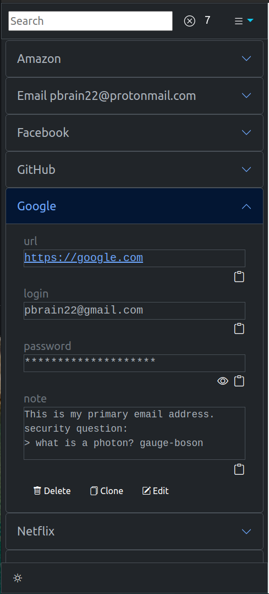
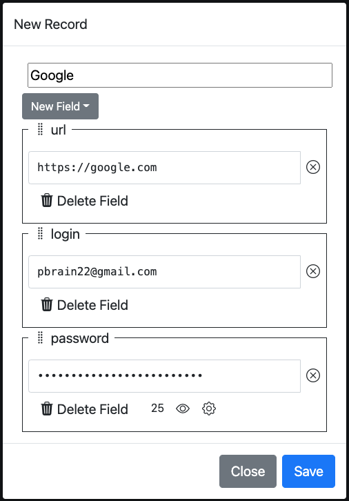
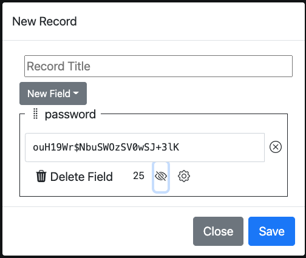
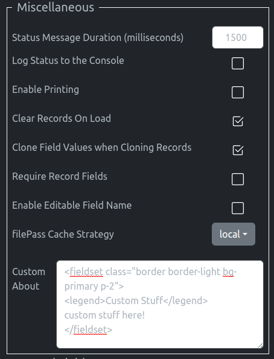
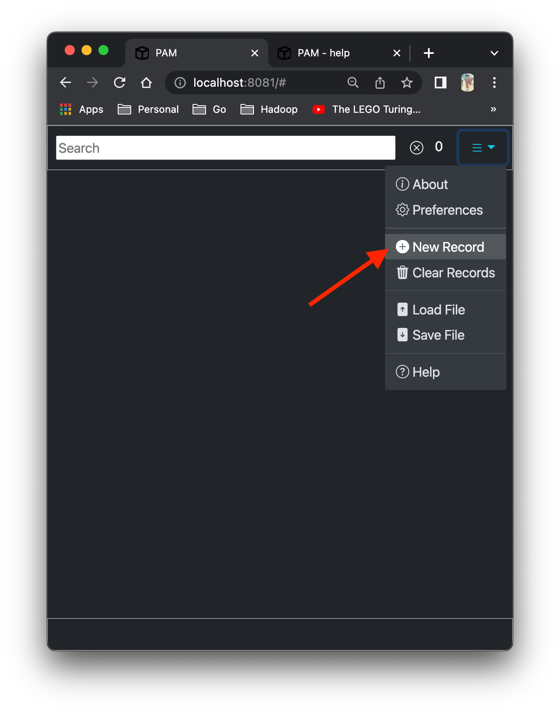
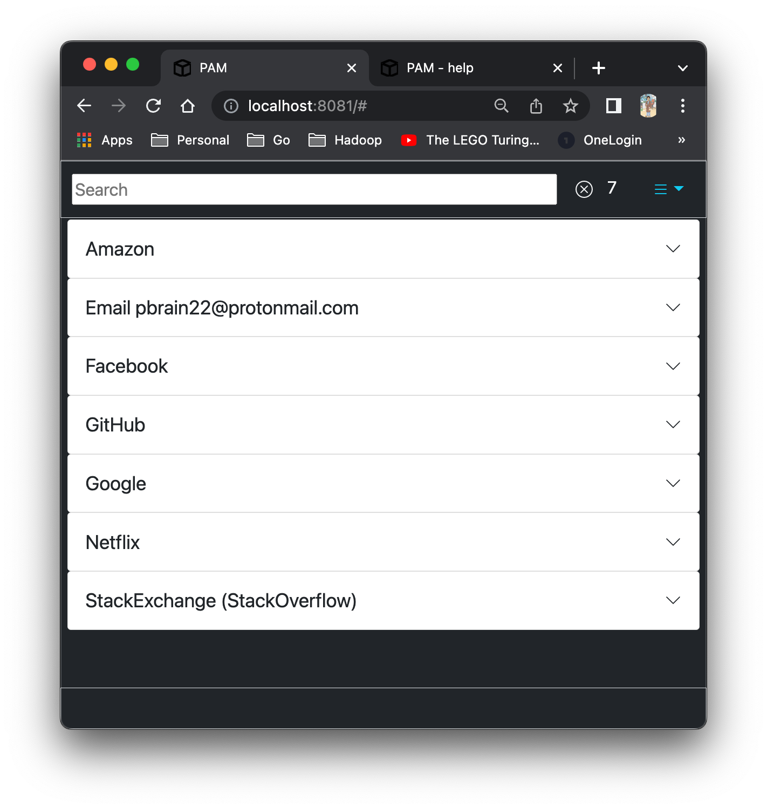
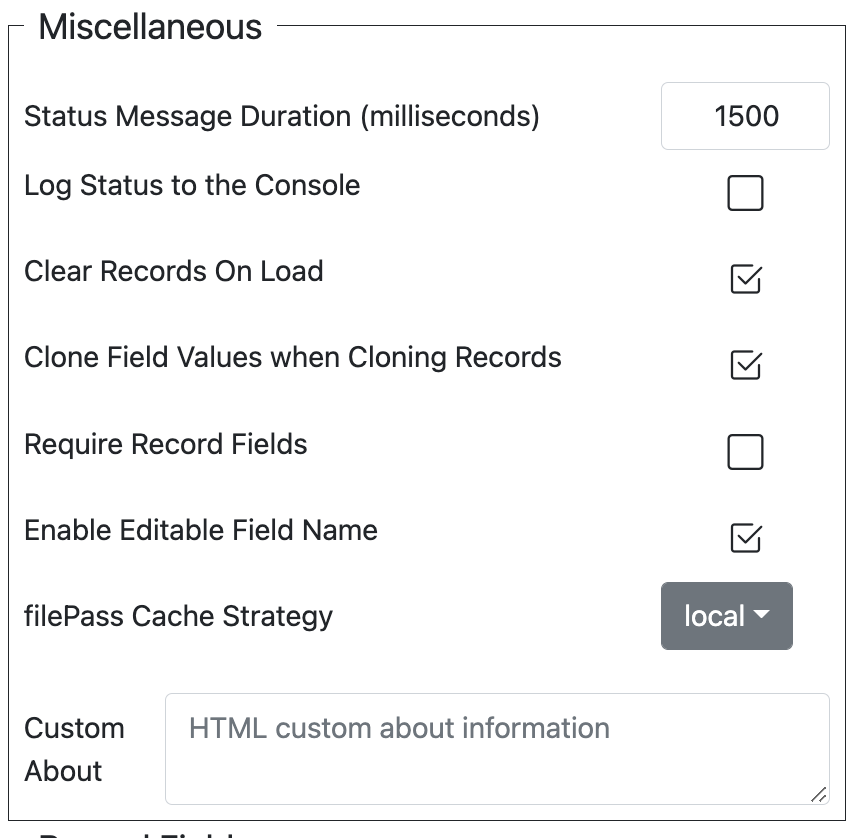

# pam
[](https://github.com/jlinoff/pam/releases)

personal account manager webapp

<details>
<summary>Metadata</summary>

The meta data in the table is populated during the build process when
the on-line help is generated.

| Field              | Value                                                                             |
| -----              | -----                                                                             |
| Author             | Joe Linoff                                                                        |
| Copyright (&copy;) | 2022                                                                              |
| License            | MIT Open Source                                                                   |
| Version            | `__VERSION__`                                                                     |
| Bootstrap Version  | `__BOOTSTRAP_VERSION__`                                                           |
| Build              | `__BUILD__`                                                                       |
| GitCommitId        | `__GIT_COMMIT_ID__`                                                               |
| GitBranch          | `__GIT_BRANCH__`                                                                  |
| project            | [https://github.com/jlinoff/pam](https://github.com/jlinoff/pam)                  |
| webapp             | [https://jlinoff.github.io/pam/www/](https://jlinoff.github.io/pam/www/)          |
| help               | [https://jlinoff.github.io/pam/www/help/](https://jlinoff.github.io/pam/www/help) |

</details>

<details>
<summary>Table of Contents</summary>

<!--ts-->

  * [Introduction](#introduction)
  * [Overview](#overview)
    * [Reasons to not use PAM](#reasons-to-not-use-pam)
      * [Reason 1: Do Not Need It](#reason-1-do-not-need-it)
      * [Reason 2: Too Complex](#reason-2-too-complex)
    * [Reasons to consider using PAM](#reasons-to-consider-using-pam)
      * [Reason 1: No Client Server Communications](#reason-1-no-client-server-communications)
      * [Reason 2: Record Model](#reason-2-record-model)
      * [Reason 3: Searching](#reason-3-searching)
      * [Reason 4: Automatic Password Generation](#reason-4-automatic-password-generation)
      * [Reason 5: File Based Storage](#reason-5-file-based-storage)
      * [Reason 6: Secure Context Encryption](#reason-6-secure-context-encryption)
      * [Reason 7: Hiding Passwords from Casual Observers](#reason-8-hiding-passwords-from-casual-observers)
      * [Reason 8: Access from mobile devices](#reason-8-access-from-mobile-devices)
      * [Reason 9: FOSS](#reason-9-foss)
  * [Layout](#layout)
    * [Menu and Search Section](#menu-and-search-section)
    * [Records Section](#records-section)
    * [Status Section](#status-section)
  * [Functions](#functions)
    * [Create New Record](#create-new-record)
      * [Topics](#topics)
      * [Fields](#fields)
        * [Record Field Types](#record-field-types)
        * [Custom Record Fields](#custom-record-fields)
      * [Password Fields](#password-fields)
        * [Cryptic Passwords](#cryptic-passwords)
        * [Memorable Passwords](#memorable-passwords)
        * [Hidden Password Representation](#hidden-password-representation)
        * [Visible Password Representation](#visible-password-representation)
        * [Password Generator](#password-generator)
      * [Method 1: Menu Approach](#method-1-menu-approach)
      * [Method 2: Clone Approach](#method-2-clone-approach)
      * [Method 3: JSON Approach](#method-3-json-approach)
    * [Edit Record](#edit-record)
    * [Delete Record](#delete-record)
    * [Clone Record](#clone-record)
    * [Clear Records](#clear-records)
    * [Save File](#save-file)
    * [Load File](#load-file)
    * [Search Records](#search-records)
    * [Get Help](#get-help)
  * [Menu](#menu)
  * [Records](#records)
    * [Unexpanded View of all Records](#unexpanded-view-of-all-records)
    * [Expanded View of a Record](#expanded-view-of-a-record)
  * [Preferences](#preferences)
    * [Search Preferences](#search-preferences)
      * [Case Insensitive Searches](#case-insensitive-searches)
      * [Search Record Titles](#search-record-titles)
      * [Search Record Field Names](#search-record-field-names)
      * [Search Record Field Names](#search-record-field-names)
      * [Search Record Field Values](#search-record-field-values)
    * [Password Preferences](#password-preferences)
      * [Minimum Password Length](#minimum-password-length)
      * [Maximum Password Length](#maximum-password-length)
      * [Memorable Password Min Word Length](#memorable-password-min-word-length)
      * [Memorable Password Word Separator](#memorable-password-word-separator)
      * [Memorable Password Min Words](#memorable-password-min-words)
      * [Memorable Password Max Tries](#memorable-password-max-tries)
      * [Memorable Password Prefix](#memorable-password-prefix)
      * [Memorable Password Suffix](#memorable-password-suffix)
    * [Miscellaneous Preferences](#miscellaneous-preferences)
      * [Log Status to the Console](#log-status-to-the-console)
      * [Clear Records On Load](#clear-records-on-load)
      * [Load Duplicate Record Strategy](#load-duplicate-record-strategy)
      * [Clone Field Values when Cloning Records](#clone-field-values-when-cloning-records)
      * [Require Record Fields](#require-record-fields)
      * [Enable Editable Field Name](#enable-editable-field-name)
      * [filePass Cache Strategy](#filepass-cache-strategy)
      * [Custom About](#custom-about)
    * [Record Fields](#record-fields)
    * [Saving Preferences](#saving-preferences)
  * [Security Considerations](#security-considerations)
    * [MITM](#mitm)
    * [Third Party Web Site Security](#third-party-web-site-security)
    * [Site Reliability](#site-reliability)
    * [Over the Shoulder Surfing Attack](#over-the-shoulder-surfing-attack)
    * [Malware: Key Logging and Screen Recording](#malware-key-logging-and-screen-recording)
    * [Malware: Clipboard Attack](#malware-clipboard-attack)
    * [Unattended Browser](#unattended-browser)
    * [Website Spoofing](#website-spoofing)
    * [Dictionary and Brute Force Password Attacks](#dictionary-and-brute-force-password-attacks)
    * [Protecting Yourself](#protecting-yourself)
    * [Multi-Factor Authentication](#multi-factor-authentication)
  * [Usage Examples](#usage-examples)
    * [Personal Account Records](#personal-account-records)
      * [Create Record File](#create-record-file)
      * [Use Record Data to Log into a Site](#use-record-data-to-log-into-a-site)
      * [Edit an Existing Record](#edit an-existing-record)
      * [Delete an Existing Record](#delete-an-existing-record)
      * [Clone an Existing Record](#clone-an-existing-record)
    * [Shared Credentials for a Small Group](#shared-credentials-for-a-small-group)
    * [Recipes](#recipes)
    * [Books](#books)
  * [Developer Notes](#developer-notes)
    * [License](#license)
    * [Build PAM](#build-pam)
    * [Test PAM](#test-pam)
    * [Release PAM](#release-pam)
    * [History](#history)

<!--t3-->

</details>

## Introduction
_PAM_ or Personal Account Manager is a free open source, single page
web application that helps you manage your confidential information as
searchable records _without having to rely on services from a
third party server_.

_PAM_ can do that because it runs inside your browser and because it
stores _your information_ in a file that _you control_.

The _PAM_ file is encrypted so the contents would be safe from hackers
if the file was stolen assuming, of course, _that the password you
used to encrypt it was strong_.

You can access _PAM_ from your own HTTP server (including localhost) or from the
public github.io server [here](https://jlinoff.github.io/pam/www/index.html).

Furthermore, _PAM_ is designed to be mobile friendly so you can access
it from your laptop browser, mobile phone or tablet.

It looks something like this on my iphone for some fictitious example
records.


The records appear as accordion entries that expand when you click on them as shown below.



Once the record is expanded you simply click on the

icon associated with the record field you are interested in (like the
password) to copy its value to the system clipboard so that it can
then be pasted them into the appropriate login field.

You can even include images like this.


There a lots of other features like searching/filtering, memorable
password generation, customized records fields and preferences as well
as techniques for securely sharing records and embedding images that
are described in the documentation below.

Please note that this is not the first tool I have written to manage
passwords but it is meant to be the last. If you are interested in
what motivated me to create yet another tool, see the
_[Security Considerations](#security-considerations)_
and
_[Reasons to consider using PAM](#reasons-to-consider-using-pam)_.
If you are interested in the genesis of _PAM_ and the stories of its
predecessors, see the [History](#history) section.

I hope that you find useful in some way.

## Overview
_PAM_ is a pretty simple application. It is basically a record editor
that runs in your browser that allows you to create records with
interesting information that can then be stored and retrieved in a
secure way.

### Reasons to not use PAM
This section talks about why you may not need or want to use _PAM_.

#### Reason 1: Do Not Need It
It is very reasonable to ask yourself why, if _PAM_ is like an editor,
you can't simply just use something like an Excel spreadsheet or a
text file editor or keep passwords on a sheet of paper or use one of
the many commercially available password managers?

That is an excellent question. The answer is that you _can_ and, if
you are already using an Excel spreadsheet or a text file editor or a sheet
of paper or a password management service or anything other method
that works well for you, _you should_.

#### Reason 2: Too Complex
Even if you do not already have a method for managing passwords _PAM_
may not be the right choice. _PAM_ requires that you understand a bit
about HTML input and textarea elements which may be confusing.  Also
the _PAM_ user interface (UI) and record data model may be confusing
or hard to understand and use because I am not a UI programmer.

The bottom line is that I wrote _PAM_ to provide some features I
wanted and to address some concerns I had with existing
approaches. Those features and concerns are discussed in the next
section to help you understand my reasoning so that you can decide
whether any of them are important to you. If you don't care about the
features and the concerns that bother me, there is no reason to use
this tool.

### Reasons to consider using PAM

This section presents the nine primary reasons that motivated me to
develop _PAM_. They are provided to to help you determine whether
_PAM_ might be interesting to you.

#### Reason 1: No Client Server Communications
_PAM_ is a single page web application (SPA) that has no backend which
means that it never communicates with an external site which protects
it from some types of cyber attacks as detailed in the
[Security Considerations](#security-considerations) section.

#### Reason 2: Record Model
In _PAM_, information is organized into files composed of records that
each have a unique title and are, in turn, composed of fields that
have a name, a type and a value. This approach is similar
to organizing information using index cards or a rolodex.

Following the index card analogy a little further, we can use a
simple example to understand the record model a bit better.

A recipe would be something you might store on an index card. Each
recipe could be a single record that might contain the _title_ (the
name of the recipe), the _ingredients_ (a field) and the
_instructions_ (another field).

##### Simple Recipe Record

So what would a simple dessert recipe look like as a in _PAM_ record?
Well, if you had a simple dessert recipe like this written on a card
with an attached picture.

<!-- PP: <blockquote style="border: 1px black solid; width: 32ch"> PP: -->


```
Ice Cream Sundae

ingredients
1. 3 scoops vanilla ice cream
2. 1 banana (sliced up)
3. chocolate sauce
4. (optional) nuts
5. (optional) Maraschino cherry
6. whipped cream

instructions
1. put ice cream in bowl
2. add slices of banana
3. add nutes
4. pour chocolate on top
5. add whip cream
6. put the cherry on top.
```

<!-- PP: </blockquote> PP: -->

It would look like this when you _create_ it in _PAM_.


It would look like this when you _view_ it in _PAM_.


As you can see, in this _"recipe"_ record, the title is `"Ice Cream
Sundae"` and the two fields "ingredients" and "instructions" contain
the multiline (`textarea`) descriptions of what the ingredients and
instructions are for this specific recipe. And, finally, there is an
"html" field that contains the image.

Note that the record field names "ingredients" and "instructions" used
in this example are custom _field names_.
They are not available by default. The "html" field _is_ a default field.

Custom record fields can be created by adding new fields to the
default fields defined in the preferences so they are available all of
the time.

For this example I created two new
_textarea_ fields named "ingredients" and "instructions" so that users
could enter multiple lines and removed all of the other default fields
except the "html" field because they were not needed. I kept the default
"html" field because I wanted to be able add pictures to the recipes.
Here is what the preferences look like after the modifications were
made.


##### Simple Account Record

Of course, there are many other types of records that might be
interesting to store in _PAM_ that can use the default record
fields _as is_.
See the [Fields](#fields) section for a description of the default
records and their types.

One common one is a record for each account that you need to login
into where you information about how to login is stored so you don't
have to remember it.

Such an _"account"_ record would have, at a minimum, the web address
(URL), the login name and the password of the account.

Note that this simplified example is only meant to show the basic
idea of importance of supporting record formats that are different
than recipes. For a real account record you would probably want to add
additional fields like an email address or a notes field.

Here is what the simple account record would look like.



Note that the password is hidden in the example above.
_PAM_ always hides the contents of passwords by default.

##### Record Model Summary

As you can see both records look quite different. Recipes records have
fields for "ingredients" and "instructions" whereas account records
have fields for the "url", "login" and "password". However, in both
cases they have the same basic structure: a title and a set of fields
that are relevant to recipes or accounts.

You could easily imagine defining other records that contain
information for other topics like _"books read"_ or _"unidentified
aerial phenomena"_ or _"bird watching"_ which would undoubtedly
require different fields. The idea of topics is dicussed in more
detail in the [Topics](#topics) section.

In my view, this approach of using _records composed of fields_
does a better job of representing this type of information than a
spreadsheet or a text file.

#### Reason 3: Searching
_PAM_ allows you to search records by their title or their field
names and values. It also filters out the records that don't match
to make it easier to see the matching records visually.

The availability of fast interactive searching makes finding records
easy.

This is what search/filtering looks like for all example records
that contain a "g".


Note that regular expressions can be used as well.
See [Search Records](#search-records) for more details.

#### Reason 4: Automatic Password Generation
I always find it hard to come up with passwords in the spur of the
moment so _PAM_ was built with the ability to automatically generate
passwords.

Of course almost all browsers and password tools provide this same
capability nowadays, but they tend to generate secure, cryptic, hard
to memorize passwords which is perfectly fine for passwords for most
accounts.

But there are a cases when you need a password that must be typed in
manually like the login password for a computer that does not use
biometric scanning or a key FOB. In those cases it is beneficial to
have a password that is secure, easy to remember and easy to type
because you cannot access a password management system _before you
login_.

I call passwords of this type _memorable_ passwords. They are composed
of common lower case English words with an optional prefix, an
optional separator between each word and an optional suffix.

Often, the prefix and suffix are used to guarantee that the password
contains the correct mix of characters that the authentication system
requires, like, at least one capital letter, at least one digit and at
least one special character.

To make these concepts a bit clearer, here are examples of a cryptic
and a memorable password.

| <!-- --> | <!-- --> |
| -------- | -------- |
| cryptic   | `Rf5NaR7LH2LbZMRhkPCfeG8` |
| memorable | `A1/health/mpegs/hopes!!` |

In this example, the memorable password word separator is `"/"`, the
prefix is `"A1/"` (capital letter and digit) and the suffix is `"!!"`
(special characters).

To help with this, _PAM_ was built with the ability to generate _cryptic_
and _memorable_ passwords.

For more detailed information about password generation in _PAM_ see the
[Password Fields](#password-fields) section.

#### Reason 5: File Based Storage
_PAM_ uses files to load and store the record data.

Using a file means that the user does not have to rely on the
cybersecurity infrastructure of a company running a web server and
storing your data at their site or another third party site. This was
alluded in
[Reason 1: No Client Server Communications](#reason-1-no-client-server-communications)
but that is not the _only_ advantage of using files.

A _PAM_ file is composed of a set of records. Any records you like.
You can use a single file for all of your records or you can have
multiple files where each file contains records that are somehow
related like records of _"recipes"_ or _"book reviews"_
or _"my favorite species of Euglena"_.

What this means is that you can group records associated by a topic in
different files to make them easier to organize and find.  This
ability to organize files around topics is the other reason that I
prefer the file based storage model.

For a more detailed discussion about how the user controls the
organization of the records and fields in a file see the
[Reason 2: Record Model](#reason-2-record-model)
section of this document.

As a side note, I store my personal _PAM_ record files in _Apple iCloud_
which is one of many cloud based storage services like _Dropbox_, _Google
Drive_ and _Microsoft OneDrive_.

For files I want to share with other folks, I use _Google Drive_ to
store the file and then share it.

When properly configured all of these storage services store the _PAM_
record file in the cloud so that it is available to anyone who knows
the file password as long as their laptop, phone or tablet is
authorized to access the storage service.

Of course you could simply load and save the data to a local file but
that _might_ restrict your ability to access to it from other devices
(like mobile phones or tables). Not only that but you would have to be
very diligent about keeping it backed up so that you would not lose
data if the local file was corrupted or lost.

#### Reason 6: Secure Context Encryption
When records are stored in a _PAM_ file they can be encrypted using a
password. The password is then used by an
[_NIST certified_](https://csrc.nist.gov/projects/cryptographic-algorithm-validation-program),
symmetric encryption algorithm: `AES-256-CBC` to encode the records.

Using a certified encryption algorithm provides a strong security
guarantee which means, that if an encrypted _PAM_ file is stolen, the
record data is considered safe from hackers trying to crack the
contents _if a strong password was used_.

Passwords like _"secret"_ or _"password123"_ or any other password
that can be found in freely available password dictionaries like the
[Kali password dictionary](https://kalitut.com/best-password-dictionary/#Kali_password_dictionary)
are _not_ strong and will _not_ protect your data because they are easy to guess.

_Always_ use a strong password to make it hard to guess. Typically a strong
password would at least 20 characters would not include any personally
identifiable information (PII) like your name, birth date or address. Also
_never, ever_ use the same password for two different sites. This is
to protect you from hackers if a site you use to is attacked and your
password is stolen.

I recommend reading
[NIST Password Guidelines](https://www.auditboard.com/blog/nist-password-guidelines/)
for more information about how to create strong passwords.

As an interesting aside, note that `AES-256-CBC` algorithm is
considered to be reasonably resistant to quantum attacks as discussed
in the literature. For example,
[here](https://crypto.stackexchange.com/questions/6712/is-aes-256-a-post-quantum-secure-cipher-or-not)
is one relevant exchange from a `crypto.stackexchange.com` discussion.

_PAM_ encryption and decryption operations are provided by and run
_inside_ the _secure context_ of the browser. This is the same _secure
context_ used for accessing sites securely for transactions, like your
bank. In practice this means that you must access _PAM_ from an HTTPS site.

The safety and security of _secure context_ operations is taken very
seriously by the internet standards organization and the organizations
that develop the major browsers.

You can read more about secure contexts
[here](https://developer.mozilla.org/en-US/docs/Web/Security/Secure_Contexts).

#### Reason 7: Hiding Passwords from Casual Observers

Passwords and other secrets are automatically hidden on the screen
(displayed as asterisks) so that someone looking over your shoulder
cannot read them unless you choose to make them visible. You can read
more about why this is beneficial in the
[Security Considerations](#security-considerations) section.

This is the default hidden view of a password with the
[Enable Editable Field Name](#enable-editable-field-name)
preference set which shows the name of the field. In this
case "password". You can see that the password value is
all _asterisks_.


This is the same view of a password when it is not hidden.
You can now see the password value.



#### Reason 8: Access from mobile devices

The record files can be accessed from mobile devices so the user has access to the
records anywhere as described in the
[Reason 5: File Based Storage](#reason-5-file-based-storage)
but that does not necessarily imply that the interface is _mobile friendly_.

What makes _PAM_ mobile friendly is that it is implemented using the
[bootstrap-5](https://getbootstrap.com/docs/5.0/getting-started/introduction/)
library to make the interface work better in the browsers present on
mobile devices.

#### Reason 9: FOSS

Last but not least, one compelling reason to try _PAM_ is that it is
free and open source software (FOSS) so you can try it without any
obligation or cost. You can also help find and fix bugs or improve
the UI.

## Layout
_PAM_ is a simple single page web application (SPA). It consists of three
basic parts: the menu and search section, the records section and the
status section.

It looks something like this


### Menu and Search Section
The top section that contains a search input
and a menu.

The search input is used to find records that match the input to make
them easier to find.

The menu at the top right is the control center for the application it
has a number of options as you can see below.


### Records Section

Underneath the top level bar, in the middle, is the records
section. Each record is shown as an entry that is displayed by its
title.  If you click or tap on the record title, the record will
expand to show the record contents (fields) and provide options for
deleting, cloning or editing the record contents.

This way of presenting the records is called an accordion display.
Below you can see how it expands after the "Facebook" entry has been
selected.


As you can see the expanded "Facebook" record has three fields: "url",
"login" and "password".


You can copy the field values to the clipboard so that they can be
pasted into login forms.

> Note that the copy works for passwords whether the
> password is visible or not.


You can also click or tap on the title of the opened record to close it.

### Status Section
Below the records section, at the bottom, is the status section where
ephemeral status messages are displayed. The messages disappear after
about 1.5 seconds but the duration is controlled by a preference that
you can set.  See the [Preferences](#preferences) section for more
information.

The status messages are used to provide activity feedback like showing
how many bytes were copied to a clipboard when a copy button is
clicked or tapped as shown in the example below.


## Functions
The following sections will go over the basic functions that _PAM_
provides.

In a nutshell they are:

1. Display information about the application.
1. Create New Record.
1. Edit Record.
1. Delete Record.
1. Clone Record.
1. Clear Records.
1. Save records to an encrypted file.
1. Load a collection of records from an encrypted file.
1. Search Records.
1. Get Help.

Each function will be discussed in a separate subsection below.

Note that Preferences were not included because they have their own
top level section in this document.

### About

Click or tap on the "About" menu entry to get information about _PAM_.
You can even add custom HTML through the preferences that is stored
for each _PAM_ file.

Here is a screen shot of what you would see.


Here is an about dialogue with a simple custom message.


Custom messages are defined in preferences as follows.



The motivation for allowing custom messages is that someone might want
to share a _PAM_ file or describe how the records are related. The
custom message would allow the person to provide their _imprimatur_ on
the collection.

### Create New Record

This is a long section because it covers a number of general concepts
that are needed by other functions like "topics" and "fields".

Creating a new record is a very common activity in _PAM_ so I tried to
make it as easy as possible.

There are three different methods you can use to create new records:

1. A record can be created in the application by clicking or tapping the "New Record" menu option,
2. A record can be created in the application by cloning an existing record or
3. A record can be created outside of the application by editing a JSON record file.

All three approaches will be discussed below in more detail.

The first method, creating the record by clicking or tapping the "New
Record" menu option in the application, is probably the best way to
create the first new record for a topic family. This is also known as
the "menu" approach and is shown below.


See the [Method 1: Menu Approach](#method-1-menu-approach) section for details.

The second method, creating a record by cloning an existing record, is
useful when you want to use the same fields as the existing record. It
is a great way to guarantee uniformity. Although if the number of
fields is small using the first method is also fine. Here is what
the clone option looks like.


See the [Method 2: Clone Approach](#method-2-clone-approach) section for details.

The third method, creating a record by editing a JSON record file, is most
useful if you are interested in creating records programmatically
(perhaps a subset of accounts that shared with a small group of users
that is automatically generated from a database). The example records
and recipes example files that are available in the "Load" dialogue
are a great place to start.

See the [Method 3: JSON Approach](#method-3-json-approach) section for details.

But, before any of the record creation approaches can be discussed in
more detail, it is very important to understand record topics and
record fields.

#### Topics
Topics define how records are related. They provide a convenient
abstraction for organizing related records in files.  Topics are
completely arbitrary. For example a topic could be something like
_"recipes"_ or _"accounts"_ or _"unidentified aerial phenomena"_ or
_"my favorite cryptography algorithms"_ or _"green things"_.

One way to use topics is to keep records related by a topic in separate
files. For example, you could define a "`recipes.txt`" file for all of
your recipe records (topic: _"recipes"_ or _"stuff to cook"_) and an
"`accounts.txt`" for your account records (topic: _"accounts"_).

Or, you could completely disregard organizing by topics and put all of
your records into a single file like "`myrecords.txt`".

Note the use of the "`.txt`" extension in the previous paragraph.
Although the "`.pam`" file extension is supported for record files
and it works on laptops. It does not always work on mobile devices
so a records file named "`myrecords.pam`" might not be readable
by the mobile browser. I recommend using the "`.txt`" for all
record files for maximum portability.

Topics are also discussed briefly at the end of the
[Reason 2: Record Model](#record-model-summary))
section.

#### Fields
Records are composed of fields. Each field has a unique name, a type
and a value.

The field _name_ is arbitrary and is meant to describes how the data in the
field is used. For example, an "ingredients" field would indicate that the value
is a list of ingredients and a "number" field would indicate that the value
is a number. An example of a field _name_ might be "mobile phone".

The field _type_ explicitly describes the type of data that field
holds like a "number" or a "phone" or an "email". Types are
built in and strictly enforced by javascript.

An example of the difference between a _name_ and a _type_ would be a
field named "mobile" of type _phone_.  The name describes _how_ it is
used whereas the type describes _what_ the input type is which, in
turn, dictates what user inputs are acceptable.  A description of each
built in record field type can be found in the
[Record Field Types](#record-field-types)
section.

The field _value_ is the unique value for the field in an individual
record that is set when a field is created or edited. For example, an
field named "email" of type "email" could have a value "wombat@foo.io"
the _name_ and the _type_ could be the same for all records that had an "email"
field but the _value_ would vary.

The default record fields are defined in the
[Preferences](#Preferences)
and show up in the "New Field" pulldown menu when a record is created
or edited. They are stored in each file with the along with the actual
records so each records file can have different default fields. For
example a file of recipe records would probably want fields of type
_"textarea"_ named "ingredients" and "instructions" but a file of
_"books read"_ records probably would not. Instead it might want _"text"_
fields named "author" and "publisher" along with, possibly, a field
of type _"number"_ named "copyright".

See the [Record Fields](#record-fields) section for details about how
to add or modify the default record fields.

There is a second more obscure way to define field names, you can
change field names _when you create or edit an individual record_ by
setting the
[Enable Editable Field Name](#enable-editable-field-name)
preference.

This capability is not enabled by default to avoid confusion between
the "name" input and the "value" input as shown below. Normally only
the "value" input is shown.

Typically there is no reason to change record field names on a per
record basis. It is better to add the new record fields to the default
list in the preferences.


##### Record Field Types

Record field types define the type of each field that you define for a
record. They are based on HTML _input_ element types except for the
_"textarea"_ type which is a HTML _textarea_ element that is displayed
as _preformatted_ text (&lt;pre&gt;&lt;/pre&gt;) and the _"html"_ type
which is also a HTML _textarea_ type but is displayed as raw HTML so
it can be used for inserting images. They are presented below as
simple types regardless of the underlying HTML element to avoid
unnecessary complexity.

You can change, add or delete record field _names_ here if you wish to
customize the user experience but you cannot change the built in
_types_. For example, you change the record field name _"note"_ from a
_"textarea"_ field to a _"text"_ but there is no way to add a new built in
type to the drop down list from the user interface.

These are the default field definitions.


The table below presents a brief overview of the pre-defined record
fields and their associated built in types and when to use them. You
can search the web for more details about
[HTML input types](https://developer.mozilla.org/en-US/docs/Learn/Forms/HTML5_input_types).

| Type | Usage |
| ---- | ----- |
| datetime-local | A datetime text string. Use it if you _only_ want to accept a datetime value. A typical usage might be the date that you finished reading a book. |
| email | An email text string. Use it if you _only_ want to accept an email value. A typical usage might be the email address of a contact. |
| html | Textarea data that is rendered directly as HTML. A typical usage might be to reference an image or to display formatted text. |
| number | A numeric text string. Use it if you _only_ want to accept an number value. A typical usage might be a measurement like height or width or any other numeric value. |
| password | A secret text string that is normally displayed as asterisks (`****`) with an eye () button that can be clicked or tapped to show the value. |
| phone | A phone number text string. Use it if you _only_ want to accept a phone number value.  A typical usage might be a mobile phone number. |
| text | A string, like a name or keyword. You can use this for any text but it is especially useful when a field can be multiple types like an email or a name. A typical usage might be a login name where the value might be a name like "wiley" or an email like "wcoyote@acme.io" or a number like "12345678". |
| textarea | A multi-line text box. A typical usage might be a note or a list of recipe ingredients. |
| url | A text string that is a uniform resource locator (URL). Use it if you _only_ want to accept a URL value. A typical usage might be the path to an account like `https://google.com` |
| username | A username. This may be slightly different than a login because a login could be an email address but, in general, it probably makes more sense to user `login` rather than `username`. |

Remember that the types were not made up by me, they were
taken directly from input element description
[here](https://developer.mozilla.org/en-US/docs/Web/HTML/Element/input),
the separate textarea element is described
[here](https://developer.mozilla.org/en-US/docs/Web/API/HTMLTextAreaElement).


##### Custom Record Fields
It is oftentimes the case that all of the _default_ record fields
are not needed for the records you are managing. This is especially
true in cases where you have a very clear understanding of the record
field requirements.

If that is the case you might want to use the preferences to delete
fields that are not relevant for your usage so that they don't clutter
up the choices. You can always add them back later if you want.

Here is an example that shows a recipe record with "ingredients" and
"instructions" fields.


Here is what the preferences look like after "ingredients" and "instructions" record fields
have been added and the previous default record fields have been pruned out.


Here is an example that shows an account record with "url", "login"
and "password" record fields.


Here is what the preferences look like with the other fields pruned out.
The "url", "login" and "password" record fields are part of the default.


#### Password Fields
Passwords fields show up in a lot of places. I chose to document them
here because you will probably first encounter them when creating a
record.

Password fields are a special case for the following three reasons.

First, they provide a generator that allows you to automatically
create passwords at the click or tap of a button.
For information about preferences that can be used to customize
password generation see
[Password Preferences](#password-preferences)

Second, they always hide the value by default so that it can be seen
by someone observing your screen.

And, finally, because they provide the ability to generate two
different types of passwords: cryptic and memorable.

##### Cryptic Passwords
Cryptic passwords consist of letters, digits and
special characters.

Here is an example: `'N5yAb!XfGa3vELPsK95K4/AAz8mts'`.

Cryptic passwords tend to be hard to memorize for most people.

They are perfect for cases where you don't have to type the
password in because they are hard to crack.

##### Memorable Passwords
Memorable passwords are used to define passwords that must
be typed in manually, as described in the
[Reason 4: Automatic Password Generation](#reason-4-automatic-password-generation)
section which means that it is important that they are secure, easy to
type and to remember.

They are composed of common lower case English words with an
optional prefix, an optional separator between each word and an
optional suffix. Often, the prefix and suffix are used to guarantee that the password
contains the correct mix of characters that the authentication system
requires, like, at least one capital letter, at least one digit and at
least one special character.

The security rationale for memorable passwords is described in this article:
[The logic behind three random words](https://www.ncsc.gov.uk/blog-post/the-logic-behind-three-random-words).

Here is an example: `'Z0/rebates/restructuring/jamaica??'` where the prefix is `'Z0/'`,
the separator is `'/'` and the suffix is `'??'`.

Memorable passwords tend to be easier to memorize than cryptic
passwords for most people.

##### Hidden Password Representation
Here is an example that shows a password in its standard hidden form.


To make the password visible, click or tap on the
 icon.

The password can be copied to the clipboard when it is hidden by
clicking on the

icon.

##### Visible Password Representation
Here is an example that shows a password in its visible hidden form.


The password can be copied to the clipboard by clicking on the

icon.

To hide the password, click or tap on the
 icon.

##### Password Generator
This is what the password field dialogue looks like with no generator.


When you click or tap on the  icon,
cryptic and memorable passwords are generated and the password
generator dialogue appears.


As you can see it always generates five memorable passwords to provide
some choices. I found that more useful than the original
implementation which only had a single choice.

> The decision to present five memorable passwords was completely
> arbitrary but it seems to work well enough for my needs and can easily be
> changed.

This is what the password generator looks like with annotations.


If you click or tap on the  icon
a second time, new passwords will be generated.

You must click or tap on the  icon
to close the dialogue.

I chose this approach because I wanted the

icon to be used to generate new passwords.

> In retrospect, that choice may not have been the most intuitive way
> to implement closing the generator dialogue it but it works well
> enough and can easily be changed if it turns out to be too
> cumbersome.

To choose a generated password simply click or tap on it and it will
be added to the field value.

#### Method 1: Menu Approach
As mentioned at the beginning of the [Create New Record Section](#create-new-record) section,
there are three different ways to create records. In this and the following sections all
three are discussed.

For this example we will create the "ingredients" and "instruction"
pre-defined fields in the [Preferences](#preferences) as _"textarea"_ fields, when
complete they will look like this.


Make sure that you click on the `"Save"` button to save the new fields.

To create a new record using the menu approach click or tap on the
`"New Record"` option from the menu.



That will popup a dialogue that looks like this.


You can now type in the record title.


From there you click or tap on the `"Type"` pulldown to select and create
the first record field. Don't worry if you select the wrong one,
they are easy to delete.

Here is where you select "ingredients" for the first field.


And then change the field name to "ingredients" and populate it.


Now do the same thing to create an "instructions" field.


One interesting thing to understand is that you can _change the order
of the fields_ by dragging them up or down. To do that select the
field title at the top of the box (fieldset) and move it. This can
also be done when editing the record.

Here is what it looks like when I dragged the "instructions" field up.


I then dragged "instructions" field back down because it should appear after
"ingredients" field.

When you are finished click or tap on the `"Save"` button to save it and you
will see it show up as a new record in the records part of the screen.


You can click or tap on the record to expand it and see the fields you just defined.


#### Method 2: Clone Approach
The second way to create a new record is by cloning it.
Cloning a record is simple. Just expand a record and click or tap on the clone button
and an edit dialogue pops up.

Using the record that was created in the previous section here is what happens when
you click or tap the `"Clone"` button.


As you can see, the clone operation created a new record with a
slightly modified title "Ice Cream Sundae Clone" _because the record
title must be unique_ and the same fields as the original record.

At this point you would typically change the title and field values
but for this demonstration will not do anything. _PAM_ makes sure that
the title is unique so it can be saved.

Click or tap the `"Save"` button and you will see this.


As you can see, _PAM_ still remembers that you had the original record
open. Just below it you will see the new cloned record.

The reason that the original record is left open is so that it is easy
to continue clicking or tapping the `"Clone"` button to create more
records.

In this case we only care about one record so you can click
or tap on the new record to expand it.


#### Method 3: JSON Approach
This approach is not going to have any screenshots because it deals with
_PAM_ internals and may change from time to time. Instead a set of instructions
is provided that should allows you to figure it out pretty easily.

1. Create one record using the menu approach or use one the examples from the "Load" dialogue.
2. Save the record to a file _without a password_.
   Normally this is a very bad idea because it could expose your data
   to a hacker so take precautions to protect the file.
3. Look at the "records" section of the file and use that as a template
   to create more records.
4. When you have finished adding the new records into the file,
   save the changes and then re-load the file in _PAM_.
5. Then save it again _with a password_.

The reason that this has to be done without a password is because
I have not yet written a command line utility to encrypt/decrypt
the files. It should be straightforward to do because it uses
the standard `"AWS_256-CBC"` algorithm.

<details>
<summary>Click here to see an example javascript file</summary>

Beware! That the format of this record may change. This is just an
example that shows how simple the format is.

```javascript
{
  "meta": {
    "date-saved": "2022-05-01T20:50:29.125Z",
    "format-version": "1.0.0"
  },
  "prefs": {
    "passwordRangeLengthDefault": 20,
    "passwordRangeMinLength": 12,
    "passwordRangeMaxLength": 32,
    "memorablePasswordWordSeparator": "/",
    "memorablePasswordMinWordLength": 2,
    "memorablePasswordMinWords": 3,
    "memorablePasswordMaxWords": 5,
    "memorablePasswordMaxTries": 10000,
    "clearBeforeLoad": true,
    "loadDupStrategy": "ignore"
  },
  "records": [
    {
      "title": "Amazon",
      "fields": [
        {
          "name": "url",
          "type": "url",
          "value": "https://www.amazon.com"
        },
        {
          "name": "username",
          "type": "text",
          "value": "pbrain22@protonmail.com"
        },
        {
          "name": "password",
          "type": "password",
          "value": "hr5Hn9pqm3u.VqMiALfdN-\""
        },
        {
          "name": "note",
          "type": "textarea",
          "value": "Lorem ipsum dolor sit amet, consectetur adipiscing elit.\nCras sodales elit in metus tempus, ut semper magna finibus.\nDonec aliquam elementum velit quis pharetra.\nPellentesque accumsan neque ut massa elementum mollis.\nNulla eget pellentesque est."
        }
      ]
    },
    {
      "title": "Email pbrain22@protonmail.com",
      "fields": [
        {
          "name": "url",
          "type": "url",
          "value": "https://mail.protonmail.com/inbox"
        },
        {
          "name": "login",
          "type": "text",
          "value": "pbrain22"
        },
        {
          "name": "password",
          "type": "password",
          "value": "rHfZ6bihw$g8ra$P4hHD"
        }
      ]
    },
    {
      "title": "Facebook",
      "fields": [
        {
          "name": "url",
          "type": "url",
          "value": "https://facebook.com"
        },
        {
          "name": "login",
          "type": "text",
          "value": "pbrain22@gmail.com"
        },
        {
          "name": "password",
          "type": "password",
          "value": "dOa#DirgJge67okTKtEzp.LSl"
        }
      ]
    },
    {
      "title": "GitHub",
      "fields": [
        {
          "name": "url",
          "type": "url",
          "value": "https://github.com"
        },
        {
          "name": "login",
          "type": "text",
          "value": "pbrain22"
        },
        {
          "name": "password",
          "type": "password",
          "value": "Aq7GdcOmYWVkyHEWEk6fBeJzm"
        }
      ]
    },
    {
      "title": "Google",
      "fields": [
        {
          "name": "url",
          "type": "url",
          "value": "https://google.com"
        },
        {
          "name": "login",
          "type": "text",
          "value": "pbrain22@gmail.com"
        },
        {
          "name": "password",
          "type": "password",
          "value": "NIJMeb8OfXEfshOG$db!"
        },
        {
          "name": "note",
          "type": "textarea",
          "value": "This is my primary email address.\nsecurity question:\n> what is a photon? gauge-boson"
        }
      ]
    },
    {
      "title": "Netflix",
      "fields": [
        {
          "name": "url",
          "type": "url",
          "value": "http://netflix.com"
        },
        {
          "name": "login",
          "type": "text",
          "value": "pbrain22@gmail.com"
        },
        {
          "name": "password",
          "type": "password",
          "value": "cGwJ$NPQ4SsI#haEsFRD"
        }
      ]
    },
    {
      "title": "StackExchange (StackOverflow)",
      "fields": [
        {
          "name": "url",
          "type": "url",
          "value": "https://stackoverflow.com"
        },
        {
          "name": "login",
          "type": "text",
          "value": "pbrain22@gmail.com"
        },
        {
          "name": "password",
          "type": "password",
          "value": "FpnzQcuq0nk/PxlMdYJ_itnK"
        }
      ]
    }
  ]
}
```

</details>

### Edit Record
To edit a record, select it from the records list and click or tap on the `"Edit"` button
to popup the edit dialogue _which is exactly the same_ as the dialogue used to
create a new record.

In fact, it is implemented using the _same code_ so you can use the
instructions from the [Create New Record](#create-new-record) section to
understand how to change or add new fields.

### Delete Record
To delete a record, select it from the records list and click or tap on the `"Delete"` button.

**Beware!!! PAM trusts you!!**

_PAM_ will not ask you if you _really_ want to delete the
record. It will just go ahead and delete it without fanfare _so be careful_.

### Clone Record
To clone a record, select it from the records list and click or tap on the `"Clone"` button.
This will create a new record that you can edit.

The clone operation is described in detail in the
[Create New Record](#create-new-record) section
under the  [Method 2: Clone Approach](#method-2-clone-approach)
subsection.

### Clear Records
Clear all of the records currently defined.

This is normally done automatically when a new file is loaded but
could be useful if you want to enter new a set of records from scratch
using the currently defined fields. Of course, you could simply delete
all of the records manually but this is simpler.

To clear all records choose the
"&nbsp;Clear Records"
option from the menu. See the [Menu](#menu) section for screenshots.

This option will ask you to confirm.

### Save File
To save records and preferences to a file by choose the
"&nbsp;Save File"
option from the menu. See the [Menu](#menu) section for screenshots.

This is the save file dialogue.


If you want the records to be encrypted, enter or generate a password
as described in [Password Generator](#password-generator) section.

Make sure that you do not forget this password. It is the _master_
password this is used to unlock all of the records and _PAM_
does _not_ keep track of it. That means that if the password is lost,
_PAM_ cannot recover the data it is lost forever.

More details about the encryption algorithm used can be found in
[Reason 6: Secure Context Encryption](#reason-6-secure-context-encryption).

Note that if you do not enter a password, the output will be plain
javascript that can be read by anyone.

Plain javascript is _NOT_ secure.

If you have records with passwords _ALWAYS_ use a password unless you
understand the consequences. For example, saving the data without a
password can sometimes be convenient because it allows you to see how
the _PAM_ data is organized which can aid automation.

### Load File
To load records and preferences from a file by choose the
"&nbsp;Load File"
option from the menu.  See the [Menu](#menu) section for screenshots.

This is the load file dialogue.


If the file was saved with a password, you must enter that password or
the file will prompt for the password when loading.

##### Example Records
If you wish to load the example records file, click or tap on the
examples text (#1) to load example records that can be used to get you
started.


These are the records that are loaded.


##### Example Recipe
If you wish to load the example recipes file, click or tap on the
examples text (#2).


This is what is loaded.


##### URL
Click or tap on the URL text (#3) to load a file from the web.


This is typically used when a PAM records file is shared because
no changes can be made.

### Search Records
_PAM_ allows you to search records by their title or their field
names and values to filter out records that do not match the search
pattern. This is extremely useful when the number of records
grows.

The search function supports case insensitive searches and regular expressions
to make it easier to find stuff.

This can be very helpful for finding out where old
passwords and obsolete accounts are still being used.

Here is the made up list of account records from the [Load Files](#load-files) example:



Here is the same list after filtering for those whose titles contain the
letter `"g"`.


To filter only those that start with `"g"` you
would use this regular expression search term instead: `"^g"`.

For more information about regular expression syntax see the documentation
for [Javascript Regular Expressions](https://developer.mozilla.org/en-US/docs/Web/JavaScript/Guide/Regular_Expressions).

### Get Help
To get this help message, choose the `"Help"` option from the menu.

If you find a bug or want to request a change or submit an improvement,
go to the [Metadata section](#pam---personal-account-manager) at the top of
this help and click or tap on the project link.

## Menu
The menu is the control center for the app. It provides the basic
operations for creating records, loading records, saving them and
it provide information about the app including this help.

Note that much of this material presented here has been discussed in
earlier sections but having it consolidated here might be
helpful. Plus there are links to the sections with relevant details.

This is what the menu looks like.


As you can see, there are seven menu options:

1. "About",
1. "Preferences",
1. "New Record",
1. "Clear Records",
1. "Load File",
1. "Save File", and
1. "Help".

Click or tap on the "&nbsp;About"
entry to see information about the app.
See the [About](#about) section for more details.

Click or tap on the "&nbsp;Preferences"
entry to see the preferences dialogue which allows you
to customize some of the app behavior. There is a lot of stuff so you might want
to read the [Preferences](#preferences) section before trying it.

Click or tap on the "&nbsp;New Record"
entry to create a new record.
See the [Create New Record](#create-new-record) section for more details.

Click or tap on the "&nbsp;Clear Records"
entry to delete all of the records.
This is useful for times when you want to create a new collection of
records that is saved in a separate file.  For example, if you wanted
to create a collection personal accounts in one file and a collection
shared accounts for a group of folks (like a development team sharing
AWS accounts).

Click or tap on the "&nbsp;Load File"
entry to load a records file.
See the [Load File](#load-file) section for more details.

Click or tap on the "&nbsp;Save File" entry
to save all of the records to a file.
See the [Save File](#save-file) section for more details.

Click or tap on the "&nbsp;Help"
entry to see this help message.

At the top of the screen is the search bar and, at the far right, the
menu.

At the bottom of the screen is a status bar that shows status
messages.

## Records
This section talks about how records are presented in _PAM_ using an
example with seven records that contain confidential information for
"Amazon", "Email", "Facebook", "Github", "Google", "Netflix" and
"Stack Exchange" fictional accounts.

See the [Create New Record](#create-new-record) section for details about how to create
records.

### Unexpanded View of all Records
We start with the unexpanded view of all records as shown below.


As you can see _PAM_ presents the records as an accordion. Each record
is one entry in the accordion that you can expand to view the record fields
or [delete](#delete-record), [clone](#clone-record) or [edit](#edit-record)
edit the record.

To get the information for an account you click or tap the button.

At the top of the screen is the search bar and, at the far right, the
menu.

At the bottom of the screen is a status bar that shows status
messages.

### Expanded View of a Record
Once you click on or tap a record it expands as shown below where
the "Facebook" record was tapped.


You can see that there are three fields in the record: "url", "login" and "password",
next to each field there is a icon that looks like a clipboard
.


If you click or tap the clipboard icon,
the field contents will be copied to the clipboard so that you can paste them into a login
dialogue.

> Note that the fields are completely customizable. You can have as many as you want.
> Fields are added, modified and deleted by the "Edit" option.

In addition to the clipboard icon there is another icon that looks like
an eye
.
that shows up for password field. If you click or tap it, the
password will be shown in plaintext and the icon will change to
an eye with a slash through it
.
By default all passwords are hidden so that they are not visible to
casual observers. Click or tap it again to re-hide the password.

In addition there are three buttons at the bottom
"&nbsp;Delete" to delete the record,
"&nbsp;Clone" to clone the record and
"&nbsp;Edit" to edit the record fields.

As you can see here.


## Preferences
Preferences allow you to customized the behavior of the app.
The defaults are set so that most people will never have to change anything.

The preferences dialogue is a big one. It is broken into 4 sections
to make it easier to understand:

1. Search - preferences that control searches.
1. Passwords - preferences that control password creation and length.
1. Miscellaneous - preferences for other stuff.
1. Record Fields - the definitions of the available fields.

Each preference is discussed in more detail in the subsections below.

### Search Preferences
These preferences control search options.

#### Case Insensitive Searches
If enabled, all searches are case insensitive, otherwise they are case sensitive.

The default is enabled.

#### Search Record Titles
If enabled, all searches look at the record titles, otherwise they do not.

The default is enabled.

#### Search Record Field Names
If enabled, all searches look at the record field names, otherwise they do not.

The default is not enabled.

You would want to enable this you wanted to see records that contained a specific field.

#### Search Record Field Values
If enabled, all searches look at the record field values, otherwise they do not.

The default is not enabled.

You would want to enable this you wanted to see records that contained a specific field
value like an obsolete email or really old password.

### Password Preferences
These preferences control automatic password creation.

For more information about passwords see [Password Fields](#password-fields)

#### Minimum Password Length
Defines the minimum length of generated cryptic and memorable passwords.

The default is 12.

I would recommend not making it shorter than the default unless a website
specifically demands it because shorter passwords are easier to crack.

#### Maximum Password Length
Defines the minimum length of generated cryptic and memorable passwords.

The default is 32.

I would recommend making it longer than the default if you can but many
websites have an upper bound for the length of password.
The chosen default seems to work for most of them.

#### Memorable Password Min Word Length
Defines the minimum size of a word in a generated memorable password.
> It has no affect on cryptic passwords.

The default is 2.

If you do not want short words like `'as'` or `'it'`, then make this longer.
I would not recommend making it shorter.

#### Memorable Password Word Separator
The string used to separate the words in a generated memorable password.

> It has no affect on cryptic passwords.

The default is a single character: `'/'`.

If you want to change the character, add any string that you like. It can be multiple
characters.
Other reasonable choices might be `':'` or `'.'` or `'@@'` or whatever you like.
It is best not to use letters.

#### Memorable Password Min Words
The minimum number of words in a generated memorable password.

> It has no affect on cryptic passwords.

The default is 3.

#### Memorable Password Max Tries
The maximum number of attempts to generate a memorable password
that meets the specified criteria from the other password preferences.

> It has no affect on cryptic passwords.

The default is 10000.

There is normally no need to ever change this but, if you change it
and make it too small, _PAM_ will report errors if it fails to
generate passwords after the maximum number of tries.

#### Memorable Password Prefix
The prefix to add to all generated memorable passwords.

The default is `''` (empty string).

You might want to add a prefix or suffix to make sure that the
generated passwords meet the requirements of websites that require
upper case letter, digits and special characters.

For example, you might specify something like `'A1!!/'` to meet the
criteria which might create passwords like
`'A1!!/html/wishes/combined'` or `'A1!!/rebates/restructuring/jamaica'`.

#### Memorable Password Suffix
The suffix to add to all generated memorable passwords.

The default is `''` (empty string).

You might want to add a prefix or suffix to make sure that the
generated passwords meet the requirements of websites that require
upper case letter, digits and special characters.

For example, you might specify something like `'/A1!!'` to meet the
criteria which might create passwords like
`'html/wishes/combined/A1!!'` or `'rebates/restructuring/jamaica/A1!!'`.

### Miscellaneous Preferences
These are the preferences didn't fall into the other categories.

#### Log Status to the Console
Log status messages to the console as well as the screen to aid
debugging.

The default is false which says do not log status messages to the
console.

You might want to enable console logging if you are debugging a
problem and are working in a browser that supports debugging.

#### Clear Records On Load
Clear all records before loading records from a file.

The default is true which says to clear the records before a loading
new records from a file.

If you set this to false, another option titled "Load Duplicate Record
Strategy" will appear that is not normally visible to ask you with
strategy you want to used for conflicts.

You might set this preference to false if you want to to merge sets of records
from different files.

#### Load Duplicate Record Strategy
This preference is not visible unless the "Clear Records On Load" preference is false.

It presents three strategies for handling duplicate records during a load operation: "allow",
"ignore", "replace".

The "allow" strategy allows duplicate records to exist by cloning them. For example
if a record with the title "Google" exists in the records and in the file being loaded,
the record from the file would be renamed to "Google Clone".

The "ignore" strategy ignores the duplicate record that is being loaded.
If there is a conflict it prefers the one already present.

The "replace" strategy ignores the duplicate record that already exists.
If there is a conflict it prefers the record being loaded.

#### Clone Field Values when Cloning Records
This preference specifies that all data is kept when cloning a record.

Remember that cloning a record is very simple and powerful way to
create new records with the same fields but you have to delete the
existing values before entering new ones which is very simple.

The default is false which says to keep the field values when cloning.

Set this preference if you want to avoid deleting the fields manually.

#### Require Record Fields
This determines whether a record can be created with no fields.

If it is true, then a new record must have a least one field defined.

The default is false which means that records can be created with no
fields so that records.

#### Enable Editable Field Name
This preference defines whether or not the user can change a field
name on a _per record_ basis.

Setting this preference is not recommended because the presence of the
"name" input can be confusing for users, a better approach is to
simply add a new field to the default fields in the preference section
as described in the
[Fields](#fields)
section.

##### Not Enabled
This is what it looks likes when it is unchecked (false).


When this is not enabled, the user can only choose record fields from
the "Record Fields" section of the preferences. See the
[Record Fields](#record-fields) section for more details.

##### Enabled
This is what it looks likes when it is checked (true).




The user can replace the default field name (in this case "name") with
whatever they want, perhaps something like "full name" or "first name"
or "last name". The "value" field is where the name is actually
entered.

#### filePass Cache Strategy

This defines the browser cache strategy for the file password.
The options are `none`, `prefs`, `local` and `session`.

The `none` option means that the file password is never stored.
The file password is _not_ remembered for the file load and save operations.
Each time you load or save a file you must re-enter it.

The `global` option means that the file password is stored in a global window
session variable.
The file password is remembered for the file load and save operations.
It is remembered until the browser tab is closed.

The `local` option means that the file password is stored in `localStorage`.
The file password is remembered for the file load and save operations.
It is remembered until it is explicitly reset.

The `session` option means that the file password is stored in `sessionStorage`.
The file password is remembered for the file load and save operations.
It is remembered until the browser tab is closed.

#### Custom About
Customized HTML that is added to the about page. It can be used
in cases where the field records have been customized to provide
an explanation or link to internal documentation.

Its use is described in the [About](#about) section.

### Record Fields
These are the default record fields that are used when creating or
editing record fields. They can be can be changed.

See the [Fields](#fields) section for more information about record
fields.

At the top of the section there is

icon that is used to create a new record field.

Each default record field has a name, a type (from a pulldown menu) and
a delete button ()
that you click to delete the record field.

The record field names must be unique but you can modify them.
They are stored with the each record file individually.

This is what the default records filed preference dialogue looks like.


### Saving Preferences
You _must_ scroll to the bottom of the dialogue and
click on the `"Save"` button at the end to save changes.
If you do not, any changes you made will be lost.

## Security Considerations
_PAM_, like all web applications, has security challenges. By
fully disclosing them here you can understand the challenges
and improve your ability to protect your record data.

### MITM
MITM refers to "Monster In The Middle" attacks or, historically, "Man
In The Middle" attacks. It an attack where a hostile eavesdropper
inserts themselves in the communications stream between a client and a
server to capture or alter the communications for nefarious purposes
like stealing credentials.

_PAM_ is not susceptible to this attack because it _does not
communicate with a server_. That is because it is a single page web
application that is downloaded and run within your browser. All data
is local. Nothing is ever transferred over the internet for an
eavesdropper to capture.

### Third Party Web Site Security
Third party web site security can be a major source of cybersecurity
vulnerabilities because clients cannot know how well such
cybersecurity vulnerabilities are mitigated unless that site publishes
a detailed report, on a periodic basis, of how often they were attacked
successfully and how many attacks they have successfully fended off.

Sadly, most companies do not provide that information. If you are
using a password manager or any other service that uses a server, you
might want to consider asking them how vulnerable they are to
cyberattacks. At a minimum, you will want to understand what is done
to protect your data from insider attacks where an employee steals the
data.

Sometimes you can get information about the security of a
site by looking at Common Vulnerability and Exposures (CVE) reports.
See [https://www.cve.org/](https://www.cve.org/) for more information.

> Poor reporting of third party web site cybersecurity vulnerabilities
> and exposures was one thing that motivated me to write _PAM_.

Because _PAM_ does not send the data to a server, it is not vulnerable
to how cybersecurity is managed on the server by a third party.

> You can verify that _PAM_ is not sending data out by monitoring
> outbound traffic from your system. _PAM_ never sends any outbound
> data.

_PAM_ encryption and decryption operations are provided by and run
_inside_ the _secure context_ of the browser. This is the same _secure
context_ used for accessing sites securely for transactions, like your
bank. In practice this means that you must access _PAM_ from an HTTPS site.

The safety and security of _secure context_ operations is taken very
seriously by the internet standards organization and the organizations
that develop the major browsers.

You can read more about secure contexts
[here](https://developer.mozilla.org/en-US/docs/Web/Security/Secure_Contexts)
and in [Reason 6: Secure Context Encryption](#reason-6-secure-context-encryption).

### Site Reliability
Although it is not an attack vector _per se_, site reliability is
another consideration when choosing a web application because a
distributed denial of service (DDoS) attack on the site or a power
failure at the site could make it unusable.

Fortunately, most modern web applications are built using commercial
cloud software as a service (SaaS) and infrastructure as a service
(IaaS) products from vendors like AWS, Azure and GCP so they tend to
be _very_ reliable but it is still something to be aware of because if
the site or the gateway to the site goes down so does the web
application.

_PAM_, is hosted and served from _github.io_ which also appears to be very
reliable but if you are concerned, you can host it wherever you like.
Also _PAM_ does not do any backend server communication (as mentioned earlier)
so it will like continue to run even if the site goes down temporarily
because, once it is loaded, it will stay resident until you close the
browser tab.

Another thing to consider is where you store your _PAM_ record
file(s). I use iCloud which is also quite reliable and allows access to
iCloud files directly from my computers, mobile devices and tablets.

Just make sure that whichever infrastructure as a service (IaaS)
offering you choose it is reliable as well because you don't want to
lose access to your file because the IaaS service is not available.

Of course you could simply load and save the data to a local file but
that might restrict access to it from other devices (like mobile
phones or tables) and you would have to be very diligent about keeping
it backed up.

### Over the Shoulder Surfing Attack
The user enters the record data in decrypted form, so it may be
vulnerable to over the shoulder surfing attacks where someone or
something (like a camera) watches or films the user typing or opening
a record and then clicking or tapping on a password field to display
the password in plaintext which could allow that information to be
stolen.

This vulnerability can be mitigated by being aware of your
surroundings to make sure you are not being watched or filmed.

> This is different and easier to mitigate than "key-logging and screen
> recording" as discussed in the next subsection.

### Malware: Key Logging and Screen Recording
If malware that takes screenshots or does key logging has been
installed on your computer, phone or tablet, you are in trouble for a
variety of reasons. It means that an attacker can see what you are
doing and capture what you are typing.

The best way to mitigate these forms of attacks is to keep your system
up to date by installing security patches and by using some sort of
security tool or tools to protect your system or, at the very least,
recognize the infection.

### Malware: Clipboard Attack
Yet another type of vulnerability is the "clipboard attack" if/when
data is copied to the clipboard for cut and paste operations. This
vulnerability exists because the clipboard is a global resource that
can be accessed by other, independent applications.

Clipboard attacks can be mitigated by making sure that your computer
does not have malware installed or by not copying to the clipboard.
Although it is probably impractical to not use the clipboard at all
so, if you do use the clipboard, make sure that you always reset it
after any copy/paste operation to minimize any chances that it will be
captured by malware or observed by an attacker. You can reset it by
simply selection a single letter or word and copying it.

Another, perhaps better, way to mitigate the clipboard vulnerability
_might_ be to eliminate the need for the clipboard by modifying
_PAM_ to automatically login in for you based on record data
using an HTTP POST operation but that is not currently available.

> Note that I say _might_ here, because I do not know how
> secure POST operations are.

### Unattended Browser
If you leave the browser unattended without locking your screen after
you have loaded your record data, someone can sit down and see the
records because they are impersonating you _after you have logged in_.

The best way to mitigate this attach is to always lock your screen when
you leave the computer unattended.

### Website Spoofing
Web site spoofing could be used to direct you to a website
that could be used to steal your information using a look alike
web application.

To mitigate that make sure that you accessing the _PAM_ from a known,
trusted site.

If you are concerned about this, you can always download, build and
run _PAM_ from your own trusted site.

### Dictionary and Brute Force Password Attacks
In general a brute force attack is any attach that uses trial and error
to crack passwords.

A dictionary attack is a brute force password attack that tries
every password in a dictionary to break decrypt sensitive data.

Both attacks are very effective in cases where the attacker has the
ability to try many passwords without being locked out and where the
password is short.

_PAM_ is vulnerable to dictionary attacks and brute force atttacks
because it can be run locally where the attacker can setup an automatic
system to try to decrypt the file using the set of available passwords.

Sites that require passwords for authentication can mitigate this
type of attack by limiting the number of login attempts allowed.

_PAM_ can also mitigate these types of attacks but it cannot do
so _automatically_ because the attacker has access to the source
code. Instead you can mitigate these attacks by using strong (high
entropy) passwords.

To give you some feel for just how effective this approach is,
consider a simple example where we have a password composed of say 20
pseudo-random upper case letters (26), lower case letters (26), digits
(10) and 2 special characters.

Thus for 20 characters, there are 64<sup>20</sup> or
1,329,227,995,784,915,872,903,807,060,280,344,576 (~1.3 undecillion)
possible passwords which is which is _one heck of
a lot possibilities_!

If an attacker were to try to crack such a password using a super
powerful computer that could perform _1 billion tests per second_
(close to the limit of todays technology), it would take something on
the order of about a sextillion (10<sup>21</sup>) years to crack
which means that your data is pretty safe if you use such a password.

On the other hand if you use a simple, six character password like
"`secret`" it would take about about a minute so don't do that.

Ideas for generating strong password are discussed in the next
section.

### Protecting Yourself
In summary, security can never be fully guaranteed, the best way to
protect your data is to follow commonly recommended security
practices:

1. Keep all of your security patches up to date.
1. Keep malware off of your systems.
1. Make sure that you are not observed.
1. Never share sensitive information (like passwords).
1. Backup your data.
1. Use a strong password for encrypting your files.
   1. It should be at least 20 characters.
   1. It should not contain personally identifiable information like dates.
   1. It should be memorable and fairly easy to type.
   1. I suggest using a memorable password of length 30 or more that
      contains 3 to 5 words with a custom prefix and suffix. Perhaps
      something with a structure like this:
      '`A1/jeans/chosen/since/tuition?!!`' (do NOT use this specific password!).
1. Make sure that the website URL is what you expect.

### Multi-Factor Authentication
Several folks have asked me why Multi-Factor Authentication (MFA) was
not included in _PAM_ to provide and additional layer of security.

In general the MFA approach assumes that the users identity must be
checked and validated (authentication) so that the site offering the
services knows that it is dealing with the valid user not an
impersonator _which is a great thing_ but it is not necessary for
_PAM_ because _PAM_ has no _site_.

Instead _PAM_ is a single page web application with _no backend
processing_, which, once it is loaded, makes it more like a local word
processor that is tailored to managing customized records in _local_
files so any additional communication over the internet represents a
risk as does storing any user information. Everything is done inside
the browser in a secure context.

No outbound information is ever sent to the internet unless the user
specifically requests it via the `"Load File"` and `"Save File"`
operations while using cloud storage but at that point all data
is encrypted both at the file level and as the HTTPS transport level
which is required for the browser secure context which, in turn, is
required by _PAM_ to function which is pretty safe if you protect your
data with a strong password.

You can verify that _PAM_ is functioning securely by monitoring outbound
internet traffic. You should never see any outbound traffic from _PAM_
that is not related to the file load and save operations.

For all of the above reasons, I felt the MFA would not improve
security and, hence, was not needed.

## Usage Examples
The examples in this section talk about how to use this app under
different scenarios.

### Personal Account Records
This is the most common usage. It is where personal account records
are stored so that you have a permanent, encrypted record of all of
your passwords.

#### Create Record File
To create a file with a single record follow these steps:

1. Navigate to the app: [ https://jlinoff.github.io/pam/www/](https://jlinoff.github.io/pam/www/).
   * This can be done from any device, like your phone, tablet or computer
     but you must have access to cloud storage
     (on iphone and ipads that would be iCloud).
1. Select the `"New Record"` option from the menu in the upper right hand corner.
1. When the new record dialogue pops up,
   enter the account name as the title, an example might be "Google email".
1. Add fields like "url", "login" and "password" and set their values.
1. Save the record.
1. At this point it will appear as your first record on the display.
1. Now save it to a file by selecting "Save File" from the menu.
1. Enter the file name, perhaps something
   like `"mystuff.pam"` or `"joe.pam"` if your name is "Joe" or `"account.pam"`.
   * I have found that some devices do not like the `".pam"` file extension.
     If that is the case use the `".txt"` file extension. Everything loves that
     and the data is guaranteed to be ASCII text (even when encrypted).
1. Enter a password.
   1. This is the password that you need to access all
      of the records in the file.
   2. The password is _not_ stored so make sure that you
      keep track of it somewhere
      because if it is lost, the records _cannot_ be retrieved.

At this point your data is stored. You can add as many additional records as you
want or change existing records. As long as you save them, they will be available
to you.

#### Use Record Data to Log into a Site
To use the data to log into a site.

1. Navigate to the app as described above.
1. Click or tap on the record that contains the information.
1. Click or tap on the "url" link so that the site opens up in a different tab.
1. Enter the login name or email by clicking or tapping on the
    icon
   next to the login name and paste into the site.
1. Enter the password by clicking or tapping on the
    icon
   next to the password and paste into the site.
   1. You do _not_ need to make the password visible to do this.
   1. It picks up the correct password even when it is hidden.

### Edit an Existing Record
To edit an existing record.

1. Navigate to the app as described above.
1. Click or tap on the record that contains the information.
1. Click or tap on the edit  icon.
1. Edit the record to make the necessary changes to the fields or title.
1. Save the record.
1. Make sure to save the file when you are done.

#### Delete an Existing Record
To delete an existing record.

1. Navigate to the app as described above.
1. Click or tap on the record that contains the information.
1. Click or tap on the delete  icon.
1. Make sure to save the file when you are done.

#### Clone an Existing Record
This is a really powerful operation that allows you to quickly create
records with the same fields.

To clone a record.

1. Navigate to the app as described above.
1. Click or tap on the record that contains the information.
1. Click or tap on the edit  icon.
1. Edit the record to update the fields.
1. Save the record.
1. Make sure to save the file when you are done.

If you want to disable the copying of field data turn off the
"Clone Field Values when Cloning Records" preference. That avoids
having to delete each old field value before typing in the new
field value.

### Shared Credentials for a Small Group
This scenario assumes that a small group of trusted people wants to
share a common file of account records with credentials that can only
be decrypted using a single shared password that is only known to the
group.

This might be suitable for a _small_ group that requires administrative
access to a _small_ number of accounts.

> Because it involves sharing a password, this approach may be too
> insecure for some.

If this approach is adopted, it would be wise to change the shared
password frequently, to audit all access to the shared file as well as
audit all access to the accounts. Also, since the shared file
_must_ be on a mounted volume that can be seen by the input file
dialogue, access to the mount and, by extension, to the file can
also be restricted.

Here are the high level steps necessary to share a _PAM_ file.

1. Create the mounted volume where the file will be located.
1. Create the pam file and populate it with the shared records.
   * Optionally, you may wish to limit the record fields to `login`,
     `password`, `note` and `host` by editing the preferences and
     removing the other fields since all of the records have a
     specific, known format.
1. Save the file to the mounted volume with a password.
1. Communicate the location of the file and the password
   to the members of the group in a secure way.

### Recipes
This is a bit of contrived example because you could easily keep all
of your recipes with your other personal account data but it might be
useful if you want to keep them separated.

The key notion here is the idea of creating two new fields in
the preference dialogue: "ingredients" and "instructions",
and then use them when you enter recipes.

Here are the high level steps necessary to get the fields
defined.

1. Open the preferences dialogue from the menu.
1. Add the new fields by clicking or tapping on the
   
   icon in the `"Record Fields"` in the preferences section.
   1. `"ingredients"` of type "textarea".
   1. `"instructions"` of type "textarea".
1. Delete all of the other record fields defined in the preferences by
   clicking or tapping on the
   
   icon because there is no need for them.

To search by an ingredient, set the "Search Record Field Values" preference
to true by clicking or tapping on it and then saving it.

### Books
This is another somewhat of contrived example because you could easily keep all
of your book reviews with your other personal account data but it might be
useful if you want to keep them separated.

For my book reviews, I enter the book title as the record title and added the following fields
using the methodology described in the recipes section above.

> Note that I _only_ add records for books that have been read.


| name | type | description |
| ---- | ---- | ----------- |
| author | textarea | there maybe multiple authors |
| date-read | text | when it was read |
| thoughts | textarea | my thoughts about the book |

To search by author, set the "Search Record Field Values" preference
to true by clicking or tapping on it and then saving it.

## Developer Notes

These are things that developers might be interested in.

It was built using pure javascript and relies on the browser secure
context to provide encryption and decryption.

It uses
[bootstrap-5](https://getbootstrap.com/docs/5.0/getting-started/introduction/)
to make it work better in mobile browsers.

### License
_PAM_ is free and open-source (FOSS) software that licensed under the
MIT Licensing terms.

Although not required, I would appreciate attribution if you decide to
copy and use the source code.

[MIT License Terms](https://en.wikipedia.org/wiki/MIT_License)

### Build PAM
Here are the steps to build PAM.

1. `git clone https://github.com/jlinoff/pam.git`
1. `make init`
   * This installs the python test infrastructure
     including pylenium as well as bootstrap.
   * It also creates the `www/js/version.js` file
     and the help.
1. `make run`
    * Runs the python server on port 8081 so
      that you can access the app locally from
      http://localhost:8081 in a secure context.

### Test PAM
Here are the steps to test PAM.

1. `make test`

The test infrastructure uses python and pylenium to
automate user interactions.

### Release PAM

Note that _PAM_ will not work unless it is released to a secure
(HTTPS) server because it requires a _secure context_.

Note that installing it on local server (localhost or 127.0.0.1) is
considered secure which is convenient for personal use.

Here are the steps.

1. Update the `VERSION` file using semantic versioning.
1. Run `make` to propagate the new version and update `README.md`
1. Run `make web` to create `pam-www.tar` which contains the app in `pam/www`.
1. Untar the `pam-www.tar` on your site.

This pre-supposes that you have clone the pam project
and have made modifications.

### History
This is one of the several times that I have written a password
manager from scratch over the past twenty years and it is intended to
be the last. Because this version while it is _far_ from perfect,
is good enough for my needs and should provide a decent start for
someone who wants to improve it.

If you are interested in the evolution of this project read on.

Below are three previous implementations that are still around
followed by a brief chronology of how things progressed over the years.

#### passman
| <!-- --> | <!-- --> |
| -------- | -------- |
| Circa | 2010 |
| Project| [https://joelinoff.com/blog/?page_id=1025](https://joelinoff.com/blog/?page_id=1025)
| Webapp| [https://projects.joelinoff.com/passman/passman-v0.7/](https://projects.joelinoff.com/passman/passman-v0.7/)
This is the oldest surviving effort. It is an early incarnation
written in pure javascript that uses a table paradigm for presenting
the data. The UI and the implementation are quite complex.

#### qspm
| <!-- --> | <!-- --> |
| -------- | -------- |
| Circa | 2018 |
| Project| [https://github.com/eSentire/qspm](https://github.com/eSentire/qspm) |
| Webapp| [https://esentire.github.io/qspm/](https://esentire.github.io/qspm/) |

This is the older effort that was implemented using Rust and
javascript and was funded by my employer at that time (eSentire, Inc.) for
a hack week project. The UI and the implementation are quite complex.

The acronym stands for Quantum Safe Password Manager. An ambitious
name to say the least.

#### myvault
| <!-- --> | <!-- --> |
| -------- | -------- |
| Circa | 2020|
| Project| [https://github.com/jlinoff/myvault](https://github.com/jlinoff/myvault)|
| Webapp| [https://jlinoff.github.io/myvault](https://jlinoff.github.io/myvault/) |
| Help| [https://jlinoff.github.io/myvault/help](https://jlinoff.github.io/myvault/help/) |

This is the precursor to pam. It was implemented using Rust and
javascript. I used it for a several of years.

It has poor implementations of the record create and edit dialogues
and a poor implementation of the password generator dialogue.

Other than that it was okay.

#### pam
| <!-- --> | <!-- --> |
| -------- | -------- |
| Circa | 2022 |
| Project| [https://github.com/jlinoff/pam](https://github.com/jlinoff/pam)|
| Webapp| [https://jlinoff.github.io/pam/www/](https://jlinoff.github.io/pam/www/) |
| Help | [https://jlinoff.github.io/pam/www/help/](https://jlinoff.github.io/pam/www/help/) |

This is the latest incarnation and it is pure javascript.
It fixes some of the problems seen in the earlier attempts
and it leverages
[bootstrap-5](https://getbootstrap.com/docs/5.0/getting-started/introduction/)
to make it work better in mobile browsers.
The implementation is a bit simpler but like all of the
other attempts there is still plenty of room for improvement.

The acronym stands for Personal Accounts Manager or Password Manager
or whatever. It doesn't really matter. I just wanted something short
and easy to remember.

#### Chronology
I first wrote a password manager in the early 2000's in javascript. In
those days I had to write my own uncertified implementations of the
encryption algorithms like AES-256-CBC and AES-256-GCM and DES3 but
that was perfectly okay because, back then, my day job involved a lot
of security stuff like designing hardware and software (in C++) to
implement certified algorithms.

As time went on, I would continue to re-implement password managers as
a hobby to learn new skills and refresh old ones. That pretty quickly
got me into javascript, python, docker, golang and, a few years ago, to
rust. It has been a fun journey and I learned a great deal.

By the time, I got around to writing _PAM_, I was using the prototype
for a lot more than password management (mostly because I could enter
records from my phone). It was a useful idiom for record management in
general which is where things are today.

You will see that I dropped Rust in the latest incarnation but that is
not because I don't think Rust is suitable or wonderful. Rust is most
definitely suitable and wonderful. I dropped it because I did not need
it. The secure context had everything I needed.

In a perfect world, I would have done this in emacs `org-mode`
(yes, I am one of those) but I was never able to get remote access
from multiple devices working as well as I liked so I stuck with
javascript.

I sincerely hope that there is something here that others can learn
from and have as much fun as I have had but, if not, it doesn't
matter, I have really enjoyed playing around with this over the
years. The journey was worth it.

Enjoy.
